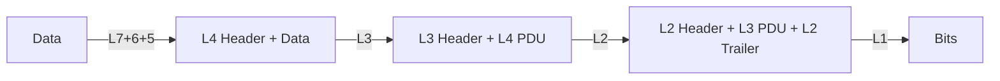
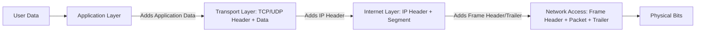

# Chapter 2: Network Models (OSI and TCP/IP)

In this chapter, we’ll learn about two important models that help us understand how networks work: the **OSI Model** and the **TCP/IP Model**. These models break network communication into smaller, simpler layers. Each layer has a specific job. We’ll also see how data is wrapped (encapsulated) and unwrapped (decapsulated) as it travels.

---

## 2.1 Why Do We Need Network Models?

Imagine sending a letter. You don’t just throw the paper – you put it in an envelope, write an address, add a stamp, drop it in a mailbox, and the postal service handles the rest. Network models work the same way: they divide the work into steps (layers). Each layer talks only to the layers above and below it. This makes network design easier, and changes in one layer don’t affect the others.

---

## 2.2 The OSI Model (Open Systems Interconnection)

The OSI model has **7 layers**. It’s a theoretical model created by the International Organization for Standardization (ISO) to help vendors and developers create interoperable network products.

### 2.2.1 The 7 Layers – From Bottom to Top

We’ll start from the bottom (closest to the physical hardware) and move up to the application (closest to the user).

| Layer # | Layer Name | Function (in simple words) |
|---------|------------|----------------------------|
| 1 | Physical | Transmits raw bits (0s and 1s) over a physical medium (cable, radio, fiber). |
| 2 | Data Link | Organizes bits into frames; handles physical addressing (MAC addresses); error detection. |
| 3 | Network | Routes packets from source to destination across multiple networks; uses logical addressing (IP addresses). |
| 4 | Transport | Provides reliable or unreliable data delivery; error recovery; flow control; uses port numbers. |
| 5 | Session | Manages sessions (dialogues) between applications; establishes, maintains, and terminates connections. |
| 6 | Presentation | Translates data formats (encryption, compression, character encoding). |
| 7 | Application | Provides network services directly to user applications (e.g., web browser, email client). |

### 2.2.2 Detailed Functions of Each Layer with Examples

#### Layer 1 – Physical Layer

- **What it does:** Converts bits into electrical signals, light pulses, or radio waves. Defines cables, connectors, voltage levels, and data rates.
- **Examples of protocols/technologies:** Ethernet (physical part), USB, Bluetooth radio, fiber optics, DSL.
- **Real‑life analogy:** The actual road or train track on which vehicles (bits) travel.

#### Layer 2 – Data Link Layer

- **What it does:** Groups bits into **frames**. Adds a **MAC address** (hardware address) of the source and destination. Detects (and sometimes corrects) transmission errors. Controls access to the physical medium (e.g., CSMA/CD for Ethernet).
- **Two sublayers:** LLC (Logical Link Control) and MAC (Media Access Control).
- **Examples:** Ethernet (IEEE 802.3), Wi‑Fi (IEEE 802.11), PPP (Point‑to‑Point Protocol).
- **Real‑life analogy:** The postal service within a single city – it knows how to deliver a letter to a specific house (MAC address) on that street.

#### Layer 3 – Network Layer

- **What it does:** Routes **packets** across different networks. Uses **IP addresses** (logical addresses) to find the best path. Fragments large packets if needed.
- **Examples:** IP (Internet Protocol – IPv4 and IPv6), ICMP (ping), RIP, OSPF (routing protocols).
- **Real‑life analogy:** The interstate highway system and GPS – it figures out the best route from New York to Los Angeles, not just within one city.

#### Layer 4 – Transport Layer

- **What it does:** Provides end‑to‑end communication between applications. Uses **port numbers** (e.g., 80 for web, 443 for secure web). Two main protocols:
  - **TCP** (Transmission Control Protocol) – reliable, connection‑oriented, error‑checked, ordered delivery.
  - **UDP** (User Datagram Protocol) – fast, connectionless, no guarantee (used for streaming, gaming).
- **Examples:** TCP, UDP, SCTP.
- **Real‑life analogy:** A registered mail service that tracks your package, resends it if lost (TCP) vs. a regular postcard that might get lost but is fast (UDP).

#### Layer 5 – Session Layer

- **What it does:** Sets up, manages, and ends **sessions** (conversations) between applications. Controls who can talk when (dialog control). Adds checkpoints for large data transfers (so if a transfer fails, it can resume from a checkpoint).
- **Examples:** NetBIOS, RPC (Remote Procedure Call), PPTP (VPN tunnel control).
- **Real‑life analogy:** A meeting moderator who decides when each person speaks and when the meeting starts/ends.

#### Layer 6 – Presentation Layer

- **What it does:** Translates data between the application format and the network format. Handles **encryption/decryption**, **compression**, and **character encoding** (e.g., ASCII, UTF‑8, EBCDIC).
- **Examples:** SSL/TLS (cryptography – though often placed in session/transport in practice), JPEG, GIF, ASCII, EBCDIC.
- **Real‑life analogy:** A translator who converts English to French and also encrypts the message with a secret code.

#### Layer 7 – Application Layer

- **What it does:** Provides network services directly to the user’s software (e.g., web browser, email client, file transfer). This is the layer the user interacts with.
- **Examples:** HTTP (web), HTTPS, FTP (file transfer), SMTP (email sending), POP3/IMAP (email receiving), DNS (domain name resolution), Telnet, SSH.
- **Real‑life analogy:** The letter you write – the actual content of the communication.

---

## 2.3 Encapsulation and Decapsulation

When data travels from a sender to a receiver, each layer adds its own **header** (and sometimes a trailer). This process is called **encapsulation**. At the receiving side, each layer removes its header – **decapsulation**.

**Simplified view:**



### Example: Sending “Hello” over HTTP

1. **Application layer (HTTP)** – “Hello” is the user data.
2. **Presentation layer** – optionally compresses/encrypts (still “Hello”).
3. **Session layer** – adds session ID (e.g., “session 123”).
4. **Transport layer (TCP)** – adds source port (e.g., 5000) and destination port (80). Creates a TCP segment.
5. **Network layer (IP)** – adds source IP (192.168.1.2) and destination IP (8.8.8.8). Creates an IP packet.
6. **Data Link layer (Ethernet)** – adds source MAC (AA:BB:CC:DD:EE:FF) and destination MAC (next hop router). Adds a trailer with error check (FCS). Creates an Ethernet frame.
7. **Physical layer** – sends bits as electrical pulses.

At the receiver, each layer strips its header and passes the rest upward.

---

## 2.4 Protocols at Each Layer of the OSI Model

Here’s a table of common protocols (not every protocol fits perfectly – some span layers, but this is typical):

| OSI Layer | Example Protocols / Technologies |
|-----------|----------------------------------|
| 7 – Application | HTTP, HTTPS, FTP, SMTP, POP3, IMAP, DNS, SSH, Telnet, SNMP |
| 6 – Presentation | SSL/TLS (often here), JPEG, MPEG, ASCII, EBCDIC |
| 5 – Session | NetBIOS, RPC, PPTP, SMB (partly session) |
| 4 – Transport | TCP, UDP, SCTP, DCCP |
| 3 – Network | IPv4, IPv6, ICMP, IGMP, ARP (often placed in L2/L3), OSPF, RIP |
| 2 – Data Link | Ethernet (802.3), Wi‑Fi (802.11), PPP, HDLC, Frame Relay, Token Ring |
| 1 – Physical | Ethernet (cables, repeaters), DSL, SONET/SDH, Bluetooth radio, USB |

---

## 2.5 The TCP/IP Model

The TCP/IP model is a practical, simpler model used on the real Internet. It has **4 layers** (sometimes 5, depending on how you count). It was developed by the U.S. Department of Defense (ARPANET).

### TCP/IP Layers vs OSI Layers

```mermaid
graph TD
    subgraph OSI Model
        O7[7. Application]
        O6[6. Presentation]
        O5[5. Session]
        O4[4. Transport]
        O3[3. Network]
        O2[2. Data Link]
        O1[1. Physical]
    end
    
    subgraph TCP/IP Model
        T4[4. Application Layer<br/>(HTTP, FTP, SMTP, DNS)]
        T3[3. Transport Layer<br/>(TCP, UDP)]
        T2[2. Internet Layer<br/>(IP, ICMP, ARP)]
        T1[1. Network Access Layer<br/>(Ethernet, Wi‑Fi, etc.)]
    end
    
    O7 --> T4
    O6 --> T4
    O5 --> T4
    O4 --> T3
    O3 --> T2
    O2 --> T1
    O1 --> T1
```

### 2.5.1 Functions of Each TCP/IP Layer

| TCP/IP Layer | Function | Equivalent OSI Layers | Example Protocols |
|--------------|----------|----------------------|-------------------|
| **Application** | Provides user applications with network services. Combines OSI layers 5,6,7. | Application, Presentation, Session | HTTP, HTTPS, FTP, SMTP, DNS, SSH |
| **Transport** | End‑to‑end reliability, flow control, multiplexing (port numbers). | Transport | TCP, UDP |
| **Internet** | Routing packets across networks, logical addressing (IP). | Network | IPv4, IPv6, ICMP, ARP (sometimes) |
| **Network Access** (also called Link Layer) | Sending frames over a physical medium, hardware addressing. | Data Link + Physical | Ethernet, Wi‑Fi, PPP, DSL |

### 2.5.2 Encapsulation in TCP/IP

The process is similar to OSI, but with only 4 layers:



### 2.5.3 Comparison Table: OSI vs TCP/IP

| Feature | OSI Model | TCP/IP Model |
|---------|-----------|---------------|
| Number of layers | 7 | 4 (or 5 if separating physical) |
| Developed by | ISO (International Org) | DARPA (U.S. DoD) |
| Theoretical / Practical | Theoretical (reference model) | Practical (used on the Internet) |
| Session & Presentation | Separate layers | Included in Application layer |
| Physical & Data Link | Separate layers | Combined into Network Access layer |
| Protocol dependencies | Independent of protocols | Built around TCP and IP |
| Popularity | Used for teaching & documentation | Used in real devices and networks |

---

## 2.6 Why Both Models Matter Today

- **OSI model** helps you **understand** network functions layer by layer. It’s a great tool for learning, troubleshooting, and designing networks.
- **TCP/IP model** is what actually runs the **Internet**. When you browse a website, send an email, or stream a video, you are using TCP/IP.

When network engineers talk about “Layer 2 switches” or “Layer 3 routers”, they are referring to OSI layers (Data Link and Network). Similarly, “TCP port 80” comes from the Transport layer of TCP/IP.

---

## Chapter Summary

- The **OSI model** has 7 layers: Physical, Data Link, Network, Transport, Session, Presentation, Application.
- Each layer has a specific job, and protocols operate at each layer.
- **Encapsulation** adds headers at each layer on the sender side; **decapsulation** removes them at the receiver.
- The **TCP/IP model** has 4 layers: Network Access, Internet, Transport, Application. It’s the real model used on the Internet.
- Both models help us design, understand, and troubleshoot networks.

In the next chapter, we’ll dive into **Physical Layer** details: cables, connectors, signaling, and how bits actually travel.