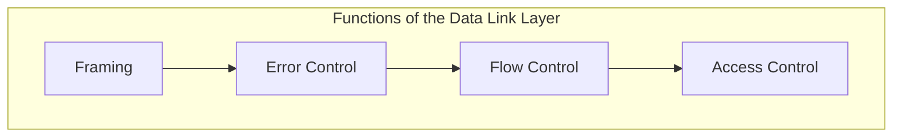
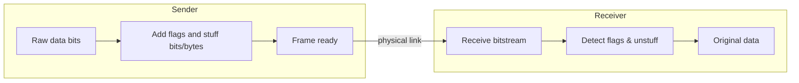
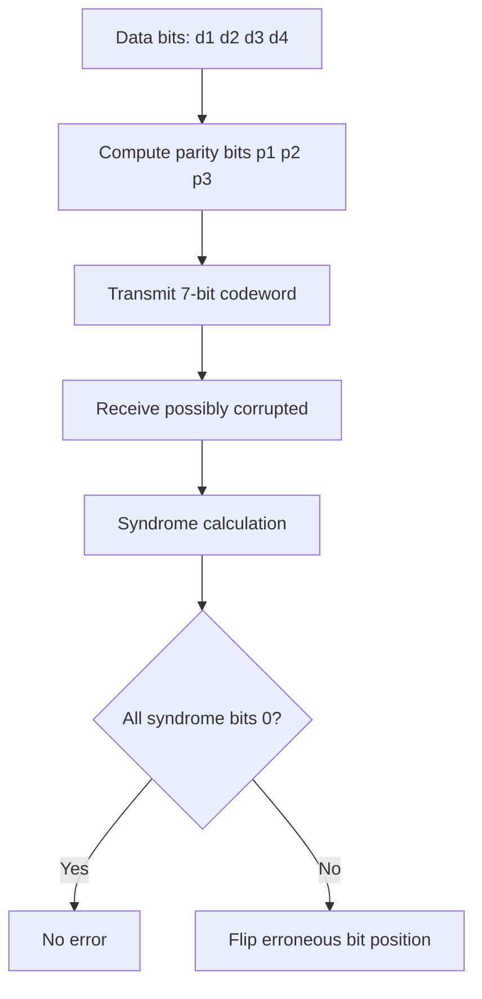
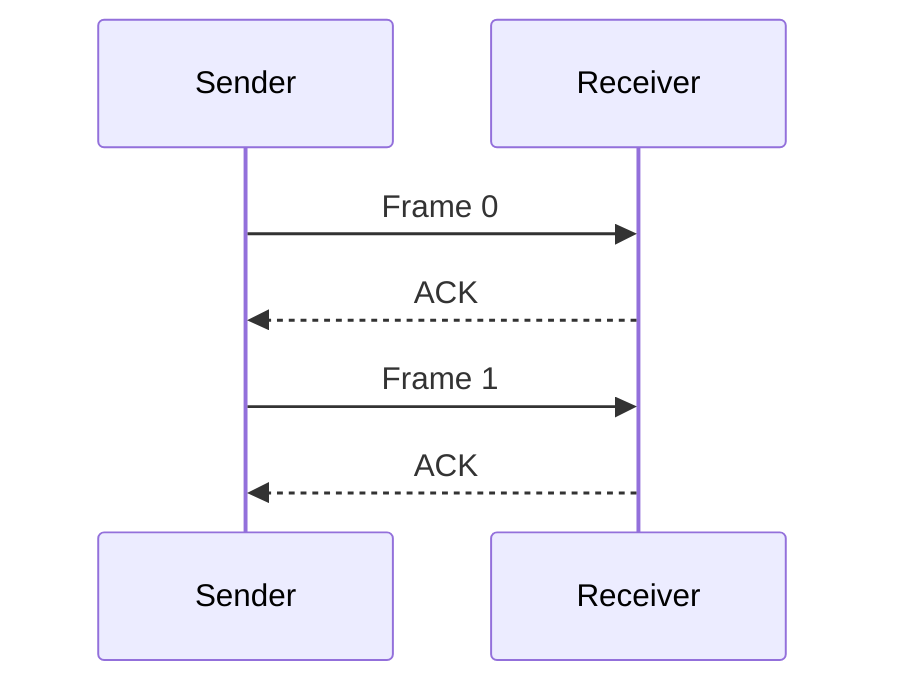
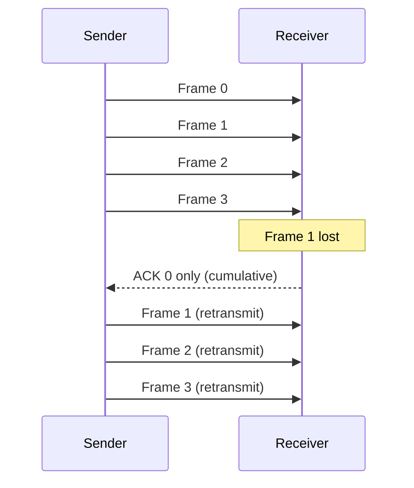
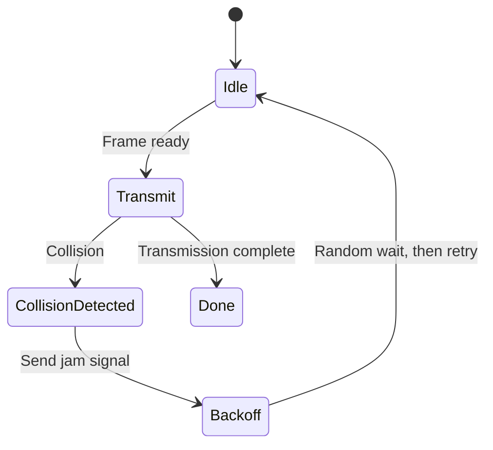
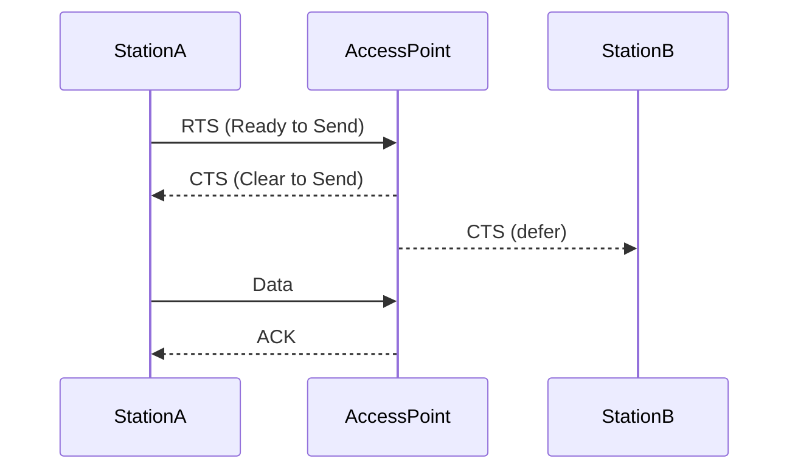

# Chapter 4: Data Link Layer

The **Data Link Layer** (Layer 2 of the OSI model) transforms a raw transmission medium into a reliable link. Its four core functions ensure that data is correctly framed, delivered without errors, not lost due to speed mismatches, and fairly shared among nodes.



---

## 1. Framing

Framing divides a stream of bits into manageable **frames** so that the receiver can recognise where a frame starts and ends.

### Methods of Framing

| Method               | How it works | Example protocol |
|----------------------|--------------|------------------|
| **Character count**  | First field gives number of bytes in frame | DECnet |
| **Byte stuffing**    | Special flag byte (e.g., `01111110`) at start/end; escape byte inserted inside data | PPP |
| **Bit stuffing**     | Flag `01111110`; after five consecutive `1`s insert a `0` in data | HDLC, USB |
| **Physical coding violation** | Use invalid signal levels as delimiters | Ethernet (Manchester) |

### Example: Bit Stuffing (HDLC)

**Rule:** After every sequence of **five `1`s**, the sender inserts a `0`. The receiver removes a `0` that follows five `1`s.

```
Original data:     011111 11110 01111110
                      ↑   ↑        ↑
After bit stuffing:011111 01110 011111010
                   (0 inserted)   (0 inserted)
```

### Framing Process



---

## 2. Error Detection and Correction

Bits can be corrupted by noise. The Data Link Layer adds **redundant bits** to detect (and sometimes correct) errors.

### Error Detection

| Method        | Description | Example |
|---------------|-------------|---------|
| **Parity bit** | Single bit to make number of `1`s even/odd | Simple, detects odd number of errors |
| **Checksum**   | Sum of data bytes, transmitted alongside | TCP/IP (weak) |
| **CRC (Cyclic Redundancy Check)** | Treat data as polynomial; divide by generator polynomial; send remainder | Ethernet, HDLC (strong) |

#### CRC Example (Generator `1001`, data `1101011011`)

```
Data:          1101011011  (append 3 zeros because generator is 4 bits)
Divisor:       1001
Remainder:     011   (after polynomial division)
Transmitted:   1101011011 011
Receiver divides by 1001 → remainder = 0 → no error.
```

### Error Correction (Hamming Code)

Hamming codes can **detect and correct single‑bit errors**. For `m` data bits, we need `r` check bits such that `2^r ≥ m + r + 1`.

**Example (7,4) Hamming code** – 4 data bits + 3 parity bits.



---

## 3. Flow Control

Flow control prevents a fast sender from overwhelming a slow receiver.

### Stop‑and‑Wait

Sender transmits one frame, waits for an **acknowledgment (ACK)**, then sends the next.



- **Inefficient** on long, high‑bandwidth links.

### Sliding Window

Allows multiple outstanding frames. Two variants:

1. **Go‑Back‑N** – Receiver accepts only in‑order frames; sender retransmits from lost frame onward.
2. **Selective Repeat** – Receiver buffers out‑of‑order frames; sender retransmits only the lost frame.

#### Example: Go‑Back‑N with window size 4



- **Piggybacking** – ACKs are carried inside data frames going in the opposite direction.

---

## 4. Access Control (Medium Access Control – MAC)

On shared media (e.g., Wi‑Fi, Ethernet bus), a protocol decides **which node transmits when**.

### Multiple Access Protocols

| Protocol              | Principle | Used in |
|-----------------------|-----------|---------|
| **ALOHA**             | Transmit whenever; collide → retransmit after random delay | Satellite |
| **CSMA/CD**           | Listen before transmitting; if collision → jam and backoff | Wired Ethernet |
| **CSMA/CA**           | Listen, but avoid collisions using RTS/CTS handshake | Wi‑Fi (802.11) |
| **Token Passing**     | Special token circulates; only token holder can transmit | Token Ring, FDDI |

### CSMA/CD (Ethernet) State Diagram



### Example: CSMA/CA (Wi‑Fi) RTS/CTS Handshake



- **Purpose:** Hide the sender from other stations (hidden terminal problem).

---

## Summary Table

| Function               | Goal                              | Key Technique(s)                 |
|------------------------|-----------------------------------|----------------------------------|
| **Framing**            | Identify frame boundaries         | Bit stuffing, byte stuffing      |
| **Error control**      | Detect/correct bit errors         | CRC, Hamming code, checksum      |
| **Flow control**       | Prevent receiver overload         | Stop‑and‑wait, sliding window    |
| **Access control**     | Coordinate shared medium access   | CSMA/CD, CSMA/CA, token passing  |

> **Real‑world example:** Ethernet uses **framing** (preamble + SFD), **CRC‑32** for error detection, **sliding window** (for reliable links), and **CSMA/CD** (historically) or full‑duplex switching (modern).

---

## Further Reading & Code Examples

- **CRC calculation in Python** – [GitHub gist](https://gist.github.com/example)
- **Simulate stop‑and‑wait** – Simple socket programming
- **HDLC bit stuffing** – C / Python implementation

```python
# Example: Bit stuffing (HDLC)
def bit_stuff(data: str) -> str:
    stuffed = ""
    count = 0
    for bit in data:
        stuffed += bit
        if bit == '1':
            count += 1
            if count == 5:
                stuffed += '0'
                count = 0
        else:
            count = 0
    return stuffed

print(bit_stuff("0111111110"))  # Output: 01111101110
```
