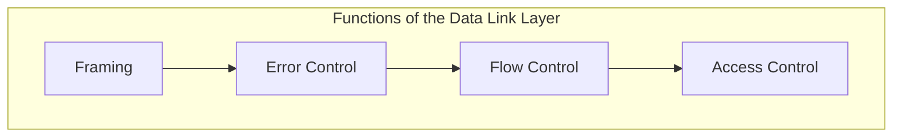
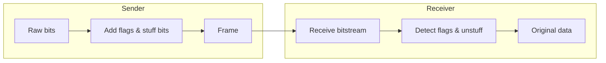
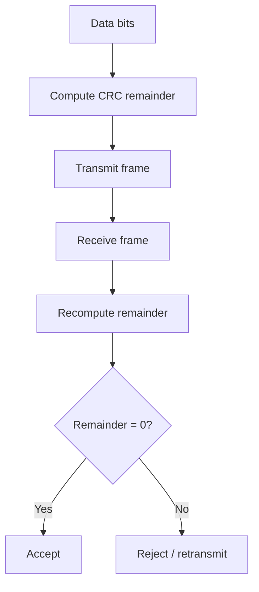
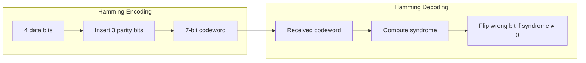
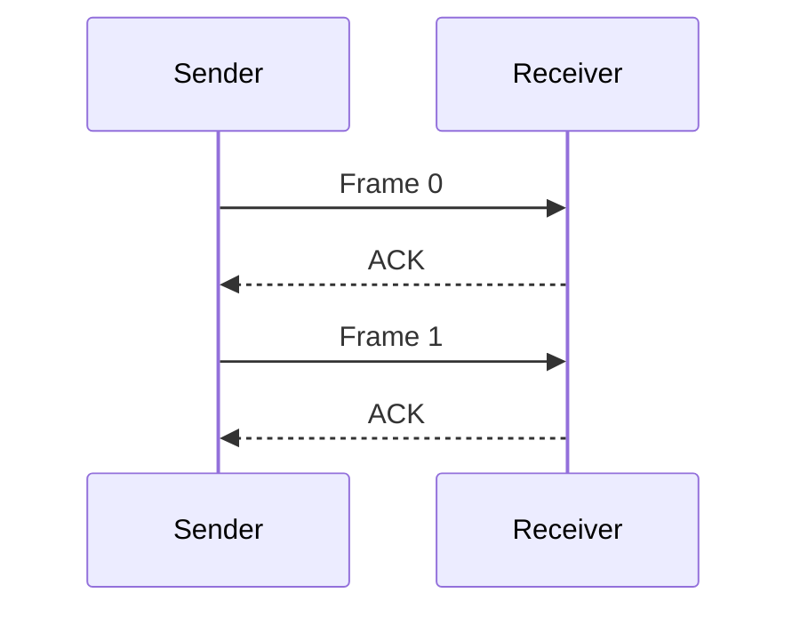
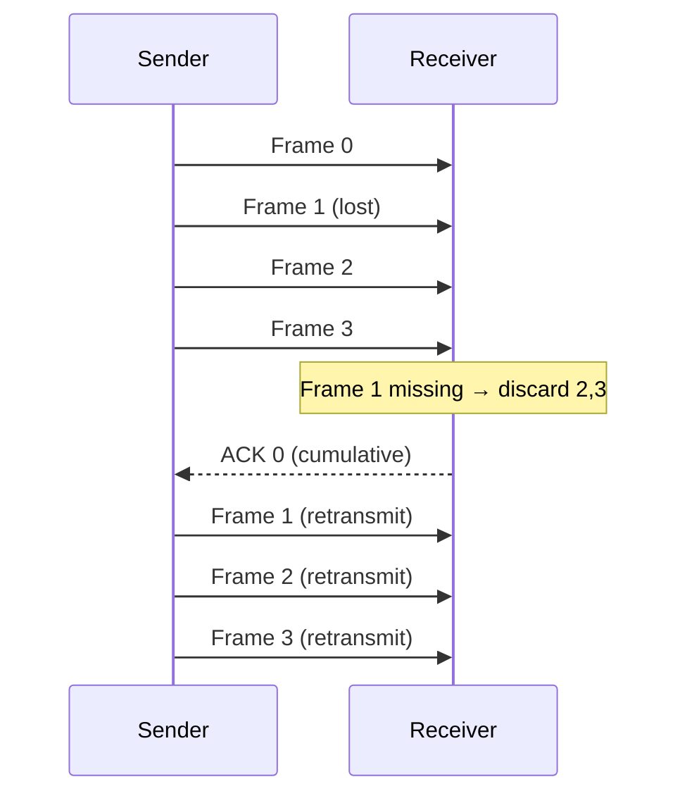
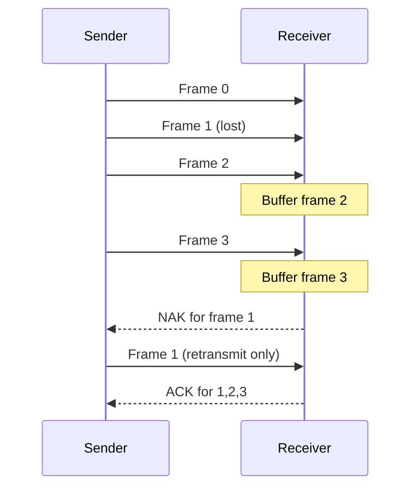
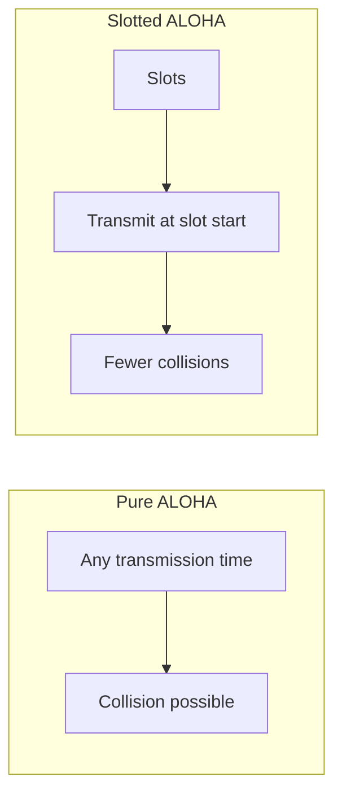
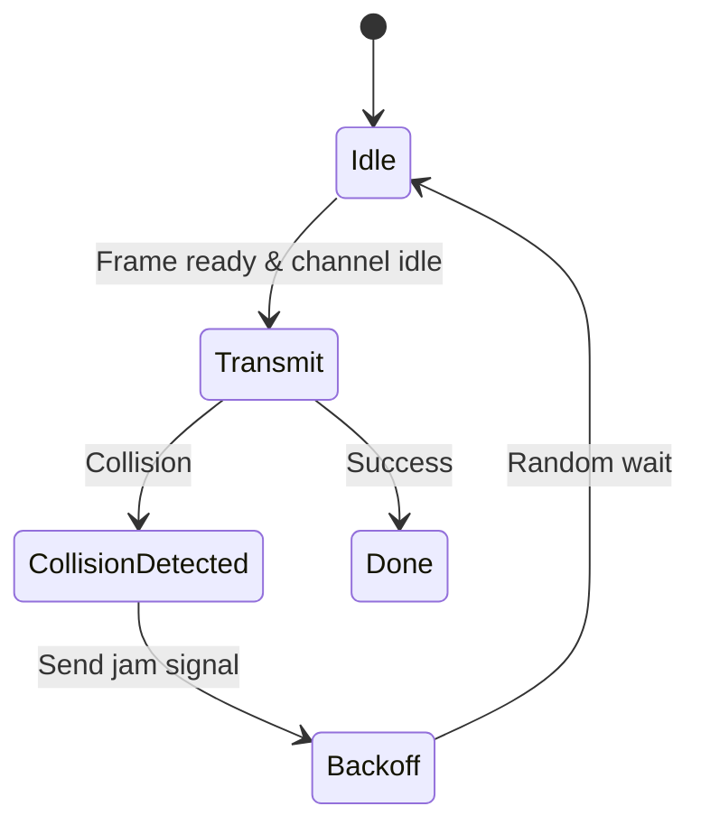
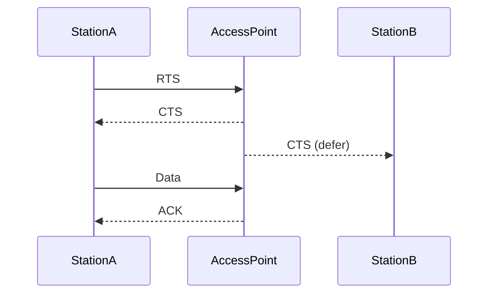

# Chapter 4: Data Link Layer

The **Data Link Layer** (Layer 2 of the OSI model) ensures reliable node‑to‑node data transfer across a physical link. Its main functions are:

- **Framing** – Delimiting bits into frames.
- **Error detection and correction** – Identifying and fixing bit errors.
- **Flow control** – Preventing sender from overwhelming receiver.
- **Access control** – Managing who transmits on a shared medium.



---

## 1. Framing

Framing allows the receiver to detect where a frame starts and ends. Common methods:

| Method               | Description | Example Protocol |
|----------------------|-------------|------------------|
| **Character count**  | First field tells frame length | DECnet |
| **Byte stuffing**    | Flag byte (e.g., `01111110`) at start/end; escape byte inserted inside data | PPP |
| **Bit stuffing**     | Flag `01111110`; after five `1`s, insert a `0` | HDLC, USB |
| **Physical coding violation** | Use invalid signal levels as delimiters | Ethernet (Manchester) |

### Example – Bit Stuffing (HDLC)

```
Original data:     011111 11110 01111110
After stuffing:    011111 01110 011111010
                  (0 inserted)   (0 inserted)
```



---

## 2. Error Detection and Correction

### 2.1 Parity Check

Adds a single bit to make the number of `1`s even (even parity) or odd (odd parity).

- **Detects** odd number of bit errors.
- **Fails** with even number of errors.

```
Example (even parity): Data 1011001 → 4 ones → parity bit = 0
Transmitted: 10110010
```

### 2.2 Checksum

Treats data as a sequence of integers (e.g., 16‑bit words), sums them, and transmits the sum (1’s complement). Receiver recomputes sum; if result is all `1`s, no error.

- Used in TCP/IP (weak compared to CRC).

### 2.3 CRC (Cyclic Redundancy Check)

Treats data as a polynomial. Divide by a generator polynomial; send the remainder. Very strong error detection.

**Example:** Generator `1001` (x³+1), data `1101011011`

```
Data:           1101011011 000   (append 3 zeros because generator is 4 bits)
Divisor:        1001
Remainder:      011
Transmitted:    1101011011 011
Receiver divides by 1001 → remainder 0 → no error.
```



### 2.4 Hamming Code (Error Correction)

Can **detect and correct single‑bit errors**. For `m` data bits, we need `r` check bits such that `2^r ≥ m + r + 1`.

**Example (7,4) Hamming code** – 4 data bits + 3 parity bits.

Parity bits cover overlapping sets of bit positions. The receiver computes a **syndrome** that directly indicates the erroneous bit position.



---

## 3. Flow & Error Control Protocols

These protocols combine **flow control** (prevent receiver overload) and **error control** (retransmit lost/corrupted frames).

### 3.1 Stop‑and‑Wait

Sender transmits one frame, waits for an **acknowledgment (ACK)**, then sends the next. Simple but inefficient on high‑bandwidth long‑delay links.



### 3.2 Sliding Window

Allows multiple outstanding frames. Uses a **window** (number of unacknowledged frames). Two common ARQ (Automatic Repeat reQuest) schemes:

#### a) Go‑Back‑N ARQ

- Receiver accepts only **in‑order** frames.
- If a frame is lost, the sender retransmits that frame **and all following frames** (even if they were received correctly).

**Example (window size 4, frame 1 lost):**



#### b) Selective Repeat ARQ

- Receiver buffers out‑of‑order frames.
- Sender retransmits **only the lost frame**.



---

## 4. MAC Sub‑layer (Medium Access Control)

The MAC sub‑layer controls access to the shared physical medium and defines **MAC addressing**.

### 4.1 MAC Addressing

- A **48‑bit** (or 64‑bit) hardware address burned into network interfaces.
- Example: `00:1A:2B:3C:4D:5E`
- Uniquely identifies each node on the same local network.

### 4.2 Channel Access Protocols

#### ALOHA

- **Pure ALOHA**: Transmit whenever data is ready. If collision occurs, wait a random time and retransmit. Throughput max ≈ 18.4%.
- **Slotted ALOHA**: Time is divided into slots. Transmit only at slot boundaries. Throughput max ≈ 36.8%.



#### CSMA/CD (Carrier Sense Multiple Access with Collision Detection)

- **Listen before talking** (carrier sense).
- If channel idle, transmit; if busy, wait.
- **Collision detection**: While transmitting, listen. If collision detected → send jam signal → backoff (exponential backoff) → retry.

Used in **wired Ethernet** (half‑duplex).



#### CSMA/CA (Collision Avoidance)

Used in **Wi‑Fi (802.11)**. Avoids collisions rather than detecting them (wireless can’t detect collisions reliably). Uses:

- **RTS/CTS handshake** (Request to Send / Clear to Send) to reserve the medium.
- **Random backoff** after each transmission.



---

## Summary Table

| Function               | Key Techniques / Protocols                |
|------------------------|-------------------------------------------|
| **Framing**            | Bit stuffing, byte stuffing               |
| **Error detection**    | Parity, Checksum, CRC                     |
| **Error correction**   | Hamming code                              |
| **Flow & error control** | Stop‑and‑Wait, Go‑Back‑N, Selective Repeat |
| **MAC access control** | ALOHA, CSMA/CD, CSMA/CA                   |

---

## Further Code Examples

### CRC‑32 in Python (using `binascii`)

```python
import binascii

data = b"Hello, Data Link Layer"
crc = binascii.crc32(data) & 0xFFFFFFFF
print(f"CRC-32: {crc:08x}")
```

### Bit Stuffing Simulation

```python
def bit_stuff(data: str) -> str:
    stuffed = ""
    count = 0
    for bit in data:
        stuffed += bit
        if bit == '1':
            count += 1
            if count == 5:
                stuffed += '0'
                count = 0
        else:
            count = 0
    return stuffed

print(bit_stuff("0111111110"))  # Output: 01111101110
```
