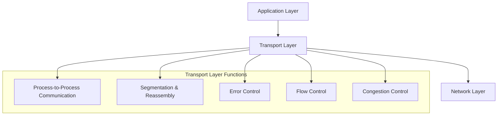
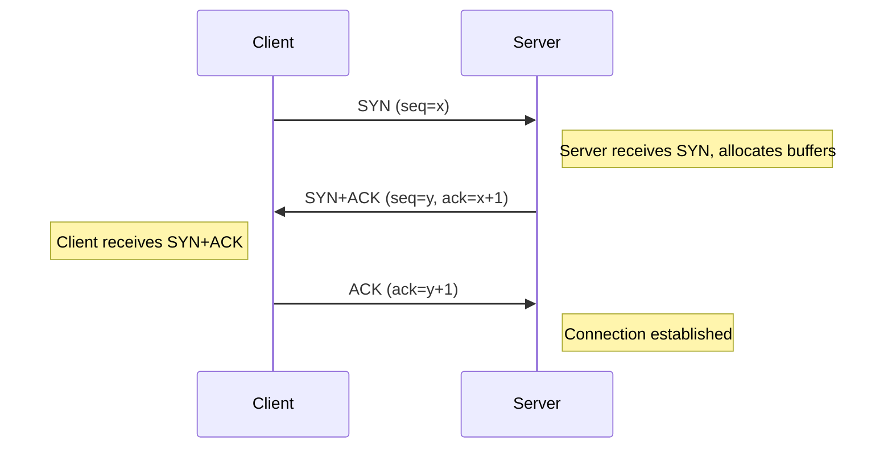
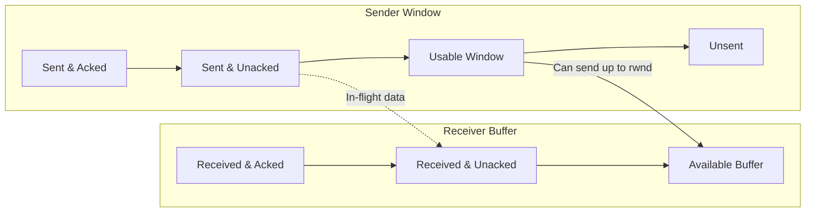
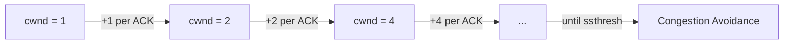
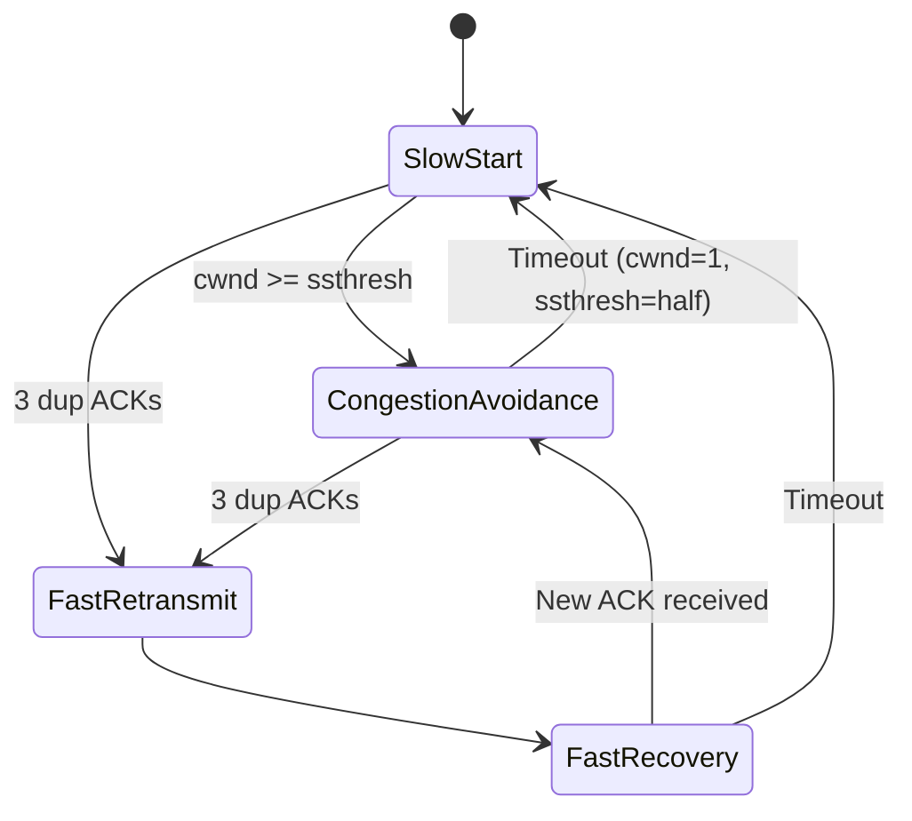
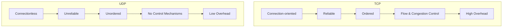

# Chapter 6: Transport Layer

The Transport Layer is the fourth layer in the OSI model and the core of the TCP/IP stack. It provides logical communication between application processes running on different hosts.

## Functions of the Transport Layer

The following diagram illustrates the key responsibilities of the transport layer:

- **Process-to-Process Communication**: Unlike the network layer which delivers packets to hosts, the transport layer delivers data to specific processes (applications) using ports.
- **Segmentation and Reassembly**: Divides application data into smaller segments for transmission and reassembles them at the destination.
- **Error Control**: Detects corrupted or lost segments and requests retransmission.
- **Flow Control**: Prevents a fast sender from overwhelming a slow receiver.
- **Congestion Control**: Prevents excessive traffic from causing network congestion.

Two main transport protocols dominate the Internet: **TCP** (Transmission Control Protocol) and **UDP** (User Datagram Protocol).

---

## TCP - Transmission Control Protocol

TCP is a connection-oriented, reliable transport protocol that provides a stream-oriented service.

### Key Characteristics

- **Connection-oriented**: A logical connection must be established before data exchange.
- **Reliable**: Uses acknowledgements (ACKs) and retransmissions to guarantee delivery.
- **In-order delivery**: Segments are reassembled in the correct order.
- **Full-duplex**: Simultaneous bidirectional data transfer.

### Three-Way Handshake

TCP establishes a connection using a three-way handshake. This synchronizes sequence numbers and negotiates parameters.

- **SYN**: Synchronize sequence number
- **ACK**: Acknowledgment
- After this exchange, both sides can send data.

### Reliable Communication

TCP uses:
- **Sequence numbers** to number each byte of data.
- **Acknowledgments** to confirm receipt.
- **Retransmission timers** to resend unacknowledged data after timeout.

### Flow Control: Sliding Window

TCP uses a sliding window mechanism to control the flow of data. The receiver advertises a `rwnd` (receiver window) indicating available buffer space.

- The sender cannot exceed the receiver's advertised window.
- As the receiver processes data and sends ACKs, the window slides forward.

### Congestion Control

TCP implements four algorithms to manage network congestion. The congestion window (`cwnd`) limits the amount of data a sender can inject into the network.

#### 1. Slow Start

- Initially, `cwnd = 1 MSS` (Maximum Segment Size).
- For each ACK received, `cwnd` doubles (exponential growth) until a threshold (`ssthresh`) is reached.

#### 2. Congestion Avoidance

- When `cwnd >= ssthresh`, growth becomes linear: `cwnd += 1/cwnd` per ACK.
- Continues until packet loss is detected.

#### 3. Fast Retransmit

- Upon receiving 3 duplicate ACKs, the sender retransmits the missing segment immediately (without waiting for timeout).

#### 4. Fast Recovery

- After fast retransmit, `ssthresh = cwnd/2`, `cwnd = ssthresh + 3`.
- For each subsequent duplicate ACK, `cwnd += 1`.
- When a new ACK arrives, `cwnd = ssthresh` and enters congestion avoidance.

The following state diagram summarizes TCP congestion control behavior:

---

## UDP - User Datagram Protocol

UDP is a simple, connectionless transport protocol that provides minimal service.

### Key Characteristics

- **Connectionless**: No handshake; each datagram is independent.
- **Unreliable**: No guarantees of delivery, ordering, or duplicate protection.
- **No flow control**: Sender can transmit at any rate.
- **No congestion control**: Does not react to network congestion.
- **Low overhead**: 8-byte header (vs. 20-byte TCP header).

### UDP Datagram Format

### Use Cases

UDP is preferred when speed and low latency outweigh reliability:

| Application | Why UDP? |
|-------------|-----------|
| Live streaming / VoIP | Dropped packets are tolerable; retransmission causes delay |
| DNS queries | Short request-response; retry mechanism at application layer |
| SNMP (network monitoring) | Low overhead, periodic polling |
| DHCP | Broadcast-based, no need for connection state |
| Online gaming | Fast updates; old data is useless |

### Comparison Diagram

---

## Summary

- The transport layer enables **process-to-process communication** and provides segmentation, error control, flow control, and congestion control.
- **TCP** is connection-oriented and reliable, using three-way handshake, sliding window flow control, and sophisticated congestion control (slow start, congestion avoidance, fast retransmit, fast recovery).
- **UDP** is connectionless, fast, and lightweight, suitable for real-time applications and simple request-response protocols.

Choose TCP when data integrity and order matter; choose UDP when speed and low latency are critical.
