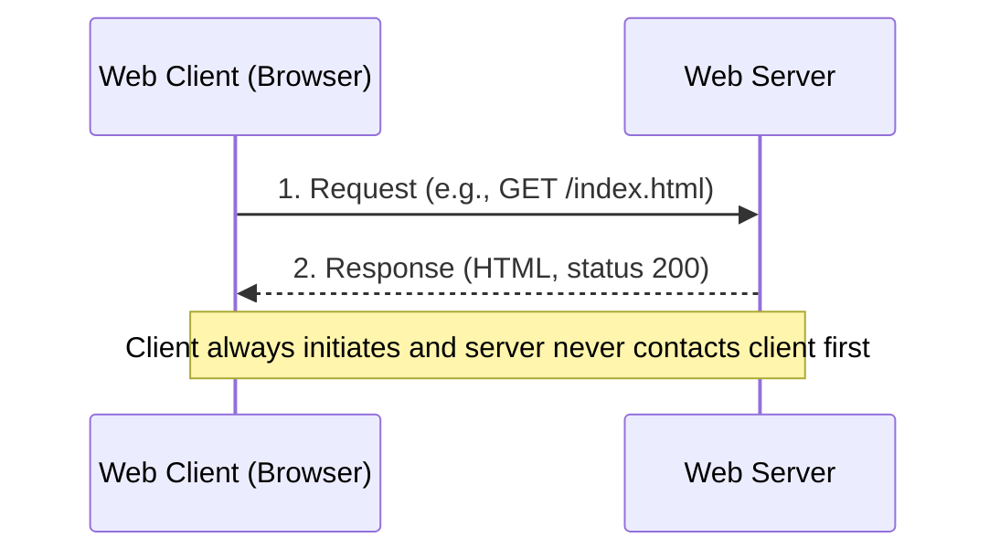
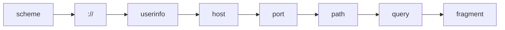
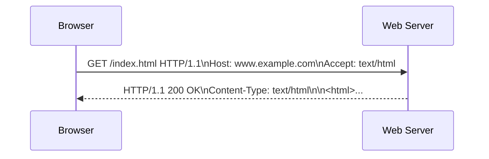
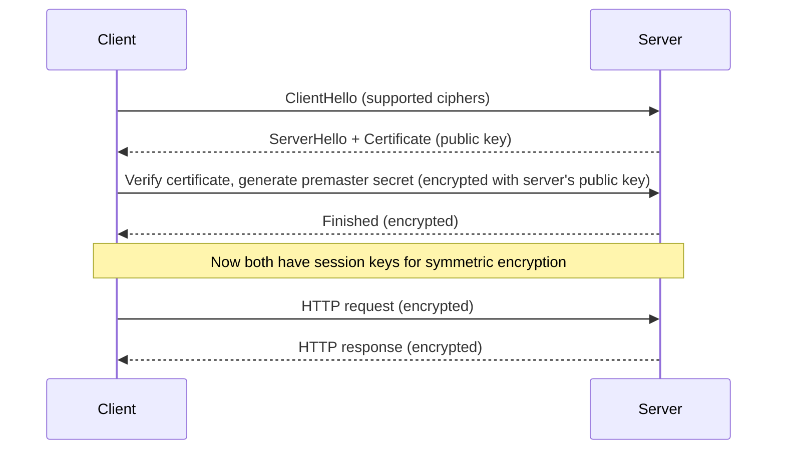
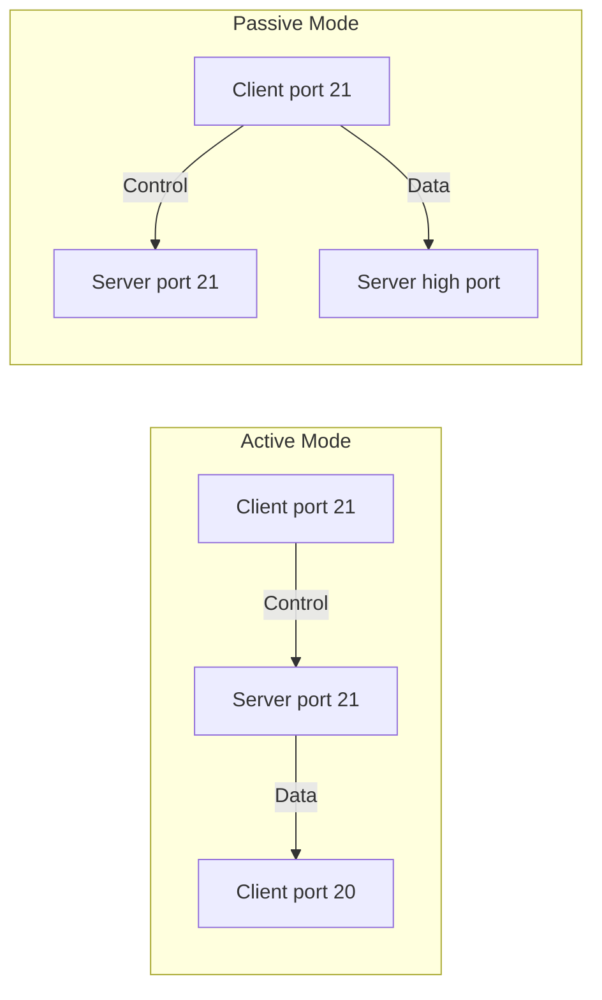
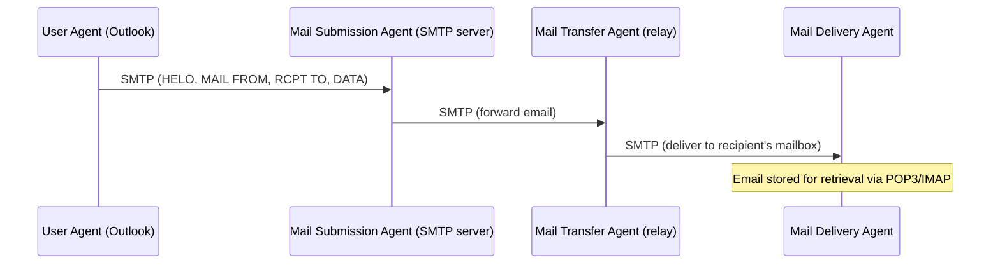
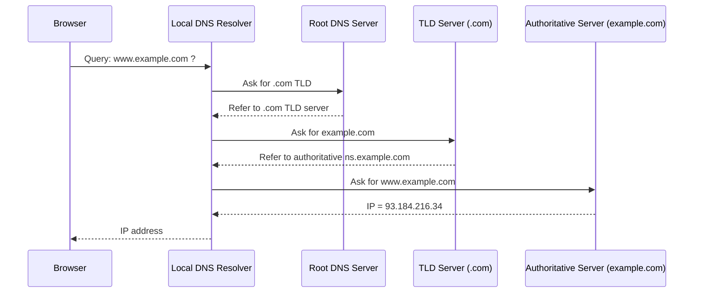
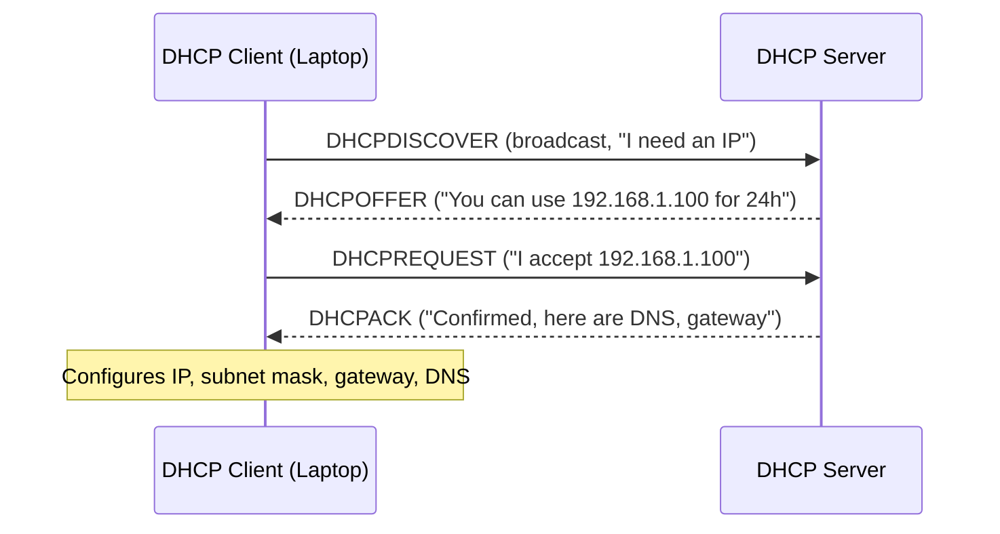

# Chapter 7: Application Layer

The **Application Layer** (Layer 7 of the OSI model) is the closest to the end user. It provides protocols and services that enable applications to communicate over a network. This chapter covers the essential protocols—HTTP/HTTPS, FTP, SMTP, POP3/IMAP, DNS, DHCP—and the core concepts of client‑server architecture, URL structure, cookies, and sessions.

---

## 1. Client‑Server Architecture

**Definition**: A distributed application structure that partitions tasks between *service providers* (servers) and *service requesters* (clients).

- **Client** – initiates contact, waits for replies, runs on user devices.
- **Server** – always on, listens for requests, provides responses, often serves many clients simultaneously.



**Example**:  
- **Client**: Your smartphone’s weather app.  
- **Server**: A cloud‑hosted weather API (e.g., `api.weather.com`). The app requests current temperature, the server replies with JSON data.

---

## 2. URL Structure (Uniform Resource Locator)

A URL is a specific string that identifies a resource and tells the client *how* to access it.



**Components (with real example)**  
`https://alice:[email protected]:443/search?q=mermaid&lang=en#results`

| Component | Value | Purpose |
|-----------|-------|---------|
| **scheme** | `https` | Protocol to use (HTTP over TLS) |
| **user:password** | `alice:secret` | Authentication (rarely used in browsers) |
| **host** | `docs.example.com` | Domain name or IP address |
| **port** | `443` | TCP port (default for HTTPS) |
| **path** | `/search` | Resource location on server |
| **query** | `q=mermaid&lang=en` | Key‑value parameters (dynamic content) |
| **fragment** | `results` | Section inside the HTML page (client‑side only) |

> **Note**: In practice, credentials in URLs are deprecated for security reasons.

---

## 3. Cookies and Sessions

HTTP is **stateless** – each request is independent. Cookies and sessions add state.

### 3.1 Cookies
Small text files stored by the browser and sent automatically with every request to the same domain.

**How it works**:

```mermaid
sequenceDiagram
    participant Browser
    participant Server

    Browser->>Server: POST /login (username, password)
    Server-->>Browser: HTTP 200 OK + Set-Cookie: sessionId=abc123; HttpOnly; Secure
    Note over Browser: Stores cookie
    Browser->>Server: GET /dashboard + Cookie: sessionId=abc123
    Server-->>Browser: Dashboard content (authenticated)
```

**Key attributes**:
- `Expires` / `Max‑Age` – lifetime.
- `Domain` / `Path` – scope.
- `Secure` – only send over HTTPS.
- `HttpOnly` – prevents JavaScript access (mitigates XSS).

### 3.2 Sessions
A **session** is server‑side storage tied to a unique session ID (usually stored in a cookie). The server keeps user data (e.g., shopping cart, login state) and the client only holds the identifier.

**Example**:  
- User adds items to cart → session ID `xyz` stores `{cart: ["laptop","mouse"]}` on server.  
- Next request includes `Cookie: sessionId=xyz` → server retrieves the cart.

---

## 4. HTTP / HTTPS

### HTTP (HyperText Transfer Protocol)
- **Port**: 80 (plain text).
- **Methods**: GET, POST, PUT, DELETE, etc.
- **Status codes**: 200 OK, 404 Not Found, 500 Internal Server Error.

**Basic HTTP exchange**:



### HTTPS (HTTP Secure)
- **Port**: 443.
- Adds **TLS/SSL** encryption between client and server.
- Prevents eavesdropping, tampering, and impersonation.

**Simplified TLS handshake**:



**Real‑world example**: Banking websites, e‑commerce (Amazon, eBay) – always use HTTPS to protect credentials and payment data.

---

## 5. FTP (File Transfer Protocol)

- **Ports**: 20 (data) & 21 (control).
- **Purpose**: Transfer files between client and server.
- **Authentication**: Username/password (or anonymous).

**FTP has two modes**:



**Common FTP commands**:
- `USER`, `PASS` – login.
- `RETR filename` – download.
- `STOR filename` – upload.
- `LIST` – list directory.

**Example**: A web developer uploads website files to a hosting server using FileZilla (FTP client) to `ftp.example.com`.

> **Note**: FTP is insecure (passwords sent in plain text). SFTP (SSH File Transfer Protocol) or FTPS (FTP over TLS) are preferred.

---

## 6. SMTP (Simple Mail Transfer Protocol)

- **Port**: 25 (standard), 587 (submission), 465 (SMTPS).
- **Purpose**: Send email from client to server, and between mail servers.
- **Direction**: Push protocol (client pushes email to server).

**Email flow using SMTP**:



**Example SMTP session**:
```
HELO mail.example.com
MAIL FROM: <[email protected]>
RCPT TO: <[email protected]>
DATA
Subject: Meeting

Tomorrow at 10 AM.
.
QUIT
```

---

## 7. POP3 / IMAP (Email Retrieval)

Both are **pull protocols** – the client retrieves emails from the server.

| Feature | POP3 (Post Office Protocol v3) | IMAP (Internet Message Access Protocol) |
|---------|--------------------------------|------------------------------------------|
| Port | 110 (plain), 995 (SSL) | 143 (plain), 993 (SSL) |
| Email storage | Downloads and usually deletes from server | Keeps emails on server, synchronises across devices |
| Folder support | No (only Inbox) | Yes (multiple folders) |
| Offline access | Yes (emails stored locally) | Limited (requires sync) |

**Typical workflow**:

```mermaid
flowchart TD
    A[Email arrives at server] --> B{Which protocol?}
    B -->|POP3| C[Client downloads all emails]
    C --> D[Emails deleted from server (default)]
    B -->|IMAP| E[Client views headers only]
    E --> F[Emails stay on server]
    F --> G[Changes mirrored across devices]
```

**Example**:  
- **POP3** used in legacy setups where you read email only from one computer.  
- **IMAP** used by Gmail, Outlook.com, and corporate environments (access from phone, laptop, webmail all stay in sync).

---

## 8. DNS (Domain Name System)

- **Port**: 53 (UDP for queries, TCP for zone transfers).
- **Purpose**: Translates human‑readable domain names (e.g., `google.com`) to IP addresses (e.g., `142.250.190.46`).

**DNS resolution steps**:



**Record types**:
- **A** – IPv4 address.
- **AAAA** – IPv6 address.
- **CNAME** – alias (e.g., `www` → `@`).
- **MX** – mail exchange server.

**Example**: When you type `https://github.com`, your computer asks DNS: “Where is github.com?” → receives `140.82.112.3`.

---

## 9. DHCP (Dynamic Host Configuration Protocol)

- **Port**: 67 (server), 68 (client).
- **Purpose**: Automatically assigns IP addresses, subnet mask, default gateway, and DNS servers to devices on a network.

**DORA process** (Discover, Offer, Request, Acknowledge):



**Lease time**: The IP is valid only for a limited time (e.g., 24 hours). Client renews before expiry.

**Example**: When you connect to a coffee shop Wi‑Fi, your phone uses DHCP to obtain an IP address like `192.168.0.15`, along with the router’s IP as gateway and the ISP’s DNS servers.

---

## Summary Table of Protocols

| Protocol | Port(s) | Main Function | Transport |
|----------|---------|---------------|-----------|
| HTTP | 80 | Transfer web pages (plain) | TCP |
| HTTPS | 443 | Secure web transfer | TCP (TLS) |
| FTP | 20,21 | File upload/download | TCP |
| SMTP | 25,587 | Send email | TCP |
| POP3 | 110,995 | Retrieve email (download & delete) | TCP |
| IMAP | 143,993 | Retrieve email (server‑side sync) | TCP |
| DNS | 53 | Name → IP resolution | UDP (mostly) |
| DHCP | 67,68 | Auto‑assign IP configuration | UDP |

---

## Final Notes

- The **Application Layer** hides the complexity of lower layers (transport, network, data link, physical) from end‑user applications.
- **Client‑server** is the dominant model, but peer‑to‑peer (P2P) also exists (e.g., BitTorrent).
- **Security** is increasingly embedded at this layer (HTTPS, SMTPS, IMAPS, POP3S, DNSSEC).

Understanding these protocols and concepts is essential for anyone building, using, or troubleshooting modern networks and the web.