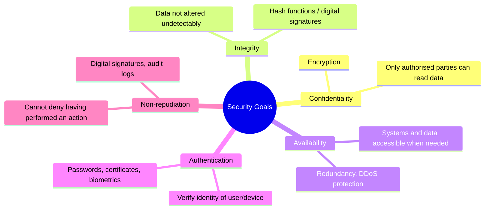
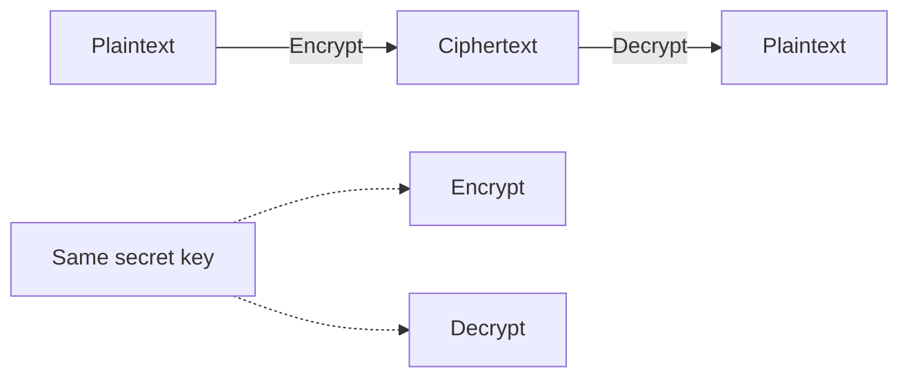
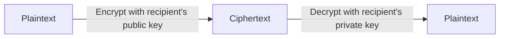
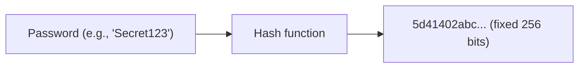
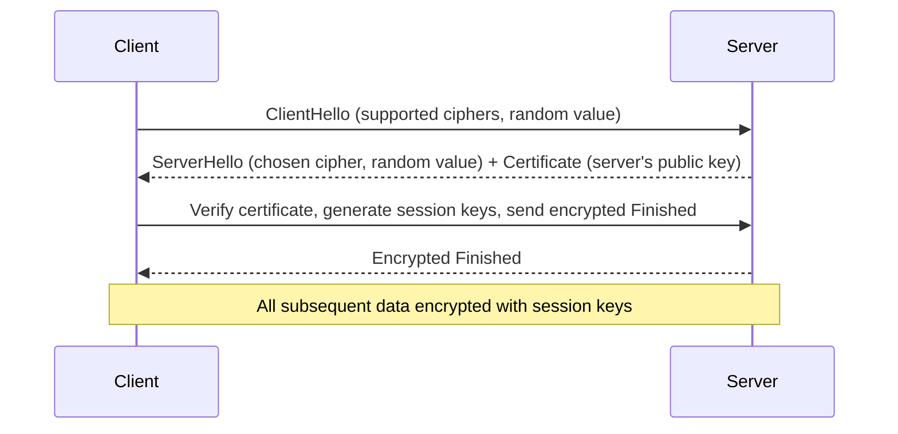
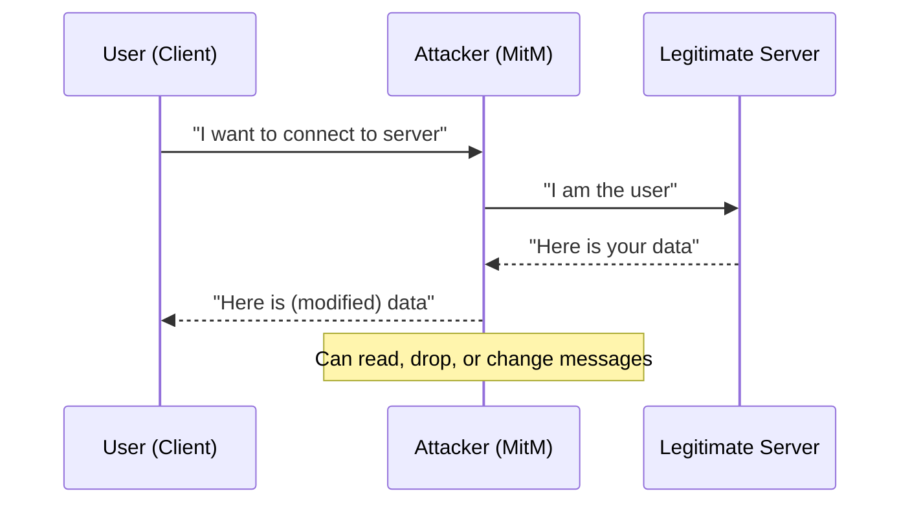
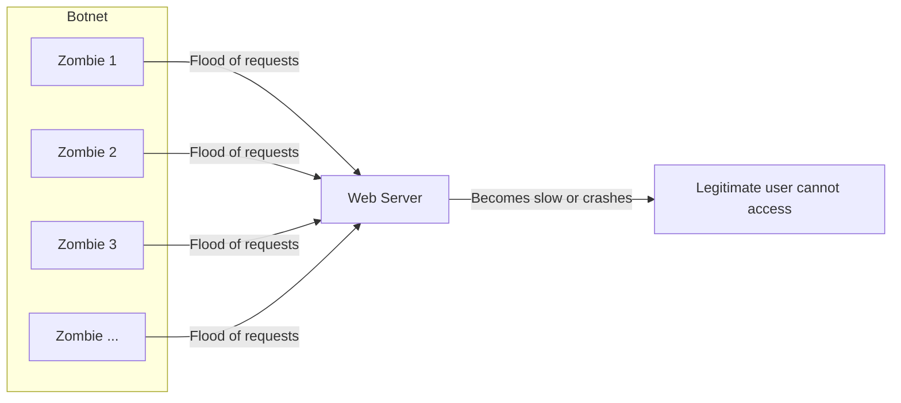
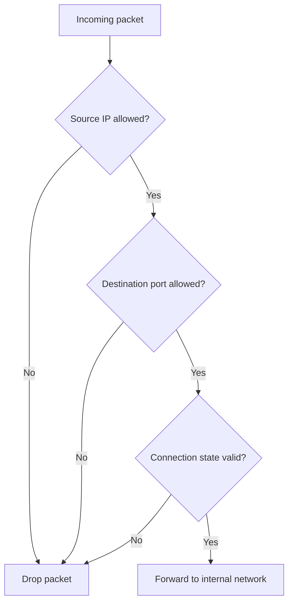
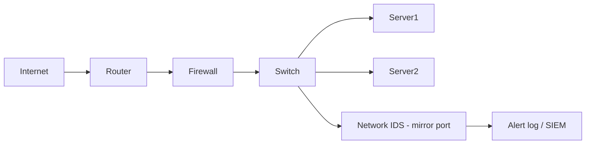

# Chapter 8: Network Security

Network security is the practice of protecting data, devices, and communications from unauthorized access, misuse, or destruction. This chapter covers the fundamental goals of security, the cryptographic building blocks, key security protocols (SSL/TLS, HTTPS), common attacks (phishing, MitM, DoS/DDoS), and protection mechanisms (firewalls, intrusion detection systems).

---

## 1. Security Goals (The CIA Triad + Non‑repudiation)

Security objectives are often summarised as **Confidentiality**, **Integrity**, **Availability** – plus **Authentication** and **Non‑repudiation**.



| Goal | Meaning | Real‑world example |
|------|---------|--------------------|
| **Confidentiality** | Prevent unauthorised reading | Encrypting a WhatsApp message so only recipient can read it |
| **Integrity** | Prevent unauthorised modification | Using a checksum to verify a downloaded file wasn’t tampered |
| **Availability** | Ensure service is accessible | Website remains online during a flash sale |
| **Authentication** | Prove identity | Logging into online banking with username + OTP |
| **Non‑repudiation** | Prevent denial of an action | Digitally signed contract – sender cannot claim they didn’t send it |

---

## 2. Cryptography

Cryptography is the art of securing communication by transforming data into an unreadable format (ciphertext) and back.

### 2.1 Symmetric Key Encryption

- **Same key** for encryption and decryption.
- Fast and efficient for bulk data.
- Problem: securely sharing the key between parties.



**Common algorithms**: AES (Advanced Encryption Standard), ChaCha20, DES (legacy).

**Example**:  
- Encrypting a hard drive with BitLocker (uses AES).  
- Wi‑Fi WPA2 uses AES for data confidentiality.

### 2.2 Asymmetric Key Encryption (Public Key)

- **Key pair**: public key (share freely) and private key (kept secret).
- Data encrypted with **public key** can only be decrypted with the matching **private key**.
- Much slower than symmetric; often used to exchange a symmetric session key.



**Common algorithms**: RSA, ECC (Elliptic Curve Cryptography).

**Real‑world use**:  
- HTTPS: browser uses server’s public key to send a secret symmetric key (TLS handshake).  
- Email encryption (PGP).  
- Digital signatures (sign with private key, verify with public key).

### 2.3 Hash Functions

- **One‑way** function: input → fixed‑length output (hash/digest).
- Cannot reverse a hash to find the original input.
- Same input always produces the same hash.
- Small change in input → completely different hash (avalanche effect).



**Common algorithms**: SHA‑256, SHA‑3, MD5 (broken, not secure).

**Applications**:
- **Password storage**: store hash, not plaintext. When user logs in, hash the entered password and compare.
- **Integrity checking**: download a file + its SHA‑256 hash; recompute hash to verify no corruption.
- **Digital signatures**: sign the hash of a message (faster than signing whole message).

---

## 3. Security Protocols: SSL/TLS and HTTPS

### 3.1 SSL / TLS (Transport Layer Security)

- **SSL** (Secure Sockets Layer) is deprecated; **TLS** (Transport Layer Security) is the modern standard.
- Operates between the Application layer (HTTP) and Transport layer (TCP).
- Provides: confidentiality (encryption), integrity (message authentication codes), and authentication (certificates).

**Simplified TLS 1.3 handshake**:



**Certificate**: Binds a domain name to a public key, digitally signed by a Certificate Authority (CA) (e.g., Let’s Encrypt, DigiCert).

### 3.2 HTTPS (HTTP over TLS)

- **Port 443**.
- HTTP messages are sent inside a TLS tunnel.
- Protects against eavesdropping (no one sees your search terms), tampering (no injected ads by ISP), and impersonation (you are talking to the real `paypal.com`).

**How a browser verifies a certificate**:
1. Checks that the certificate’s domain matches the URL.
2. Checks that the certificate is not expired.
3. Checks that the signature is from a trusted CA (list built into OS/browser).
4. (Optional) checks revocation status via OCSP/CRL.

> **Example**: When you visit `https://github.com`, the browser performs a TLS handshake with GitHub’s server, verifies its certificate, and then sends the HTTP request encrypted.

---

## 4. Common Attacks

### 4.1 Phishing

- Attacker impersonates a legitimate entity (bank, IT support) to trick the user into revealing credentials, credit card numbers, or clicking malicious links.
- Usually delivered via email, SMS (smishing), or fake websites.

```mermaid
flowchart TD
    A[Attacker sends fake email: "Your password expired, click here"] --> B[User clicks link]
    B --> C[Fake login page that looks like real bank]
    C --> D[User enters real username/password]
    D --> E[Attacker collects credentials]
    E --> F[Attacker logs into real bank account]
```

**Prevention**:  
- Check sender address and URL carefully.  
- Use multi‑factor authentication (MFA).  
- Browser warnings for known phishing sites.  
- User education.

### 4.2 Man‑in‑the‑Middle (MitM)

- Attacker secretly intercepts and possibly alters communication between two parties who believe they are talking directly.
- Can happen on unencrypted Wi‑Fi (evil twin access point), ARP spoofing, or compromised routers.



**Prevention**:  
- HTTPS with proper certificate validation (browser will warn if certificate is spoofed).  
- Avoid public Wi‑Fi without VPN.  
- Use mutual authentication (e.g., client certificates).

### 4.3 DoS / DDoS (Denial of Service)

- **DoS**: Single source floods a target with traffic, making it unavailable.
- **DDoS**: Multiple compromised machines (botnet) coordinate the attack.

**Types**:
- **Volumetric**: Flood bandwidth (UDP floods, ICMP floods).
- **Protocol**: Exploit weaknesses in protocols (SYN flood, Ping of Death).
- **Application layer**: Slow HTTP requests, exhausting server resources.



**Real‑world example**: 2016 Dyn DNS attack – massive DDoS using Mirai botnet (IoT devices) took down Twitter, Netflix, and others.

**Protection**:  
- Rate limiting, firewalls, intrusion prevention systems.  
- Content Delivery Networks (CDNs) like Cloudflare absorb traffic.  
- Over‑provisioning bandwidth and using DDoS mitigation services.

---

## 5. Protection Mechanisms

### 5.1 Firewalls

A firewall monitors and controls incoming/outgoing network traffic based on predefined rules.

**Types**:

| Type | How it works | Example |
|------|--------------|---------|
| **Packet filtering** | Inspects headers (IP, port, protocol) | iptables, Windows Firewall |
| **Stateful inspection** | Tracks connection state (e.g., allows return traffic) | Most modern firewalls |
| **Application layer (Next‑Gen)** | Deep packet inspection, understands HTTP, DNS, etc. | Palo Alto, Fortinet |

**Example rule** (conceptual):
- Block all incoming traffic on port 23 (Telnet).
- Allow outgoing HTTPS (port 443) from any internal IP.
- Allow SSH (port 22) only from the IT department’s IP range.



### 5.2 Intrusion Detection Systems (IDS)

- **IDS** passively monitors traffic and alerts when suspicious patterns (signatures) or anomalies are detected.
- Does **not** block traffic (unlike Intrusion Prevention System – IPS).

**Two main detection methods**:
1. **Signature‑based** – matches known attack patterns (e.g., a specific exploit string). Fast but cannot detect new attacks (zero‑day).
2. **Anomaly‑based** – learns normal behaviour and alerts on deviations. Can find novel attacks but may have false positives.

**Deployment**:
- **NIDS** (Network IDS): monitors a network segment (e.g., at a switch span port).
- **HIDS** (Host‑based IDS): runs on a server, monitors logs, file integrity, system calls.



**Example**: Snort (open source NIDS) can alert when it sees a known SQL injection attempt like `' OR '1'='1` in a HTTP request.

---

## Summary Table of Security Topics

| Topic | Key concept | Real‑world tool/protocol |
|-------|-------------|--------------------------|
| Confidentiality | Encryption keeps data secret | AES, TLS |
| Integrity | Hash functions detect changes | SHA‑256, HMAC |
| Authentication | Prove identity | Passwords, certificates, MFA |
| Non‑repudiation | Digital signatures | RSA + SHA‑256 |
| Symmetric encryption | Same key for both sides | AES‑256 |
| Asymmetric encryption | Public / private key pair | RSA, ECC |
| Hash function | One‑way fingerprint | SHA‑256 |
| TLS/SSL | Encrypts application data | HTTPS (port 443) |
| Phishing | Social engineering, fake login pages | MFA, user training |
| Man‑in‑the‑middle | Intercepting communication | Certificate validation, VPN |
| DDoS | Overwhelming resources | Cloudflare, rate limiting |
| Firewall | Filters packets by rules | iptables, pfSense |
| IDS | Detects intrusions, alerts | Snort, Suricata |

---

## Final Notes

- **Defence in depth** – use multiple layers: firewall, IDS, encryption, strong authentication.
- **No single solution** guarantees security; people, processes, and technology must work together.
- **Threat landscape evolves** – keep software updated, monitor logs, and practice incident response.

Understanding these security fundamentals is essential for designing, operating, and auditing networks in any organisation.