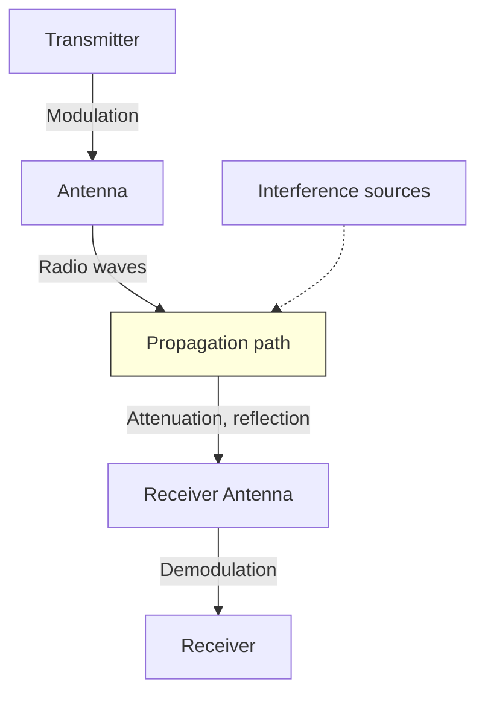
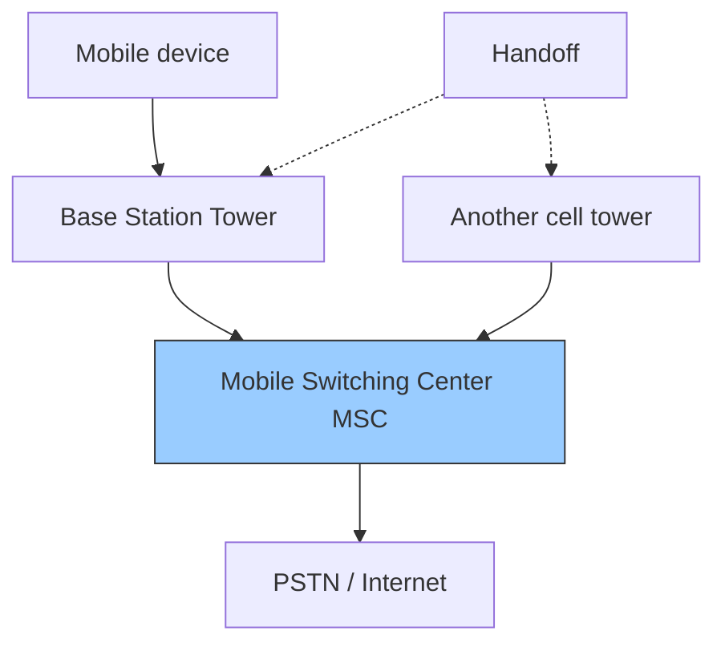
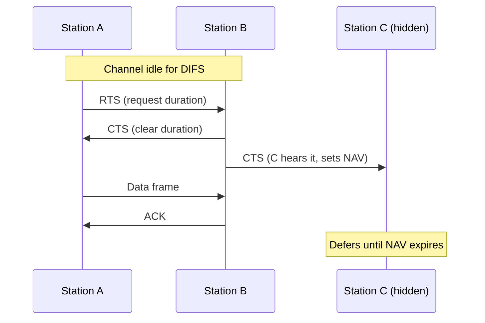
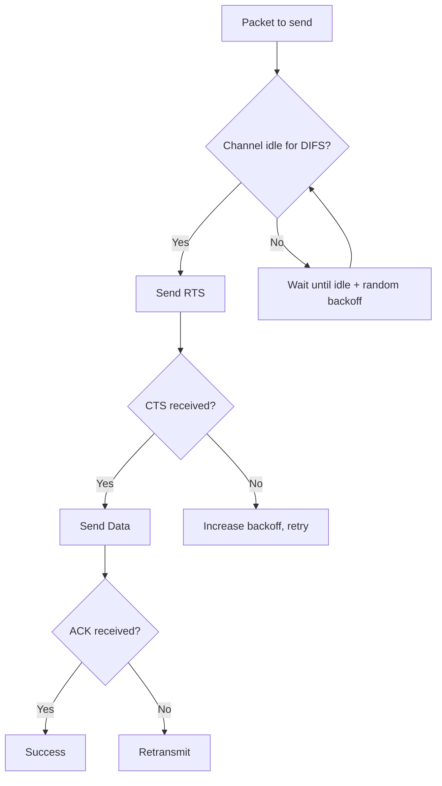

# Chapter 10: Wireless and Mobile Networks

This chapter covers the fundamentals of wireless communication, cellular networks, Wi-Fi (IEEE 802.11) including its architecture and medium access control (CSMA/CA), and a basic overview of Mobile IP. Diagrams using Mermaid and practical examples are included.

## Basics of Wireless Communication

Wireless communication transmits data over the air using electromagnetic waves (radio frequencies, microwaves, infrared). Key challenges and concepts:

- **Signal attenuation** – Signal weakens with distance and obstacles.
- **Interference** – Other devices operating on same frequency cause collisions.
- **Multipath propagation** – Signals bounce off objects, arriving at different times.
- **Hidden terminal problem** – Two stations out of range of each other but both in range of an access point may collide.
- **SNR (Signal-to-Noise Ratio)** – Higher SNR gives better data rates.

### Wireless vs. Wired

| Feature               | Wired (Ethernet)        | Wireless (Wi-Fi)          |
|-----------------------|-------------------------|---------------------------|
| Medium                | Copper/fiber            | Air (RF)                  |
| Collision detection   | CSMA/CD (easy)          | Hard to detect while transmitting |
| Interference          | Low                     | High (other networks, devices) |
| Mobility              | Limited by cable        | Full mobility within coverage |

### Basic Wireless Communication Diagram



## Cellular Networks

Cellular networks divide geographical area into **cells**, each served by a base station (cell tower). Cells reuse frequencies to maximise capacity.

### Key Components

- **Mobile Station (MS)** – User device (phone, modem).
- **Base Station (BS)** – Tower with transceiver.
- **Mobile Switching Center (MSC)** – Connects calls, manages handoff, links to PSTN.
- **Handoff** – Transferring an active call from one cell to another as the user moves.

### Generations Overview

| Generation | Key Features                         | Data Rate       |
|------------|--------------------------------------|-----------------|
| 2G (GSM)   | Digital voice, SMS                   | ~100 kbps       |
| 3G (UMTS)  | Mobile data, video calls             | 384 kbps – 2 Mbps |
| 4G (LTE)   | All-IP, low latency, streaming       | 10–100 Mbps     |
| 5G         | Ultra-low latency, massive IoT, mmWave| 1–10 Gbps       |

### Cellular Architecture



**Example**  
While driving and on a 4G LTE call, your phone measures signal strength from neighbouring towers. When the current tower’s signal drops below a threshold, the MSC coordinates a **hard handoff** (or soft in CDMA) to the stronger tower without dropping the call.

## Wi-Fi (IEEE 802.11)

Wi-Fi is a family of wireless local area network (WLAN) standards operating in 2.4 GHz, 5 GHz, and 6 GHz bands. Common versions: 802.11a/b/g/n/ac/ax (Wi-Fi 6).

### Architecture

Wi-Fi networks use two main modes:

1. **Infrastructure mode** – Devices (stations, STA) communicate via an **Access Point (AP)**. The AP connects to a wired network (e.g., Ethernet, DSL).
2. **Ad‑hoc mode** – Devices communicate directly (IBSS – Independent Basic Service Set). Less common today.

**Basic Service Set (BSS)** – One AP plus associated stations.  
**Extended Service Set (ESS)** – Multiple APs with the same SSID, allowing roaming.

### Wi-Fi Architecture Diagram

```mermaid
graph TD
    subgraph BSS 1
        AP1[Access Point 1]
        STA1[Station 1]
        STA2[Station 2]
        STA1 --- AP1
        STA2 --- AP1
    end
    subgraph BSS 2
        AP2[Access Point 2]
        STA3[Station 3]
        STA3 --- AP2
    end
    AP1 ---|Distribution System (Ethernet)| AP2
    AP1 ---|Internet| R[Router]
```

### CSMA/CA (Carrier Sense Multiple Access with Collision Avoidance)

Wireless cannot use CSMA/CD (Collision Detection) because:
- A station cannot listen while transmitting (half‑duplex radio).
- Hidden terminals make collisions hard to detect.

**CSMA/CA** uses **collision avoidance** via:

- **Physical carrier sensing** – Listen before talk. If channel idle for DIFS (DCF Interframe Space), transmit.
- **Virtual carrier sensing** – Use **RTS/CTS** (Request to Send / Clear to Send) frames to reserve the channel.
- **Random backoff** – After a busy channel becomes idle, wait random time to reduce simultaneous transmissions.

#### RTS/CTS Mechanism

1. Sender sends **RTS** (contains duration).
2. Receiver replies with **CTS** (also contains duration).
3. All other stations hear either RTS or CTS and set their **NAV** (Network Allocation Vector) – a timer to defer transmission.
4. Sender transmits data.
5. Receiver sends **ACK**.

This solves hidden terminal problem.



**Example**  
In a home Wi‑Fi network, two laptops near the router but out of each other’s range (hidden terminals) both try to upload a file. RTS/CTS prevents collisions – one laptop’s RTS reaches the router, the router sends CTS that both laptops hear, so the other waits.

### CSMA/CA Flowchart



## Mobile IP (Basic Overview)

Mobile IP allows a mobile device (mobile node) to change its point of attachment to the Internet without changing its IP address, maintaining ongoing connections (e.g., TCP sessions).

### Key Components

- **Mobile Node (MN)** – The roaming device.
- **Home Agent (HA)** – A router on the mobile node’s home network. Tracks the mobile node’s current location.
- **Foreign Agent (FA)** – A router on the visited network. Provides care‑of address and assists delivery.
- **Care‑of Address (CoA)** – The temporary IP address of the mobile node while away from home.

### Operation (Three Phases)

1. **Agent Discovery** – HA and FA advertise their presence via ICMP router discovery messages. MN detects when it is away.
2. **Registration** – MN registers its CoA with HA (via FA if needed). HA creates a mobility binding.
3. **Tunneling** – Packets sent to MN’s home IP are intercepted by HA, encapsulated (IP‑in‑IP) and forwarded to CoA. FA decapsulates and delivers to MN.

### Mobile IP Tunneling Diagram

```mermaid
graph LR
    CN[Correspondent Node] -->|Packet to MN's home IP| HA[Home Agent]
    HA -->|Encapsulated tunnel| FA[Foreign Agent]
    FA -->|Decapsulate| MN[Mobile Node]
    MN -->|Reverse tunnel (optional)| HA
    HA -->|Forward| CN
    style HA fill:#f9c,stroke:#333
    style FA fill:#c9f,stroke:#333
```

**Example**  
A travelling salesperson with a laptop (home IP 192.168.1.10) connects to a hotel Wi‑Fi. The hotel’s router acts as FA. The laptop registers its care‑of address (10.0.0.5) with its home agent back at the office. The home agent tunnels any incoming traffic (e.g., ongoing VoIP call) to 10.0.0.5, so the call continues uninterrupted.

### Limitations of Mobile IP

- **Triangle routing** – Traffic from CN to MN goes via HA, increasing latency. Route optimisation exists but adds complexity.
- **Security** – Registration and tunnelling need authentication (IPsec).
- **Ingress filtering** – Some networks drop packets with non‑topological source addresses.

## Summary Table

| Topic                     | Key Points                                                                 |
|---------------------------|----------------------------------------------------------------------------|
| Wireless basics           | Attenuation, interference, hidden terminal, SNR                           |
| Cellular networks         | Cells, handoff, MSC, evolution 2G→5G                                      |
| Wi‑Fi architecture        | BSS, ESS, infrastructure mode, AP, stations                               |
| CSMA/CA                   | Physical + virtual carrier sensing, RTS/CTS, NAV, random backoff          |
| Mobile IP                 | Home/Foreign agent, care‑of address, tunnelling, triangle routing         |

These concepts are essential for understanding how modern wireless and mobile networks provide connectivity, mobility, and acceptable performance despite inherent physical limitations.