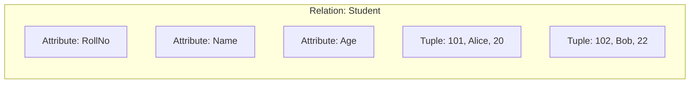
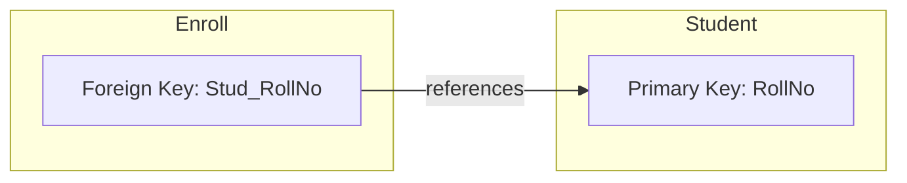
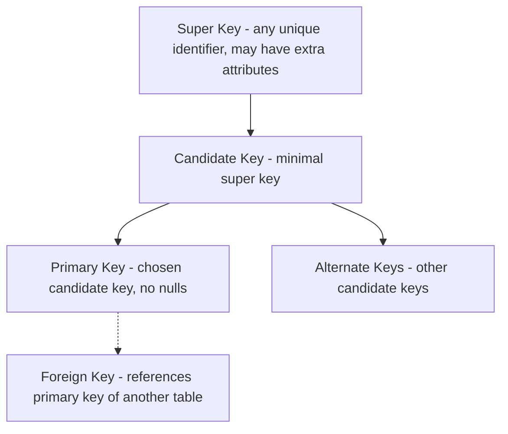
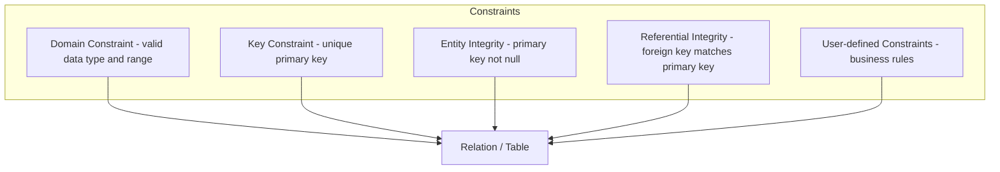
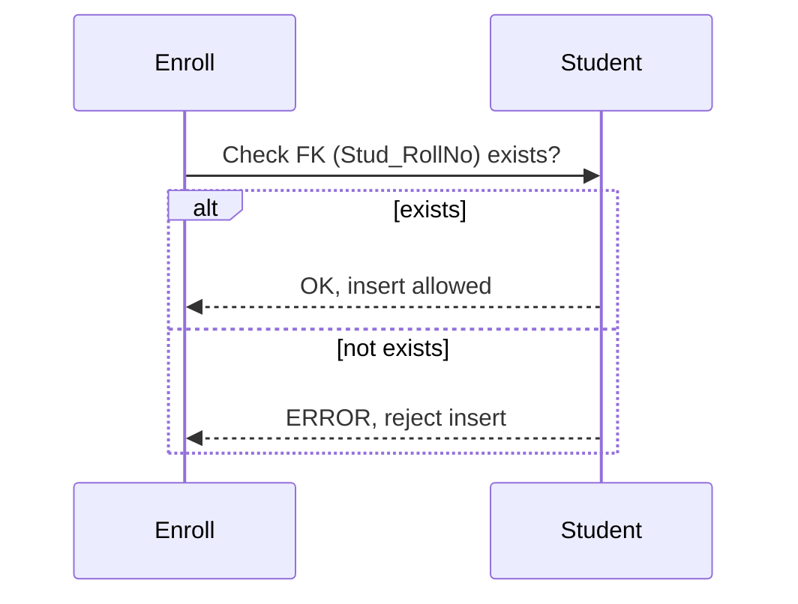
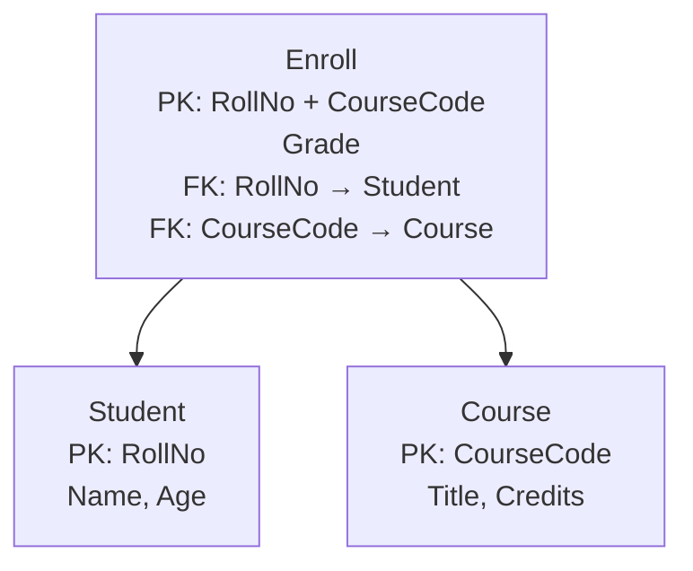

# Chapter 2: Relational Model

## 1. Relation, Tuple, Attribute

The relational model represents data as a **table** (relation).

| Term | Definition | Analogy |
|------|------------|---------|
| **Relation** | A table with rows and columns | A spreadsheet |
| **Tuple** | A row in the relation | A record / row |
| **Attribute** | A column in the relation | A field |

**Example** – `Student` relation:

| RollNo (Attribute) | Name (Attribute) | Age (Attribute) |
|--------------------|------------------|----------------|
| 101                | Alice            | 20              | ← Tuple
| 102                | Bob              | 22              | ← Tuple



**Properties of relations**:
- Each tuple is unique (no duplicate rows).
- Order of tuples does not matter.
- Order of attributes does not matter (but usually fixed).
- Each attribute has a domain (data type).

---

## 2. Keys

Keys are attributes (or sets of attributes) that uniquely identify tuples.

### 2.1 Super Key

A **super key** is any set of attributes that uniquely identifies a tuple. It may contain extra attributes.

**Example**: In `Student(RollNo, Name, Age)`
- `{RollNo}` → super key (minimal)
- `{RollNo, Name}` → super key (redundant)
- `{Name, Age}` → not a super key (Name may duplicate)

### 2.2 Candidate Key

A **candidate key** is a minimal super key – no proper subset is a super key.

**Example**:
- `{RollNo}` is a candidate key (if RollNo is unique).
- `{Name}` may be a candidate key only if names are guaranteed unique (rare).

### 2.3 Primary Key

The **primary key** is one candidate key chosen by the database designer as the main identifier. It cannot be `NULL`.

**Example**: `RollNo` chosen as primary key.

### 2.4 Foreign Key

A **foreign key** is an attribute (or set) in one relation that refers to the primary key of another relation. It establishes a relationship between tables.

**Example**: `Enroll` table has `Stud_RollNo` that references `Student(RollNo)`.



**Hierarchy of keys**:



---

## 3. Integrity Constraints

Integrity constraints ensure data accuracy and consistency.

| Constraint | Description | Example |
|------------|-------------|---------|
| **Domain constraint** | Attribute values must be from a predefined domain (data type, range) | Age between 0 and 120 |
| **Key constraint** | No two tuples have the same primary key value | RollNo unique |
| **Entity integrity** | Primary key cannot be `NULL` | RollNo always present |
| **Referential integrity** | Foreign key value must match an existing primary key in the referenced table (or be `NULL` if allowed) | Every `Stud_RollNo` in Enroll must exist in Student |
| **User-defined constraint** | Business rules not covered by others | Salary > 0, Email format |



**Referential integrity diagram** (using sequence diagram style):



---

## 4. Relational Schema

A **relational schema** describes the structure of a relation – its name, attributes, domains, and constraints.

**Notation**:
- Relation name followed by list of attributes.
- Primary key underlined.
- Foreign key indicated with arrow.

**Example** – University database:

```
Student( RollNo, Name, Age )
Enroll( RollNo, CourseCode, Grade )
Course( CourseCode, Title, Credits )
```

with:
- Primary keys: `RollNo` in Student, `CourseCode` in Course, `(RollNo, CourseCode)` in Enroll.
- Foreign key: `Enroll.RollNo` references `Student.RollNo`; `Enroll.CourseCode` references `Course.CourseCode`.

```mermaid
flowchart LR
    subgraph Schema
        S[Student(RollNo, Name, Age)]
        E[Enroll(RollNo, CourseCode, Grade)]
        C[Course(CourseCode, Title, Credits)]
    end
    E -->|FK RollNo| S
    E -->|FK CourseCode| C
```

**Schema diagram** (detailed):



---

## Summary Table

| Concept | Definition |
|---------|------------|
| **Relation** | Table with rows and columns |
| **Tuple** | Row of a relation |
| **Attribute** | Column of a relation |
| **Super key** | Set of attributes that uniquely identifies a tuple |
| **Candidate key** | Minimal super key |
| **Primary key** | Chosen candidate key, not null |
| **Foreign key** | References primary key of another relation |
| **Domain constraint** | Attribute values must be from allowed set |
| **Key constraint** | No duplicate primary keys |
| **Entity integrity** | Primary key cannot be null |
| **Referential integrity** | Foreign key must match existing primary key |
| **Relational schema** | Description of relation structure (name, attributes, keys) |

---