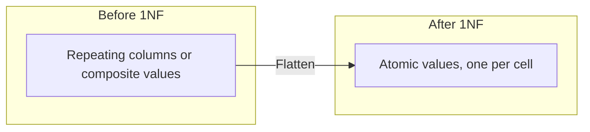
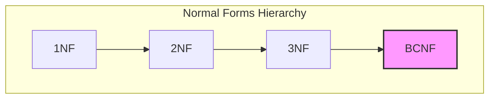
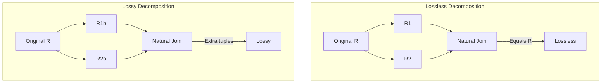
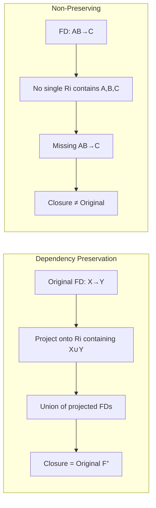
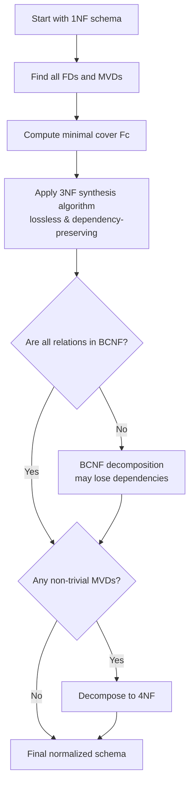

# Chapter 7: Normalization

Normalization is the process of decomposing relational schemas to eliminate redundancy and avoid update anomalies (insertion, deletion, and modification anomalies). It is based on the theory of functional dependencies and, for higher normal forms, multi-valued dependencies. This chapter covers the first four normal forms, the conditions for lossless decomposition, and the concept of dependency preservation.

## 7.1 First Normal Form (1NF)

### Definition
A relation schema R is in **First Normal Form (1NF)** if the domain of every attribute is **atomic** (indivisible). No attribute can contain sets, lists, composite values, or repeating groups. Every tuple contains exactly one value (possibly NULL) per attribute.

### Violations and Resolution
Violations occur in two common forms:
- **Repeating columns**: e.g., `phone1`, `phone2`, `phone3`.
- **Set-valued attributes**: e.g., `phone_numbers` containing "555-1111,555-2222".

**Resolution**: Flatten the relation by creating a separate tuple for each value in the multi-valued attribute.

**Example (repeating columns)**:

| emp_id | name  | phone1   | phone2   |
|--------|-------|----------|----------|
| 101    | Alice | 555-1111 | 555-2222 |

After 1NF:

| emp_id | name  | phone_number |
|--------|-------|--------------|
| 101    | Alice | 555-1111     |
| 101    | Alice | 555-2222     |

**Diagram**:



### Importance
1NF is mandatory for all relational database systems. It eliminates nested structures and ensures that each row-column intersection contains a single value.

## 7.2 Second Normal Form (2NF)

### Prerequisite
The relation must already be in 1NF.

### Definition
A relation is in **2NF** if it has **no partial dependency**: no non-prime attribute (an attribute that is not part of any candidate key) is functionally dependent on only a **proper subset** of any candidate key. In other words, every non-prime attribute must be **fully functionally dependent** on every candidate key.

### Partial Dependency Explained
Given a candidate key that is composite (e.g., `(student_id, course_id)`), a partial dependency occurs when a non-prime attribute depends on only one part of the key (e.g., `student_id → student_name`).

### Example Violation
Consider `Enroll(student_id, course_id, student_name, grade)`.
- Candidate key: `(student_id, course_id)`.
- Non-prime attributes: `student_name`, `grade`.
- FD: `student_id → student_name` exists. Here, `student_name` depends on a proper subset of the key (`student_id` alone). This is a partial dependency → violates 2NF.

### Decomposition to 2NF
Decompose into:
- `Student(student_id, student_name)` – all attributes depend on the full key.
- `Enroll(student_id, course_id, grade)` – the remaining attributes depend on the full key.

### Formal Algorithm for 2NF
Given a relation R with candidate keys and a set of FDs F:
1. Identify all partial dependencies: for each candidate key K that is composite, if there exists an FD X → Y where X ⊂ K, X is non‑empty, and Y contains non‑prime attributes.
2. For each such X → Y, create a new relation `(X ∪ Y)` and remove Y from the original relation.
3. Ensure each relation is in 1NF and has no remaining partial dependencies.

**Diagram**:

```mermaid
flowchart TD
    subgraph "1NF with composite key"
        R[Enroll(student_id, course_id, student_name, grade)<br/>Partial: student_id → student_name]
    end
    subgraph "2NF Decomposition"
        S[Student(student_id, student_name)]
        E[Enroll(student_id, course_id, grade)]
    end
    R --> S
    R --> E
```

## 7.3 Third Normal Form (3NF)

### Prerequisite
The relation must be in 2NF.

### Definition
A relation is in **3NF** if it has **no transitive dependency**: for every non‑trivial functional dependency X → Y, either:
- X is a superkey, **or**
- Y is prime (i.e., every attribute in Y is part of some candidate key).

Equivalently, no non‑prime attribute is functionally dependent on another non‑prime attribute.

### Transitive Dependency Explained
A transitive dependency occurs when X → Y and Y → Z, with Y not being a candidate key and Z being non‑prime. Then X → Z is transitive and undesirable.

### Example Violation
Consider `Employee(emp_id, dept_id, dept_location)` with FDs:
- `emp_id → dept_id`
- `dept_id → dept_location`
Here, `emp_id → dept_location` is transitive via `dept_id`. `dept_location` is non‑prime and depends on `dept_id` (a non‑superkey). This violates 3NF.

### Decomposition to 3NF
Decompose into:
- `Employee(emp_id, dept_id)`
- `Department(dept_id, dept_location)`

### Synthesis Algorithm for 3NF (Lossless, Dependency‑Preserving)
Given a relation R and a set of FDs F:
1. Compute a minimal cover `Fc` of F.
2. For each FD X → Y in Fc, create a relation schema `(X ∪ Y)`.
3. If none of the created schemas contains a candidate key of R, add an additional relation that contains a candidate key.
4. Eliminate any relation that is a subset of another.

This algorithm guarantees a 3NF decomposition that is both lossless and dependency‑preserving.

**Diagram**:

```mermaid
flowchart LR
    subgraph "Transitive dependency"
        A[emp_id] --> B[dept_id] --> C[dept_location]
    end
    subgraph "3NF Decomposition"
        R1[Employee(emp_id, dept_id)]
        R2[Department(dept_id, dept_location)]
    end
```

## 7.4 Boyce-Codd Normal Form (BCNF)

### Definition
A relation is in **BCNF** if for every non‑trivial functional dependency X → Y (where Y is not a subset of X), X is a **superkey**. BCNF is a stronger version of 3NF: it removes all redundancy based on functional dependencies, but may sacrifice dependency preservation.

### Difference from 3NF
In 3NF, a dependency X → Y is allowed if Y is prime (i.e., part of a candidate key) even when X is not a superkey. BCNF forbids this. Thus BCNF is stricter.

### Example Violation of BCNF but Not 3NF
Consider `Instructor(course_id, instructor_id, office)` with FDs:
- `course_id → instructor_id` (each course has one instructor)
- `instructor_id → office` (each instructor has one office)
Candidate keys: `(course_id)` only? Let's examine: `course_id` determines `instructor_id`, and `instructor_id` determines `office`. So `course_id` alone determines all attributes? Yes, `course_id → instructor_id, office`. So candidate key = `{course_id}`. Now FD `instructor_id → office` violates BCNF because `instructor_id` is not a superkey. However, is it allowed in 3NF? `office` is non‑prime, and `instructor_id` is not a superkey, so it also violates 3NF? Actually, in this example it violates both. Let's construct a classic BCNF/3NF difference:

Classic example: `R(A, B, C)` with FDs: `AB → C` and `C → B`. Candidate keys: `AB` and `AC`. Here, `C → B` has `C` not a superkey, but `B` is prime (part of candidate key `AB`). So the dependency is allowed in 3NF but violates BCNF. That is the distinction.

**BCNF Decomposition Algorithm** (lossless, may lose dependencies):
1. Initialize result = {R}.
2. While there is a relation S in result that is not in BCNF:
   - Choose a non‑trivial FD X → Y in S that violates BCNF (X is not a superkey of S).
   - Replace S with `(X ∪ Y)` and `(S \ Y)`.
3. Continue until all relations are in BCNF.

**Example**: `R(A, B, C)` with FDs `AB → C`, `C → B`. Violation: `C → B`. Decompose:
- First decomposition: `R1(C, B)`, `R2(A, C)`. Now `R1` has `C → B` (C is superkey in R1, so BCNF). `R2` has no non‑trivial FDs except trivial, so BCNF. The decomposition is lossless but the FD `AB → C` is lost because `R2(A, C)` alone does not imply `AB → C`.

**Diagram**:



## 7.5 Fourth Normal Form (4NF) – Basic Idea

### Motivation
BCNF deals only with functional dependencies. However, there exist **multi-valued dependencies (MVDs)** that can cause redundancy even in BCNF relations.

### Multi-valued Dependency (MVD)
An MVD `X →→ Y` (read as "X multi‑determines Y") means that for a given X value, the set of Y values is independent of the set of Z values, where Z is the set of all remaining attributes. Formally, if (x, y1, z1) and (x, y2, z2) are tuples, then (x, y1, z2) and (x, y2, z1) must also be tuples.

### Definition of 4NF
A relation is in **4NF** if it is in BCNF and has **no non‑trivial multi-valued dependencies** except those that are implied by candidate keys (i.e., an MVD X →→ Y where X is a superkey is allowed).

### Example Violation
Consider `Employee_Skills_Languages(emp_id, skill, language)`. Assume each employee can have multiple skills and multiple languages independently. The relation is in BCNF because the only key is all three attributes, and there are no FDs. However, there is an MVD: `emp_id →→ skill` and `emp_id →→ language`. This causes redundancy: for each skill, every language is repeated.

| emp_id | skill  | language |
|--------|--------|----------|
| 1      | Java   | English  |
| 1      | Java   | French   |
| 1      | SQL    | English  |
| 1      | SQL    | French   |

The repetition is eliminated by decomposing into:
- `Employee_Skill(emp_id, skill)`
- `Employee_Language(emp_id, language)`

**Diagram**:

```mermaid
graph LR
    subgraph "Before 4NF (redundancy)"
        A[emp_id | skill | language<br/>1 | Java | English<br/>1 | Java | French<br/>1 | SQL  | English<br/>1 | SQL  | French]
    end
    subgraph "After 4NF"
        B[emp_id | skill<br/>1 | Java<br/>1 | SQL]
        C[emp_id | language<br/>1 | English<br/>1 | French]
    end
    A --> B
    A --> C
```

## 7.6 Lossless Decomposition

### Definition
A decomposition of a relation R into `R1, R2, ..., Rk` is **lossless** (or lossless‑join) if the natural join of all `Ri` yields exactly the original relation R (no spurious tuples and no missing tuples). Losslessness is **mandatory** for any practical decomposition.

### Testing for Binary Decomposition
For a decomposition into `R1` and `R2`, the join is lossless if and only if:
- `(R1 ∩ R2) → R1` **or** `(R1 ∩ R2) → R2` (i.e., the common attributes form a superkey for at least one of the relations).

### Example
`R(A, B, C)` with F = `{A → B}`. Decompose into `R1(A, B)` and `R2(A, C)`. Intersection = `{A}`. Since `A → B` holds, `A` is a superkey of `R1`. Hence lossless.

### Lossy Decomposition Counterexample
`R(A, B, C)` with no FDs (or with `A → B`). Decompose into `R1(A, B)` and `R2(B, C)`. Intersection = `{B}`. `B` is not a superkey of either (no FD `B → A` or `B → C`). The join may produce spurious tuples.

**Diagram**:



### Algorithm for Lossless Decomposition into BCNF
The BCNF decomposition algorithm described earlier always produces a lossless decomposition because each step replaces a relation with two relations whose common attributes include the left‑hand side of a violating FD, which is a superkey of the new relation.

## 7.7 Dependency Preservation

### Definition
A decomposition is **dependency‑preserving** if the union of the projections of the original functional dependencies onto each decomposed relation implies all original dependencies. Formally, let `F` be the set of FDs on `R`. For each `Ri`, compute `π_Ri(F)` = all FDs `X → Y` such that `X ∪ Y ⊆ Ri` and `X → Y` is in `F⁺`. The decomposition is dependency‑preserving if `(π_R1(F) ∪ π_R2(F) ∪ ... ∪ π_Rk(F))⁺ = F⁺`.

In simpler terms: every FD in `F` should be enforceable by checking individual relations without performing joins.

### Example of Preservation
`R(A, B, C)` with `F = {A → B, B → C}`. Decompose into `R1(A, B)` and `R2(B, C)`. Projected FDs: `R1` gives `A → B`; `R2` gives `B → C`. Their union implies `A → C` (transitivity), which was implied by `F`. So dependencies are preserved.

### Example of Non‑Preservation
`R(A, B, C)` with `F = {AB → C, C → B}`. Decompose into `R1(A, C)` and `R2(B, C)` (or into BCNF as earlier: `R1(C, B)`, `R2(A, C)`). Projected FDs: `R1` gives `C → B`; `R2` gives no non‑trivial FDs. The FD `AB → C` cannot be derived from these projections because it involves both `A` and `B` together, which are never in the same relation. Hence the decomposition is **not** dependency‑preserving.

### Importance
Dependency preservation allows efficient integrity checking: each FD can be enforced on a single relation. Without it, checking an FD may require a join, which is expensive. However, BCNF sometimes forces the loss of dependencies; 3NF can always preserve dependencies.

**Diagram**:



## 7.8 Summary Table of Normal Forms

| Normal Form | Condition | Redundancy Eliminated | Dependency Preservation Possible? |
|-------------|-----------|----------------------|------------------------------------|
| 1NF         | Atomic attributes | Repeating groups | N/A |
| 2NF         | No partial dependencies | Redundancy from composite keys | Yes |
| 3NF         | No transitive dependencies | Redundancy from non-key dependencies | Yes (synthesis algorithm) |
| BCNF        | Every FD's left-hand side is a superkey | All FD-based redundancy | Not always |
| 4NF         | No non-trivial MVDs except those implied by keys | MVD-based redundancy | N/A (handles MVDs) |

## 7.9 Practical Design Guidelines

1. **Start from a minimal cover** of functional dependencies.
2. **Decompose to 3NF** using the synthesis algorithm to achieve losslessness and dependency preservation.
3. **Check for BCNF violations**; if present and dependency loss is acceptable, further decompose to BCNF.
4. **Always ensure lossless join** – it is non‑negotiable.
5. **Test for MVDs** only if redundancy remains in BCNF; then normalize to 4NF.

**Algorithmic Flowchart**:



## 7.10 Conclusion

Normalization is a rigorous approach to database design that reduces redundancy and prevents anomalies. First normal form ensures atomicity. Second and third normal forms remove partial and transitive dependencies, respectively. Boyce‑Codd normal form provides a stronger condition but may sacrifice dependency preservation. Fourth normal form addresses multi-valued dependencies. Lossless decomposition is always required, while dependency preservation is highly desirable. Understanding these concepts enables the creation of robust, maintainable relational databases.
