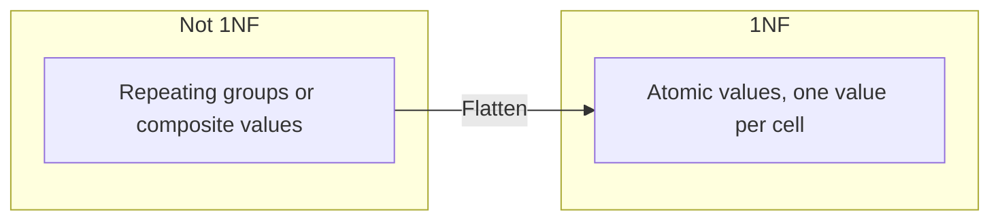
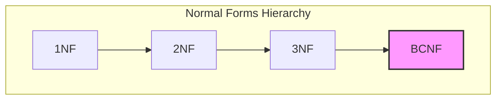
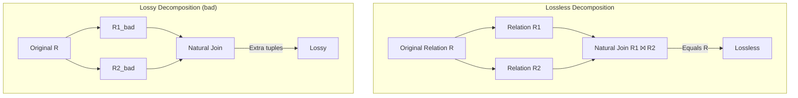
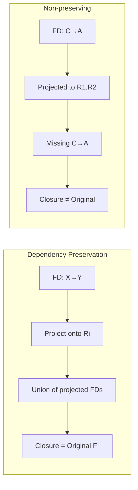
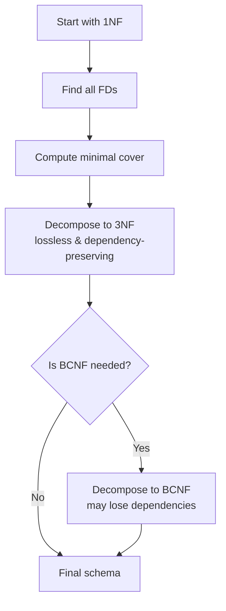

# Chapter 7: Normalization

Normalization is the process of organizing database schemas to reduce redundancy and avoid update anomalies (insertion, deletion, modification anomalies). It involves decomposing relations into smaller, well-structured relations based on functional dependencies and other constraints. The normal forms provide a progression from less normalized (1NF) to more highly normalized (4NF, 5NF).

## 7.1 First Normal Form (1NF)

A relation is in **1NF** if all attribute domains are atomic (indivisible) and every tuple contains a single value for each attribute. In other words, no repeating groups or multi-valued attributes are allowed.

**Example violating 1NF** (repeating groups):

| emp_id | name     | phone_numbers          |
|--------|----------|------------------------|
| 101    | Alice    | 555-1111, 555-2222     |
| 102    | Bob      | 555-3333               |

**Conversion to 1NF** (separate rows for each phone number):

| emp_id | name     | phone_number |
|--------|----------|--------------|
| 101    | Alice    | 555-1111     |
| 101    | Alice    | 555-2222     |
| 102    | Bob      | 555-3333     |

**Diagram**:



## 7.2 Second Normal Form (2NF)

2NF applies to relations already in 1NF. A relation is in **2NF** if it is in 1NF and **no partial dependency** exists: no non-prime attribute (an attribute not part of any candidate key) is functionally dependent on only a proper subset of any candidate key.

**Example violation**: Consider `Enroll(student_id, course_id, student_name, grade)`, with candidate key `(student_id, course_id)`. If `student_id → student_name`, then `student_name` depends only on part of the key → partial dependency.

**Decomposition to 2NF**:
- Create `Student(student_id, student_name)`
- Create `Enroll(student_id, course_id, grade)`

**Diagram**:

```mermaid
flowchart TD
    subgraph "1NF Relation with composite key"
        R[Enroll(student_id, course_id, student_name, grade)<br/>Partial dependency: student_id → student_name]
    end
    subgraph "2NF Decomposition"
        S[Student(student_id, student_name)]
        E[Enroll(student_id, course_id, grade)]
    end
    R --> S
    R --> E
```

## 7.3 Third Normal Form (3NF)

A relation is in **3NF** if it is in 2NF and **no transitive dependency** exists: no non-prime attribute is functionally dependent on another non-prime attribute. Equivalently, for every non-trivial FD X → Y, either X is a superkey or Y is prime (part of a candidate key).

**Example violation**: `Employee(emp_id, dept_id, dept_location)` with FDs: `emp_id → dept_id`, `dept_id → dept_location`. Here `emp_id → dept_location` is transitive via `dept_id`. `dept_location` is non-prime and depends on a non-superkey.

**Decomposition to 3NF**:
- `Employee(emp_id, dept_id)`
- `Department(dept_id, dept_location)`

**Diagram**:

```mermaid
flowchart LR
    subgraph "Transitive dependency"
        A[emp_id] --> B[dept_id] --> C[dept_location]
    end
    subgraph "3NF Decomposition"
        R1[Employee(emp_id, dept_id)]
        R2[Department(dept_id, dept_location)]
    end
```

## 7.4 Boyce-Codd Normal Form (BCNF)

BCNF is a stronger version of 3NF. A relation is in **BCNF** if for every non-trivial FD X → Y, X is a superkey. BCNF eliminates all redundancy based on functional dependencies, but some dependencies may be lost during decomposition.

**Example violation**: `Instructor(instructor_id, course_id, student_id, grade)` with candidate keys `(instructor_id, course_id, student_id)` and `(course_id, student_id)`? Actually, consider `Course(course_id, instructor_id, office)` with FD: `course_id → instructor_id` and `instructor_id → office`. The FD `instructor_id → office` violates BCNF because `instructor_id` is not a superkey (unless `instructor_id` is a candidate key, which it is not).

**BCNF decomposition** (lossless):
- `CourseInfo(course_id, instructor_id)`
- `InstructorOffice(instructor_id, office)`

**Comparison of 3NF and BCNF**:



## 7.5 Fourth Normal Form (4NF) – Basic Idea

4NF addresses multi-valued dependencies (MVDs), which occur when a relation has two or more independent multi-valued attributes. A relation is in **4NF** if it is in BCNF and has **no non-trivial multi-valued dependencies** except those implied by candidate keys.

An MVD X →→ Y means that for a given X, the set of Y values is independent of the set of Z values (where Z contains the remaining attributes). 4NF decomposes such relations to avoid redundancy.

**Example violation**: `Employee_Skills_Languages(emp_id, skill, language)`. Each employee can have multiple skills and multiple languages independently. This leads to repetition: for each skill-language pair, a row appears.

**Decomposition to 4NF**:
- `Employee_Skill(emp_id, skill)`
- `Employee_Language(emp_id, language)`

**Diagram**:

```mermaid
graph LR
    subgraph "Before 4NF (redundancy)"
        A[emp_id | skill | language<br/>1 | Java | English<br/>1 | Java | French<br/>1 | SQL  | English<br/>1 | SQL  | French]
    end
    subgraph "After 4NF"
        B[emp_id | skill<br/>1 | Java<br/>1 | SQL]
        C[emp_id | language<br/>1 | English<br/>1 | French]
    end
    A --> B
    A --> C
```

## 7.6 Lossless Decomposition

A decomposition of a relation R into R1 and R2 is **lossless** (or lossless-join) if the natural join of R1 and R2 yields exactly the original relation R (no spurious tuples). A sufficient condition: the common attributes of R1 and R2 must form a superkey for at least one of R1 or R2.

**Testing lossless join**: For decomposition (R1, R2) with schema R and FD set F, the join is lossless if (R1 ∩ R2) → R1 or (R1 ∩ R2) → R2 is in F⁺.

**Example**: R(A, B, C) with F = {A → B}. Decompose into R1(A, B) and R2(A, C). Intersection = {A}. A → B is in F, so A is a superkey of R1 → lossless.

**Diagram**:



## 7.7 Dependency Preservation

A decomposition is **dependency-preserving** if the union of the functional dependencies projected onto each decomposed relation implies all original FDs. Formally, let F be the original FD set, and let Fi be the projection of F onto relation Ri (all FDs that hold in Ri). The decomposition preserves dependencies if (F1 ∪ F2 ∪ … ∪ Fk)⁺ = F⁺.

**Example**: R(A, B, C) with F = {A → B, B → C}. Decompose into R1(A, B) and R2(B, C). F1 = {A → B}, F2 = {B → C}. Their union implies A → C (via transitivity) which was implied originally. Dependency preserved.

**Non-preserving example**: R(A, B, C) with F = {A → B, B → C, C → A}. Decompose into R1(A, B) and R2(B, C). FD C → A is lost because it cannot be derived from projections (needs A and C together).

**Diagram**:



## 7.8 Summary of Normal Forms

| Normal Form | Condition | Key Characteristic |
|-------------|-----------|---------------------|
| 1NF         | Atomic domains | No repeating groups |
| 2NF         | 1NF + no partial dependency | No non-prime depends on part of candidate key |
| 3NF         | 2NF + no transitive dependency | No non-prime depends on another non-prime |
| BCNF        | For every FD X→Y, X is a superkey | Stronger than 3NF |
| 4NF         | BCNF + no non-trivial MVDs except key implied | Handles independent multi-valued attributes |

## 7.9 Practical Normalization Guidelines

- **Goal**: Achieve at least 3NF or BCNF for most designs.
- **Trade-off**: BCNF may lose dependency preservation; 3NF preserves dependencies but may retain some redundancy.
- **Lossless decomposition is mandatory**; dependency preservation is desirable but not always possible.
- **Normalization steps**:
  1. Identify all functional dependencies.
  2. Compute minimal cover.
  3. Decompose to 3NF (lossless, dependency-preserving algorithm).
  4. Further decompose to BCNF if needed (may lose dependencies).

**Algorithm flowchart**:

