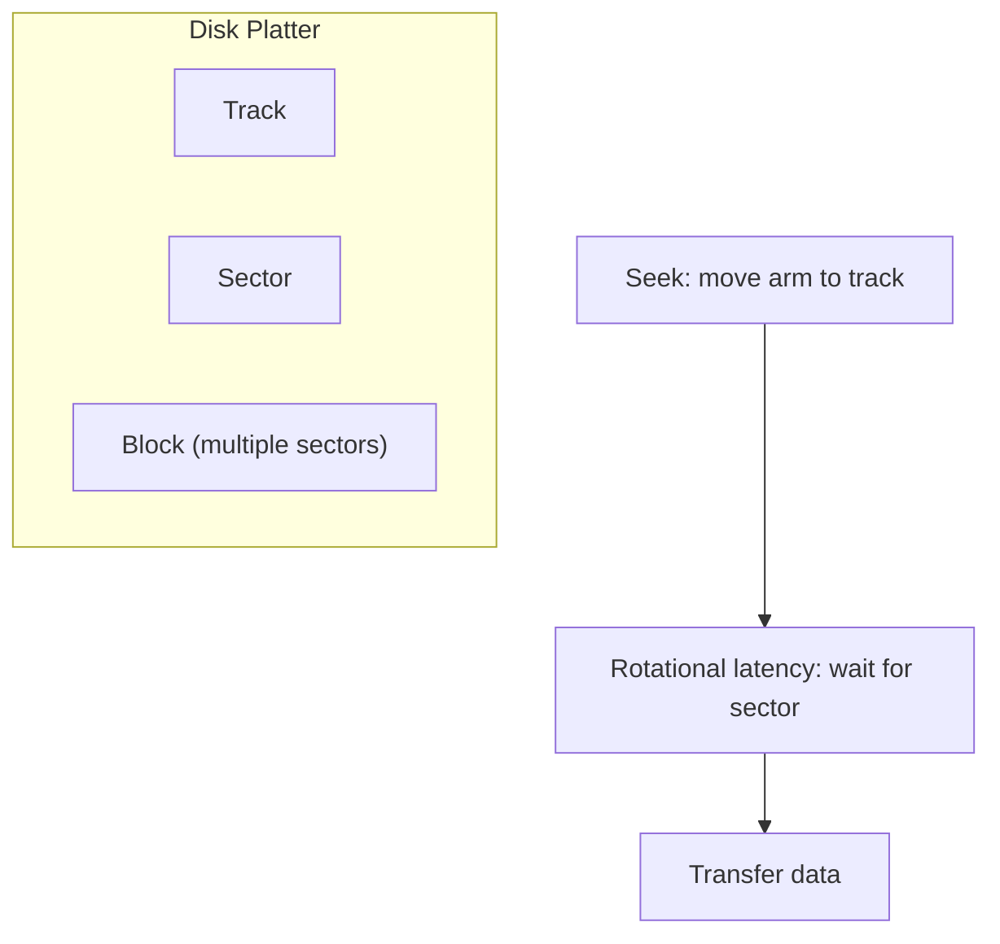
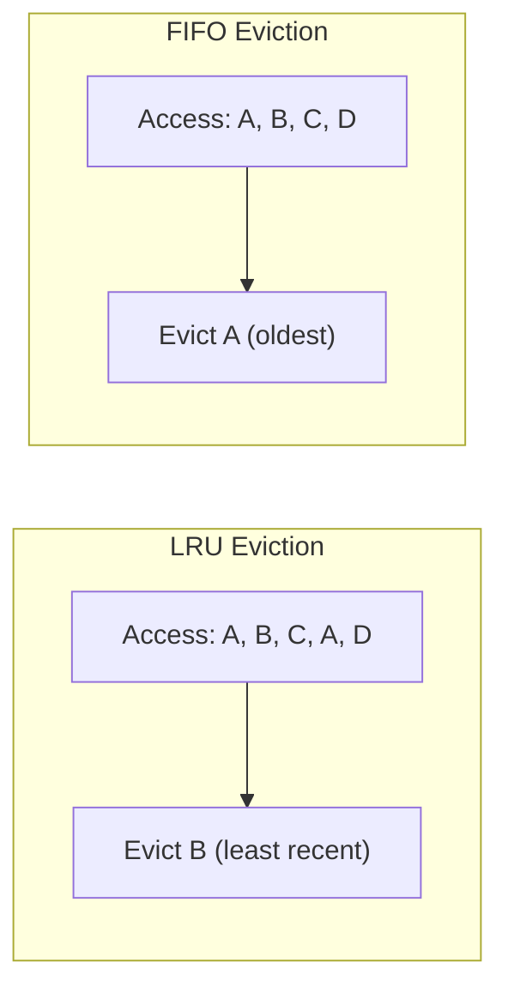
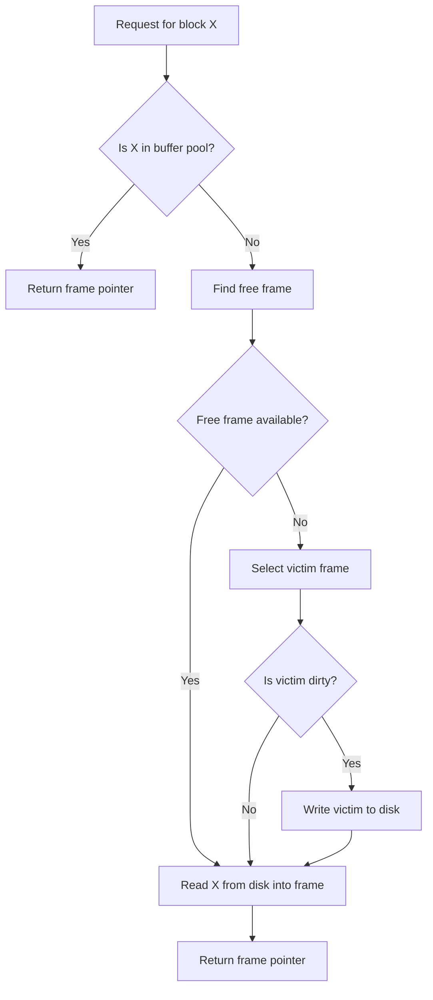
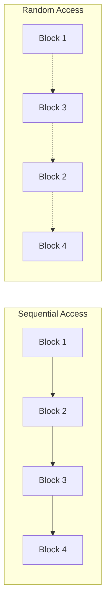

# Chapter 13: Storage and Buffer Management

Efficient database management relies heavily on how data is stored on disk and how it is moved between disk and main memory. Disk I/O is orders of magnitude slower than memory access, making storage and buffer management critical for performance. This chapter describes the physical disk structure, buffer pool management, and the access techniques used to reduce I/O overhead.

## 13.1 Disk Storage Structure

Magnetic hard disk drives (HDDs) and solid‑state drives (SSDs) are the primary persistent storage media in database systems. Understanding HDD geometry helps in optimizing data placement; SSDs have different characteristics but are often abstracted similarly at the file system level.

### 13.1.1 Physical Disk Components (HDD)

A typical HDD consists of:
- **Platters**: Circular magnetic disks stacked on a spindle.
- **Tracks**: Concentric circles on each platter surface.
- **Sectors**: The smallest addressable unit on a track (typically 512 bytes or 4 KB).
- **Blocks (Pages)**: A logical unit of data transfer between disk and memory (usually 4 KB, 8 KB, or 16 KB). A block spans one or more consecutive sectors.
- **Heads**: Read/write heads attached to an arm that moves across tracks.
- **Cylinder**: All tracks at the same radius across all platters.

### 13.1.2 Disk Access Time Components

When reading or writing a block, three delays occur:
1. **Seek time**: Time to move the arm to the correct track. (Dominant cost, 5‑10 ms)
2. **Rotational latency**: Time for the desired sector to rotate under the head (average half a rotation, 2‑4 ms for 7200 RPM).
3. **Transfer time**: Time to read/write the data (negligible for a block, <0.1 ms).

Thus, sequential access (reading consecutive blocks) is much faster than random access because seek and rotational delays are minimized.

**Diagram**:



### 13.1.3 File Organization on Disk

The database management system (DBMS) maps logical database objects (tables, indexes) into files, which are then stored as blocks on disk. Each block has a unique address (disk block number). The DBMS’s storage manager is responsible for allocating, reading, and writing these blocks.

**Block Diagram**:

```mermaid
flowchart LR
    DB[Database Tables] --> File[File] --> Extent[Extents] --> Block[Blocks (4-16 KB)] --> Sector[Sectors (512 B)]
```

## 13.2 Buffer Management

The **buffer manager** is responsible for bringing disk blocks into main memory (the buffer pool) and managing them efficiently. It reduces disk I/O by keeping frequently used blocks in memory.

### 13.2.1 Buffer Pool

The buffer pool is an array of **frames**, each the size of a disk block. When a block is needed, the buffer manager:
1. Checks if the block is already in the buffer pool (cache hit).
2. If not (cache miss), reads the block from disk into a free frame.
3. If no free frame is available, selects a victim frame to evict (using a replacement policy).
4. If the victim frame is dirty (modified), writes it back to disk before eviction.

### 13.2.2 Buffer Replacement Policies

The choice of replacement policy affects buffer hit rates. Common policies:

- **Least Recently Used (LRU)**: Evicts the block that has not been accessed for the longest time. Works well for repeated access patterns.
- **First‑In‑First‑Out (FIFO)**: Evicts the oldest loaded block. Simple but may evict frequently used blocks.
- **Clock (Second Chance)**: An efficient approximation of LRU using a circular list and reference bits.
- **Most Recently Used (MRU)**: Evicts the most recently used block; useful for certain scan patterns.
- **Random**: Evicts a random block; surprisingly effective in some workloads.

**LRU vs FIFO Example Diagram**:



### 13.2.3 Dirty Blocks and Forced Writes

A **dirty block** is a buffer frame that has been modified but not yet written to disk. Before evicting a dirty block, the buffer manager must write it back. This write is called **forced write**. To improve performance, the DBMS may periodically flush dirty blocks using a background writer.

### 13.2.4 Buffer Manager Operations

- **Pin/Unpin**: A pinned block cannot be evicted. Used when a transaction is actively using a block.
- **Flush**: Write a dirty block to disk.
- **Prefetching**: Read blocks ahead of expected use to amortize seek time.

**Buffer Manager Flowchart**:



### 13.2.5 Buffer Management in Practice

- **Local vs Global policies**: Local policies manage buffers per transaction; global policies manage the entire pool.
- **Hysteresis**: Some DBMSs use two thresholds (low water, high water) to control flushing.
- **OS caching**: The DBMS often bypasses the operating system’s file cache (using direct I/O) to avoid double caching and gain control over replacement.

## 13.3 Access Techniques

Access techniques are strategies to minimize disk I/O when retrieving data. They combine file organization, indexing, and buffer management.

### 13.3.1 Sequential Access

Sequential access reads consecutive blocks from disk. Because seek and rotational latency are incurred only once per large read, it is very efficient. Used for:
- Table scans (full table reads).
- Range scans on clustered indexes.
- Sequential file processing.

**Sequential vs Random Access Diagram**:



### 13.3.2 Indexed Access

Using an index (B+‑tree, hash) to locate a record typically requires fewer block accesses than a full scan. For a B+‑tree of height h, a point query reads:
- h index blocks (from root to leaf).
- 1 data block (if not already in buffer).

For range queries, after locating the leftmost leaf, the leaf chain provides sequential access.

### 13.3.3 Prefetching (Read‑Ahead)

The DBMS predicts which blocks will be needed soon and issues asynchronous read requests. Common patterns:
- **Sequential prefetch**: After reading block i, prefetch block i+1, i+2, etc.
- **Index leaf prefetch**: Prefetch sibling leaves when scanning an index.

Prefetching hides latency but must be tuned to avoid wasting I/O bandwidth.

### 13.3.4 Double Buffering

Double buffering uses two buffers: one is being processed by the CPU while the other is being read from disk. This overlaps I/O with computation. Often used in external sorting and hash joins.

### 13.3.5 Columnar Storage Access

In column‑oriented DBMSs, each column is stored separately. Queries that access only a few columns read only the relevant column files, reducing I/O. This is an advanced access technique that improves cache efficiency and compression.

## 13.4 Summary

Storage and buffer management form the foundation of database performance. Key concepts:

- **Disk storage**: Platters, tracks, sectors, blocks; access time dominated by seek and rotational latency.
- **Buffer management**: Buffer pool caches blocks in memory; replacement policies (LRU, Clock, etc.) choose victims; dirty blocks must be written back.
- **Access techniques**: Sequential access is fast; indexed access reduces block reads; prefetching and double buffering overlap I/O with computation.

Understanding these mechanisms allows database administrators and developers to configure memory, choose appropriate file organizations, and optimize queries for minimal I/O.
