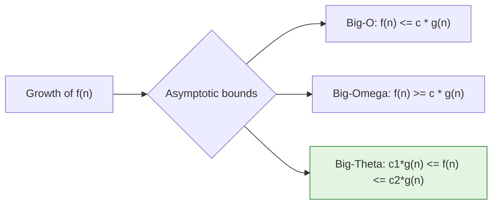
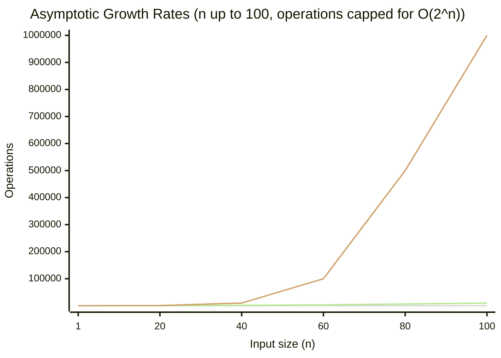

# Chapter 1: Introduction to Data Structures and Algorithms

## 1. What are Data Structures and Algorithms?

A **data structure** is a specialized format for organizing, processing, retrieving, and storing data. It defines the relationship between data elements and the operations that can be performed on them. Examples include arrays, linked lists, stacks, queues, trees, and hash tables.

An **algorithm** is a finite sequence of well-defined, step-by-step instructions for solving a specific problem or accomplishing a task. Algorithms transform input data into desired output through a series of computational steps.

The synergy between data structures and algorithms is fundamental: the choice of data structure directly impacts the efficiency of an algorithm, and conversely, algorithms are often designed to leverage the properties of specific data structures.

## 2. Why DSA Matters in Software Development and Interviews

### In Software Development
- **Performance optimization**: Efficient DSA choices reduce computational cost, memory usage, and response times in production systems.
- **Scalability**: Systems handling millions of users or terabytes of data require algorithms that scale sub‑linearly or log‑linearly.
- **Resource management**: Embedded systems, real‑time applications, and high‑frequency trading platforms demand predictable time and space bounds.
- **Problem solving**: Many real‑world problems (e.g., routing, scheduling, searching, sorting) have known DSA solutions that avoid reinventing the wheel.

### In Technical Interviews
- **Problem‑solving signal**: DSA questions test analytical thinking, pattern recognition, and coding fluency under constraints.
- **Common framework**: Most major tech companies (FAANG, Microsoft, etc.) use DSA problems to standardize candidate evaluation.
- **Transferable skill**: Mastery of DSA enables candidates to tackle unfamiliar problems by reducing them to known patterns (e.g., sliding window, dynamic programming, graph traversal).

## 3. Algorithm Efficiency: Time and Space Complexity

Complexity analysis quantifies the resources an algorithm consumes as a function of its input size \( n \).

- **Time complexity**: The amount of computational time (number of elementary operations) an algorithm takes to run.
- **Space complexity**: The amount of additional memory (excluding input storage) an algorithm allocates during execution.

Both are expressed using asymptotic notation, which describes the limiting behaviour as \( n \) grows arbitrarily large.

### Why analyse complexity?
- Compare algorithms independently of hardware or programming language.
- Identify bottlenecks and scalability limits.
- Predict performance for large inputs before implementation.

## 4. Asymptotic Notations

Asymptotic notations describe the growth rate of functions. They ignore constant factors and lower‑order terms.

### Big‑O (O) – Upper Bound
Defines an asymptotic upper bound: the worst‑case scenario (or an upper limit on growth).  
\( f(n) = O(g(n)) \) if there exist positive constants \( c \) and \( n_0 \) such that \( 0 \le f(n) \le c \cdot g(n) \) for all \( n \ge n_0 \).

### Big‑Omega (Ω) – Lower Bound
Defines an asymptotic lower bound: the best‑case scenario or a lower limit on growth.  
\( f(n) = \Omega(g(n)) \) if there exist positive constants \( c \) and \( n_0 \) such that \( 0 \le c \cdot g(n) \le f(n) \) for all \( n \ge n_0 \).

### Big‑Theta (Θ) – Tight Bound
Defines both upper and lower bounds, meaning the function grows at the same rate as \( g(n) \).  
\( f(n) = \Theta(g(n)) \) if there exist positive constants \( c_1, c_2, n_0 \) such that \( c_1 g(n) \le f(n) \le c_2 g(n) \) for all \( n \ge n_0 \).

#### Relationships
- If \( f(n) = \Theta(g(n)) \), then \( f(n) = O(g(n)) \) and \( f(n) = \Omega(g(n)) \).
- \( O \) is used most often in practice to describe worst‑case complexity.

The diagram below illustrates the relationship between these notations for a hypothetical time complexity function \( f(n) \).



## 5. Common Complexity Classes

The table below summarises the most frequently encountered complexity classes, typical algorithms that exhibit them, and practical implications.

| Class      | Name            | Example Algorithm                    | Scales to \( n \) |
|------------|----------------|--------------------------------------|-------------------|
| \( O(1) \) | Constant        | Array access by index, push/pop on stack | Huge            |
| \( O(\log n) \) | Logarithmic | Binary search, balanced BST search    | Very large        |
| \( O(n) \) | Linear          | Linear search, array sum              | Millions          |
| \( O(n \log n) \) | Linearithmic | Merge sort, heap sort                 | Millions          |
| \( O(n^2) \) | Quadratic       | Bubble sort, naive matrix multiplication | Thousands      |
| \( O(2^n) \) | Exponential     | Recursive Fibonacci (naive), subset generation | 20–30       |
| \( O(n!) \) | Factorial       | Naive travelling salesman (permutations) | 10–12           |

### Detailed Descriptions with C++ Examples

#### \( O(1) \) – Constant Time
The algorithm executes a fixed number of operations regardless of input size.

**Example**: Access an element in an array by index.
```cpp
int getFirstElement(int arr[], int n) {
    // Input n is ignored; single indexing operation
    return arr[0];   // O(1)
}
```

#### \( O(\log n) \) – Logarithmic Time
The input size is halved (or reduced by a constant factor) at each step. Very efficient.

**Example**: Binary search on a sorted array.
```cpp
int binarySearch(int arr[], int left, int right, int target) {
    while (left <= right) {
        int mid = left + (right - left) / 2;
        if (arr[mid] == target)
            return mid;
        else if (arr[mid] < target)
            left = mid + 1;
        else
            right = mid - 1;
    }
    return -1;
}
```

#### \( O(n) \) – Linear Time
The algorithm performs a single pass over the input.

**Example**: Sum all elements of an array.
```cpp
int arraySum(int arr[], int n) {
    int total = 0;
    for (int i = 0; i < n; ++i) {
        total += arr[i];
    }
    return total;
}
```

#### \( O(n \log n) \) – Linearithmic Time
Often achieved by divide‑and‑conquer algorithms that split the problem into smaller parts and then combine them.

**Example**: Merge sort.
```cpp
#include <vector>
using namespace std;

void merge(vector<int>& arr, int left, int mid, int right) {
    int n1 = mid - left + 1;
    int n2 = right - mid;
    vector<int> L(n1), R(n2);
    for (int i = 0; i < n1; ++i) L[i] = arr[left + i];
    for (int j = 0; j < n2; ++j) R[j] = arr[mid + 1 + j];

    int i = 0, j = 0, k = left;
    while (i < n1 && j < n2) {
        if (L[i] <= R[j]) arr[k++] = L[i++];
        else arr[k++] = R[j++];
    }
    while (i < n1) arr[k++] = L[i++];
    while (j < n2) arr[k++] = R[j++];
}

void mergeSort(vector<int>& arr, int left, int right) {
    if (left >= right) return;
    int mid = left + (right - left) / 2;
    mergeSort(arr, left, mid);
    mergeSort(arr, mid + 1, right);
    merge(arr, left, mid, right);
}
```

#### \( O(n^2) \) – Quadratic Time
Double nested iterations over the input. Becomes slow quickly.

**Example**: Bubble sort.
```cpp
void bubbleSort(int arr[], int n) {
    for (int i = 0; i < n - 1; ++i) {
        for (int j = 0; j < n - i - 1; ++j) {
            if (arr[j] > arr[j + 1]) {
                int temp = arr[j];
                arr[j] = arr[j + 1];
                arr[j + 1] = temp;
            }
        }
    }
}
```

#### \( O(2^n) \) – Exponential Time
Often arises in recursive algorithms that solve overlapping sub‑problems without memoization.

**Example**: Naive recursive Fibonacci.
```cpp
int fib(int n) {
    if (n <= 1) return n;
    return fib(n - 1) + fib(n - 2);
}
```

#### \( O(n!) \) – Factorial Time
Algorithms that generate all permutations of a set. Only feasible for very small \( n \).

**Example**: Naive generation of all permutations (printing each).
```cpp
#include <algorithm>
#include <vector>
using namespace std;

void printPermutations(vector<int>& arr) {
    sort(arr.begin(), arr.end());
    do {
        // Process current permutation (e.g., print)
        for (int x : arr) printf("%d ", x);
        printf("\n");
    } while (next_permutation(arr.begin(), arr.end()));
}
```

### Visual Comparison of Growth Rates

The following Mermaid diagram plots the number of operations against input size for major complexity classes. Note the logarithmic scale on the y‑axis to accommodate large ranges.



*Note: For readability, the diagram uses a logarithmic conversion on the vertical axis. Actual \( O(2^n) \) at \( n=100 \) is astronomically large.*

## 6. Practical Guidelines for Complexity Analysis

1. **Always consider worst‑case** unless the problem explicitly asks for average or best‑case analysis.
2. **Drop constants and lower‑order terms**: \( 3n^2 + 5n + 2 \) simplifies to \( O(n^2) \).
3. **Analyse loops carefully**: A loop that runs \( n \) times contributes a factor of \( n \); nested loops multiply.
4. **Recursive algorithms** often follow recurrence relations (e.g., \( T(n) = 2T(n/2) + n \) yields \( O(n \log n) \)).
5. **Space complexity** includes call stack memory for recursion (e.g., naive recursion for Fibonacci uses \( O(n) \) stack space).

## 7. Summary

- Data structures organise data; algorithms manipulate it. Together they form the foundation of efficient software.
- DSA knowledge is critical for building scalable systems and passing technical interviews.
- Complexity analysis uses asymptotic notations (Big‑O, Big‑Omega, Big‑Theta) to describe resource usage.
- Recognising common complexity classes (\( O(1), O(\log n), O(n), O(n \log n), O(n^2), O(2^n), O(n!) \)) helps choose the right algorithm for the input size constraints.

The next chapter will cover fundamental data structures: arrays, linked lists, stacks, and queues, along with their time complexity trade‑offs.
