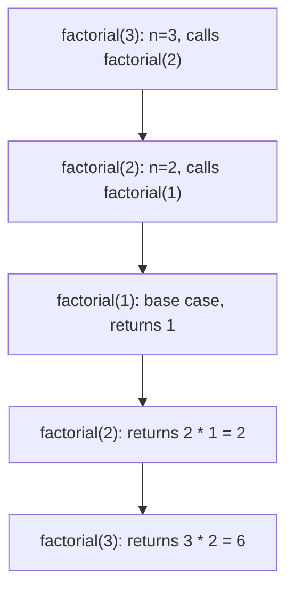

# Chapter 2: Mathematics & Prerequisites

This chapter covers essential foundations for data structures and algorithms: recursion, backtracking, discrete mathematics, and bit manipulation. Each section explains **what**, **why**, and **when to use** to help you apply these concepts in problem-solving.

## 1. Recursion Basics

**What**: A function that calls itself to solve a smaller instance of the same problem.

**When to use**:
- Problems that can be broken into identical sub‑problems (divide & conquer)
- Tree and graph traversals (DFS, binary tree operations)
- Backtracking (exploring decision trees)
- Mathematical sequences defined recursively (factorial, Fibonacci)
- Parsing recursive structures (JSON, XML, nested lists)

### 1.1 Components (to the point)

- **Base case**: Terminates recursion; the smallest problem instance with a direct answer.
- **Recursive case**: Calls itself with reduced/modified input moving toward the base case.
- **Call stack**: Automatically managed stack storing local variables, parameters, and return addresses for each active call.

**Real-life analogy**: Russian nesting dolls – open outer to reach inner (recursive descent), then close on way back (returns).

### 1.2 Example: Factorial

```cpp
int factorial(int n) {
    if (n <= 1) return 1;          // base case
    return n * factorial(n - 1);   // recursive case
}
```

### 1.3 Call Stack Visualisation (factorial(3))



### 1.4 When to Avoid Recursion

- **Deep recursion** (e.g., `n > 10^5`) risks stack overflow → use iterative version.
- **Expensive recomputation** (naive Fibonacci) → use memoisation or iteration.
- **Performance‑critical real‑time systems** → iteration avoids function call overhead.

## 2. Backtracking Principles

**What**: Systematic trial‑and‑error search that incrementally builds candidates and aborts (backtracks) those that violate constraints.

**When to use**:
- Combinatorial search problems: subsets, permutations, combinations
- Constraint satisfaction: N‑Queens, Sudoku, crossword puzzles
- Path finding in mazes or graphs (with pruning)
- Generating all valid configurations (e.g., parentheses, letter combinations)

### 2.1 Backtracking Template (to the point)

```
void backtrack(state, choices):
    if is_goal(state): record(state); return
    for each choice in choices:
        if is_valid(state + choice):
            make_choice(choice)
            backtrack(state + choice, new_choices)
            undo_choice(choice)   // backtrack
```

**Real-life analogy**: Solving a maze – try a path; if dead end, return to last junction and try next direction.

### 2.2 Example: Generate All Subsets

```cpp
void generateSubsets(vector<int>& nums, int index, vector<int>& current, vector<vector<int>>& result) {
    result.push_back(current);                     // include current subset
    for (int i = index; i < nums.size(); ++i) {
        current.push_back(nums[i]);                // choose
        generateSubsets(nums, i + 1, current, result);
        current.pop_back();                        // backtrack
    }
}
```

**Time**: $O(2^n)$, **Space**: $O(n)$ (stack depth).

### 2.3 When Backtracking is Inefficient

- Large search space without effective pruning (e.g., brute‑force all permutations of 50 items)
- Problems with overlapping subproblems – dynamic programming is better (e.g., shortest path in DAG)

## 3. Mathematical Foundations

### 3.1 Logarithms and Exponents

**Definition**: $\log_b a = c \iff b^c = a$. In CS, base 2 ($\log n$).

**When to use**:
- **Complexity analysis**: $O(\log n)$ appears in binary search, balanced BSTs, priority queues (heaps).
- **Divide & conquer**: Algorithms that halve input (merge sort, quick sort average case).
- **Repeated squaring**: Fast modular exponentiation.

**Key property**: $\log_b (xy) = \log_b x + \log_b y$.

**Real-life analogy**: Folding a paper in half repeatedly – number of folds to reach single thickness is $\log_2(\text{length})$.

### 3.2 Summations and Series

**Definition**: Compact representation of loop/recursive costs.

| Series | Formula | Typical Use |
|--------|---------|--------------|
| Arithmetic | $\sum_{i=1}^{n} i = n(n+1)/2$ | Nested loops, analysing $O(n^2)$ |
| Geometric | $\sum_{i=0}^{n} 2^i = 2^{n+1}-1$ | Exponential algorithms, binary recursion |
| Harmonic | $\sum_{i=1}^{n} 1/i \approx \ln n$ | Average‑case of quicksort, load balancing |

**When to use**: To derive exact complexity from loop structures or recurrence relations.

### 3.3 Permutations and Combinations

**Definition**:
- Permutation (ordered): $P(n,k) = n!/(n-k)!$
- Combination (unordered): $\binom{n}{k} = n!/(k!(n-k)!)$

**When to use**:
- Brute‑force upper bounds: TSP $O(n!)$, subset generation $O(2^n)$.
- Probability calculations in randomised algorithms (e.g., random permutations).
- Counting problems in dynamic programming state spaces.

### 3.4 Modular Arithmetic

**Definition**: Arithmetic where numbers wrap around after reaching a modulus $m$.

**When to use**:
- **Hashing**: Hash tables use modulo to map keys to bucket indices.
- **Cryptography**: RSA, Diffie‑Hellman (modular exponentiation).
- **Preventing overflow**: Multiply large numbers by taking mod at each step.
- **Competitive programming**: Many results required modulo $10^9+7$.

**Fast modular exponentiation** (binary exponentiation):

```cpp
long long modPow(long long base, long long exp, long long mod) {
    long long result = 1;
    base %= mod;
    while (exp) {
        if (exp & 1) result = (result * base) % mod;
        base = (base * base) % mod;
        exp >>= 1;
    }
    return result;
}
```

### 3.5 Prime Numbers and GCD

**Definition**:
- Prime: integer $>1$ with no divisors other than 1 and itself.
- GCD: greatest common divisor of two integers.

**When to use**:
- **Prime numbers**: Hash table sizes (reduce collisions), RSA key generation, primality tests in contest problems.
- **GCD**: Simplifying fractions, computing LCM ($\text{lcm}(a,b) = a \cdot b / \gcd(a,b)$), cryptography, periodicity calculations.

**Euclidean algorithm for GCD** – $O(\log \min(a,b))$:

```cpp
int gcd(int a, int b) {
    while (b) { int t = b; b = a % b; a = t; }
    return a;
}
```

## 4. Bit Manipulation

**What**: Direct operations on binary representation using bitwise operators.

**When to use**:
- **Performance**: Extremely fast (single CPU instruction).
- **State compression**: Store multiple boolean flags in one integer (e.g., visited sets in DP).
- **Subset enumeration**: Iterate over all subsets of a set using bitmask `0..2^n-1`.
- **Low‑level programming**: Device drivers, embedded systems, network protocols.
- **Competitive programming**: Solve problems with small constraints ($n \le 20$ for exponential bitmask DP).

### 4.1 Bitwise Operators (quick reference)

| Operator | Symbol | Effect |
|----------|--------|--------|
| AND | `&` | Set bit if both are 1 |
| OR  | `|` | Set bit if at least one is 1 |
| XOR | `^` | Set bit if bits differ |
| NOT | `~` | Flip all bits |
| Left shift | `<<` | Shift left, zero fill |
| Right shift| `>>` | Shift right (logical for unsigned) |

### 4.2 Common Tricks (when to apply)

| Trick | Code | Use Case |
|-------|------|-----------|
| Power of two | `n && !(n & (n-1))` | Check alignment, hash table sizing |
| Set k‑th bit | `n \|= (1 << k)` | Mark present in bitmask |
| Clear k‑th bit | `n &= ~(1 << k)` | Remove flag |
| Toggle k‑th bit | `n ^= (1 << k)` | Flip flag |
| Check k‑th bit | `(n >> k) & 1` | Test membership |
| Count set bits (Kernighan) | `while(n) { n &= n-1; count++; }` | Hamming weight, parity |
| Isolate lowest set bit | `n & -n` | Tree‑like structures (Fenwick tree) |
| Swap without temp | `a ^= b; b ^= a; a ^= b;` | Limited use (readability suffers) |

**Example: Subset enumeration using bitmask**

```cpp
int n = 3;  // elements 0,1,2
for (int mask = 0; mask < (1 << n); ++mask) {
    // mask’s bits indicate which elements are in subset
    for (int i = 0; i < n; ++i) {
        if (mask & (1 << i)) 
            cout << i << " ";
    }
    cout << endl;
}
```

## 5. Summary

| Topic | What (to the point) | When to Use |
|-------|---------------------|--------------|
| Recursion | Function calls itself | Divide & conquer, tree/graph traversal, backtracking |
| Backtracking | Trial & error with pruning | Combinatorial search, constraint satisfaction |
| Logarithms | Inverse of exponentiation | Complexity analysis ($O(\log n)$), divide & conquer |
| Summations | Compact loop cost | Analysing nested loops, recurrence relations |
| Permutations/combinations | Ordered/unordered selections | Brute‑force bounds, probability, counting |
| Modular arithmetic | Wrap‑around numbers | Hashing, crypto, overflow prevention |
| Primes & GCD | Divisibility basics | Hash sizes, crypto, fraction reduction |
| Bit manipulation | Direct bitwise ops | Flags, state compression, subset enumeration, performance |

The next chapter will analyse recursive algorithms using recurrence relations and the Master Theorem, and introduce advanced mathematical tools for DSA.
