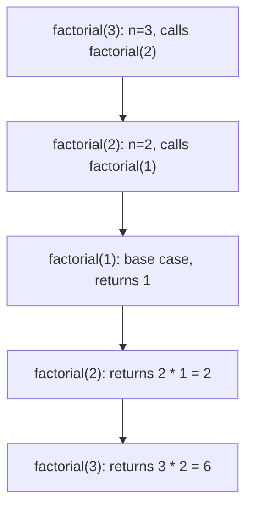

# Chapter 2: Mathematics & Prerequisites

This chapter covers essential mathematical and algorithmic foundations required for mastering data structures and algorithms. Topics include recursion, backtracking, discrete mathematics, and bit manipulation.

## 1. Recursion Basics

Recursion is a programming technique where a function calls itself to solve a smaller instance of the same problem. It is widely used in tree traversals, divide-and-conquer algorithms, and backtracking.

### 1.1 Components of a Recursive Function

- **Base case**: The condition under which the function stops calling itself. It directly returns a result without further recursion.
- **Recursive case**: The part where the function calls itself with a modified argument, moving towards the base case.
- **Call stack**: The underlying mechanism that tracks active function calls. Each recursive call adds a new frame to the stack; returns pop frames.

**Real-life analogy**: Russian nesting dolls (Matryoshka). To find the smallest doll, you open the outer doll (recursive call), continue until you find the innermost doll (base case), then close each doll on the way back (return).

### 1.2 Example: Factorial

```cpp
int factorial(int n) {
    if (n <= 1)          // base case
        return 1;
    return n * factorial(n - 1);  // recursive case
}
```

### 1.3 The Call Stack in Recursion

When `factorial(3)` executes:



### 1.4 Risks of Recursion

- **Stack overflow**: Deep recursion exceeds the call stack limit.
- **Redundant computation**: Naive recursion (e.g., Fibonacci) recomputes same values exponentially.

## 2. Backtracking Principles

Backtracking is a systematic way to explore all possible configurations of a problem by building candidates incrementally and abandoning (backtracking from) those that cannot lead to a valid solution.

### 2.1 General Backtracking Algorithm Structure

1. **Choose**: Make a choice from available options.
2. **Constrain**: Check if the choice violates any constraint. If yes, backtrack.
3. **Goal**: If the current state satisfies the solution criteria, record it.
4. **Recurse**: Move to the next step.
5. **Undo choice** (backtrack) and try the next option.

**Real-life analogy**: Solving a maze. At a junction, you try a path. If you hit a dead end, you return to the junction (backtrack) and try another direction.

### 2.2 Example: Generating All Subsets (using backtracking)

```cpp
#include <vector>
using namespace std;

void generateSubsets(vector<int>& nums, int index, vector<int>& current, vector<vector<int>>& result) {
    result.push_back(current);            // include current subset
    for (int i = index; i < nums.size(); ++i) {
        current.push_back(nums[i]);       // choose
        generateSubsets(nums, i + 1, current, result);
        current.pop_back();               // backtrack (undo choice)
    }
}
```

**Complexity**: $O(2^n)$ time, $O(n)$ additional stack space.

## 3. Mathematical Foundations

### 3.1 Logarithms and Exponents

- **Logarithm**: $\log_b a = c$ means $b^c = a$. Base $b$ is often 2 in computer science (binary logarithm, $\log n$).
- **Properties**:
  - $\log_b (xy) = \log_b x + \log_b y$
  - $\log_b (x^y) = y \log_b x$
  - $b^{\log_b x} = x$

**Relevance**: Appearance in divide-and-conquer algorithms (e.g., binary search: $O(\log n)$). $\log n$ grows very slowly.

**Real-life analogy**: The number of times you can repeatedly fold a piece of paper in half (halving the length) until it becomes a single layer is $\log_2(\text{original length})$.

### 3.2 Summations and Series

Summations compactly express loops and recursive costs.

- **Arithmetic series**: $\sum_{i=1}^{n} i = \frac{n(n+1)}{2} = O(n^2)$
- **Geometric series**: $\sum_{i=0}^{n} 2^i = 2^{n+1} - 1 = O(2^n)$
- **Harmonic series**: $\sum_{i=1}^{n} \frac{1}{i} = \ln n + O(1)$ — appears in average-case complexity of quicksort.

**Example**: Nested loops with total iterations $\sum_{i=1}^{n} \sum_{j=i}^{n} 1 = \sum_{i=1}^{n} (n-i+1) = n(n+1)/2$.

### 3.3 Permutations and Combinations

Used for analysing brute‑force algorithms and probabilistic data structures.

- **Permutations** (ordered arrangements): $P(n, k) = \frac{n!}{(n-k)!}$
- **Combinations** (unordered selections): $\binom{n}{k} = \frac{n!}{k!(n-k)!}$

**Relevance**: Travelling salesman brute force = $O(n!)$; subset generation = $O(2^n)$.

### 3.4 Modular Arithmetic

Modular arithmetic keeps numbers within a fixed range and is essential for hashing, cryptography, and avoiding overflow.

- **Basic operations**: $(a + b) \bmod m = ((a \bmod m) + (b \bmod m)) \bmod m$  
  Same for subtraction, multiplication.
- **Modular exponentiation**: Compute $a^b \bmod m$ efficiently without huge intermediates.

```cpp
// Fast modular exponentiation: computes (base^exp) % mod
long long modPow(long long base, long long exp, long long mod) {
    long long result = 1;
    base %= mod;
    while (exp > 0) {
        if (exp & 1) result = (result * base) % mod;
        base = (base * base) % mod;
        exp >>= 1;
    }
    return result;
}
```

### 3.5 Prime Numbers and GCD

- **Prime numbers**: Integers $>1$ with no positive divisors other than 1 and itself. Used in hashing (prime table sizes) and cryptography.
- **Greatest Common Divisor (GCD)**: The largest positive integer dividing two numbers. Euclidean algorithm runs in $O(\log \min(a,b))$.

```cpp
int gcd(int a, int b) {
    while (b != 0) {
        int temp = b;
        b = a % b;
        a = temp;
    }
    return a;
}
```

- **Primality test (naive)**: Check divisibility up to $\sqrt{n}$, $O(\sqrt{n})$.

## 4. Bit Manipulation

Bit manipulation operates directly on binary representations of integers. It is extremely fast and used in low‑level optimisations, state compression, and embedded systems.

### 4.1 Bitwise Operators

Assume integers are represented in two's complement. Operations are performed on each bit independently.

| Operator | C++ Symbol | Description                      | Example (n=6, binary 110) |
|----------|------------|----------------------------------|----------------------------|
| AND      | `&`        | 1 if both bits are 1             | `6 & 4` → `4` (100)         |
| OR       | `|`        | 1 if at least one bit is 1        | `6 | 1` → `7` (111)         |
| XOR      | `^`        | 1 if bits are different          | `6 ^ 3` → `5` (101)         |
| NOT      | `~`        | Flip all bits (including sign bit)| `~6` → `-7` (two’s complement) |
| Left shift | `<<`    | Shift bits left; fill with 0     | `6 << 1` → `12` (1100)       |
| Right shift| `>>`    | Shift bits right (implementation‑defined for signed) | `6 >> 1` → `3` (11) |

### 4.2 Common Bit Manipulation Tricks

**Checking if an integer is a power of two**

A power of two has exactly one set bit. `(n & (n - 1))` clears the lowest set bit. If the result is zero and `n > 0`, then `n` is a power of two.

```cpp
bool isPowerOfTwo(unsigned int n) {
    return n && !(n & (n - 1));
}
```

**Toggling the k‑th bit** (0‑indexed from LSB)

```cpp
int toggleBit(int n, int k) {
    return n ^ (1 << k);
}
```

**Setting the k‑th bit to 1**

```cpp
int setBit(int n, int k) {
    return n | (1 << k);
}
```

**Clearing the k‑th bit (set to 0)**

```cpp
int clearBit(int n, int k) {
    return n & ~(1 << k);
}
```

**Counting set bits (population count)**

Brian Kernighan’s algorithm: repeatedly clears the lowest set bit.

```cpp
int countSetBits(unsigned int n) {
    int count = 0;
    while (n) {
        n &= (n - 1);
        count++;
    }
    return count;
}
```

Alternatively, use built‑in: `__builtin_popcount(n)` (GCC/Clang).

**Checking if k‑th bit is set**

```cpp
bool isBitSet(int n, int k) {
    return n & (1 << k);
}
```

**Swapping two integers without temporary variable**

```cpp
int a = 5, b = 7;
a ^= b;
b ^= a;
a ^= b;
// Now a = 7, b = 5
```

**Finding the only non‑repeating element in an array where every other element repeats twice**

XOR of all elements cancels duplicates: `result = xor(arr)`.

### 4.3 Practical Use Cases

- **Subset enumeration**: Represent subsets as bitmask (0..2^n-1). Each bit indicates inclusion.
- **State compression in DP**: Reduced memory by storing boolean flags in a single integer.
- **Game programming**: Board representation, move generation.
- **Permission systems**: Each bit represents a permission flag.

## 5. Summary

- **Recursion** requires a base case and careful management of the call stack.
- **Backtracking** systematically explores candidates and prunes invalid paths.
- **Mathematical foundations** (logarithms, series, combinatorics, modular arithmetic, primes, GCD) are indispensable for complexity analysis and algorithm design.
- **Bit manipulation** offers ultra‑fast operations for flags, state compression, and low‑level optimisations.

The next chapter will introduce analysis of recursive algorithms (recurrence relations, master theorem) and more advanced mathematical tools for DSA.
