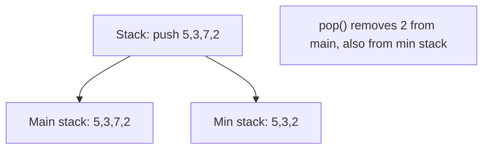

# Chapter 5: Stacks and Queues

This chapter covers linear data structures that restrict access order: stacks (LIFO), queues (FIFO), deques, and priority queues (heaps). It includes implementations, applications, and classic problems.

## 1. Stack

**What**: A linear data structure that follows Last‑In‑First‑Out (LIFO) principle. Elements are added and removed from the same end (top).

**Real-life analogy**: A stack of plates – you put a new plate on top and take the top plate first.

**When to use**:
- Function call management (call stack)
- Undo/Redo operations (e.g., text editors)
- Parsing expressions (balanced parentheses, postfix evaluation)
- Backtracking algorithms (DFS, maze solving)
- Browser history (back button)

### 1.1 Array‑Based Implementation

```cpp
class StackArray {
private:
    int* arr;
    int capacity;
    int topIndex;
public:
    StackArray(int size) : capacity(size), topIndex(-1) {
        arr = new int[capacity];
    }
    ~StackArray() { delete[] arr; }
    void push(int x) {
        if (topIndex == capacity - 1) throw overflow_error("Stack overflow");
        arr[++topIndex] = x;
    }
    void pop() {
        if (topIndex < 0) throw underflow_error("Stack empty");
        topIndex--;
    }
    int top() {
        if (topIndex < 0) throw underflow_error("Stack empty");
        return arr[topIndex];
    }
    bool empty() const { return topIndex == -1; }
};
```

### 1.2 Linked‑List‑Based Implementation

```cpp
class StackLL {
private:
    struct Node {
        int data;
        Node* next;
        Node(int val) : data(val), next(nullptr) {}
    };
    Node* topNode;
public:
    StackLL() : topNode(nullptr) {}
    ~StackLL() { while (topNode) pop(); }
    void push(int x) {
        Node* newNode = new Node(x);
        newNode->next = topNode;
        topNode = newNode;
    }
    void pop() {
        if (!topNode) throw underflow_error("Stack empty");
        Node* temp = topNode;
        topNode = topNode->next;
        delete temp;
    }
    int top() {
        if (!topNode) throw underflow_error("Stack empty");
        return topNode->data;
    }
    bool empty() const { return topNode == nullptr; }
};
```

### 1.3 Applications

#### Balanced Parentheses

Check if parentheses, brackets, and braces are properly nested.

```cpp
bool isBalanced(string expr) {
    stack<char> st;
    for (char c : expr) {
        if (c == '(' || c == '{' || c == '[')
            st.push(c);
        else if (c == ')' || c == '}' || c == ']') {
            if (st.empty()) return false;
            char top = st.top();
            if ((c == ')' && top != '(') ||
                (c == '}' && top != '{') ||
                (c == ']' && top != '['))
                return false;
            st.pop();
        }
    }
    return st.empty();
}
```

#### Expression Evaluation (Postfix)

**When to use**: Compilers, calculators.

Evaluate a postfix expression using a stack:

```cpp
int evaluatePostfix(string postfix) {
    stack<int> st;
    for (char c : postfix) {
        if (isdigit(c)) st.push(c - '0');
        else {
            int b = st.top(); st.pop();
            int a = st.top(); st.pop();
            switch (c) {
                case '+': st.push(a + b); break;
                case '-': st.push(a - b); break;
                case '*': st.push(a * b); break;
                case '/': st.push(a / b); break;
            }
        }
    }
    return st.top();
}
```

**Infix to Postfix** uses operator precedence and a stack (Shunting‑yard algorithm).

#### Next Greater Element

**What**: For each element in an array, find the next element to the right that is greater.

```cpp
vector<int> nextGreaterElement(vector<int>& nums) {
    int n = nums.size();
    vector<int> result(n, -1);
    stack<int> st; // stores indices of elements waiting for a greater element
    for (int i = 0; i < n; ++i) {
        while (!st.empty() && nums[st.top()] < nums[i]) {
            result[st.top()] = nums[i];
            st.pop();
        }
        st.push(i);
    }
    return result;
}
```

**Time**: O(n). **Real‑life analogy**: Find the next taller person in a line looking to the right.

#### Largest Rectangle in Histogram

**Problem**: Given bar heights, find the largest rectangle area that can be formed.

**Approach**: Use a stack to find the nearest smaller bar on left and right.

```cpp
int largestRectangleArea(vector<int>& heights) {
    stack<int> st;
    int maxArea = 0;
    heights.push_back(0); // sentinel
    for (int i = 0; i < heights.size(); ++i) {
        while (!st.empty() && heights[st.top()] > heights[i]) {
            int h = heights[st.top()];
            st.pop();
            int left = st.empty() ? -1 : st.top();
            maxArea = max(maxArea, h * (i - left - 1));
        }
        st.push(i);
    }
    heights.pop_back();
    return maxArea;
}
```

#### Min Stack (getMin in O(1))

**Design**: A stack that supports `push`, `pop`, `top`, and `getMin` all in O(1) time.

**Approach**: Use an auxiliary stack that stores the current minimum at each level.

```cpp
class MinStack {
    stack<int> st;
    stack<int> minSt;
public:
    void push(int x) {
        st.push(x);
        if (minSt.empty() || x <= minSt.top())
            minSt.push(x);
    }
    void pop() {
        if (st.top() == minSt.top()) minSt.pop();
        st.pop();
    }
    int top() { return st.top(); }
    int getMin() { return minSt.top(); }
};
```



## 2. Queue

**What**: First‑In‑First‑Out (FIFO) principle. Elements are added at the rear and removed from the front.

**Real-life analogy**: A queue of people waiting in line – the first person arrives first, gets served first.

**When to use**:
- Task scheduling (CPU, printer queue)
- Breadth‑First Search (BFS) in graphs and trees
- Buffering (IO buffers, message queues)
- Sliding window problems

### 2.1 Array‑Based Implementation (Circular Queue)

Uses a fixed‑size array with `front` and `rear` pointers that wrap around.

```cpp
class CircularQueue {
    int* arr;
    int capacity;
    int frontIdx, rearIdx;
    int count; // optional: number of elements
public:
    CircularQueue(int size) : capacity(size), frontIdx(0), rearIdx(-1), count(0) {
        arr = new int[capacity];
    }
    ~CircularQueue() { delete[] arr; }
    bool enqueue(int x) {
        if (count == capacity) return false;
        rearIdx = (rearIdx + 1) % capacity;
        arr[rearIdx] = x;
        count++;
        return true;
    }
    bool dequeue() {
        if (count == 0) return false;
        frontIdx = (frontIdx + 1) % capacity;
        count--;
        return true;
    }
    int front() {
        if (count == 0) throw underflow_error("Queue empty");
        return arr[frontIdx];
    }
    bool empty() const { return count == 0; }
};
```

### 2.2 Linked‑List‑Based Queue

```cpp
class QueueLL {
    struct Node {
        int data;
        Node* next;
        Node(int val) : data(val), next(nullptr) {}
    };
    Node* frontNode;
    Node* rearNode;
public:
    QueueLL() : frontNode(nullptr), rearNode(nullptr) {}
    void enqueue(int x) {
        Node* newNode = new Node(x);
        if (rearNode) rearNode->next = newNode;
        else frontNode = newNode;
        rearNode = newNode;
    }
    void dequeue() {
        if (!frontNode) throw underflow_error("Queue empty");
        Node* temp = frontNode;
        frontNode = frontNode->next;
        if (!frontNode) rearNode = nullptr;
        delete temp;
    }
    int front() {
        if (!frontNode) throw underflow_error("Queue empty");
        return frontNode->data;
    }
    bool empty() const { return frontNode == nullptr; }
};
```

### 2.3 Double‑Ended Queue (Deque)

**What**: Allows insertion and deletion at both ends. Available as `std::deque` in C++.

**When to use**:
- Sliding window maximum/minimum
- Palindrome checking
- Job scheduling with priority at both ends

### 2.4 Applications

#### Sliding Window Maximum

**Problem**: Given an array and window size k, find the maximum element in each sliding window.

**Approach**: Use a deque storing indices of elements in decreasing order.

```cpp
vector<int> slidingWindowMaximum(vector<int>& nums, int k) {
    deque<int> dq;
    vector<int> result;
    for (int i = 0; i < nums.size(); ++i) {
        // remove out-of-window indices
        if (!dq.empty() && dq.front() == i - k)
            dq.pop_front();
        // maintain decreasing order
        while (!dq.empty() && nums[dq.back()] <= nums[i])
            dq.pop_back();
        dq.push_back(i);
        if (i >= k - 1)
            result.push_back(nums[dq.front()]);
    }
    return result;
}
```

**Time**: O(n). **Real‑life analogy**: You have a moving magnifying glass over a number line, and you always want the largest visible number.

#### BFS Traversal (using queue)

Queue is fundamental for level‑order traversal of trees and graphs.

```cpp
void bfs(Node* root) {
    if (!root) return;
    queue<Node*> q;
    q.push(root);
    while (!q.empty()) {
        Node* curr = q.front(); q.pop();
        cout << curr->val << " ";
        if (curr->left) q.push(curr->left);
        if (curr->right) q.push(curr->right);
    }
}
```

## 3. Priority Queue (Heap)

**What**: A data structure that always gives access to the highest (or lowest) priority element. Typically implemented as a binary heap.

- **Max‑heap**: Parent >= children; maximum at root.
- **Min‑heap**: Parent <= children; minimum at root.

**When to use**:
- Scheduling tasks by priority
- Finding Kth largest/smallest elements
- Merging multiple sorted sequences
- Dijkstra’s and Prim’s algorithms

**C++ Standard Library**: `priority_queue<T>` (max‑heap by default). Use `priority_queue<T, vector<T>, greater<T>>` for min‑heap.

### 3.1 Heap Operations

| Operation | Description | Time Complexity |
|-----------|-------------|----------------|
| `heapify` | Build heap from array | O(n) |
| `insert` | Add element, bubble up | O(log n) |
| `extract min/max` | Remove root, heapify down | O(log n) |
| `get min/max` | Peek root | O(1) |
| `decrease key` | Reduce value, bubble up | O(log n) |

### 3.2 Manual Heap Implementation (Min‑Heap)

```cpp
class MinHeap {
    vector<int> heap;
    void heapifyUp(int idx) {
        while (idx > 0) {
            int parent = (idx - 1) / 2;
            if (heap[parent] <= heap[idx]) break;
            swap(heap[parent], heap[idx]);
            idx = parent;
        }
    }
    void heapifyDown(int idx) {
        int size = heap.size();
        while (true) {
            int left = 2 * idx + 1;
            int right = 2 * idx + 2;
            int smallest = idx;
            if (left < size && heap[left] < heap[smallest]) smallest = left;
            if (right < size && heap[right] < heap[smallest]) smallest = right;
            if (smallest == idx) break;
            swap(heap[idx], heap[smallest]);
            idx = smallest;
        }
    }
public:
    void insert(int val) {
        heap.push_back(val);
        heapifyUp(heap.size() - 1);
    }
    int extractMin() {
        if (heap.empty()) throw underflow_error("Heap empty");
        int root = heap[0];
        heap[0] = heap.back();
        heap.pop_back();
        if (!heap.empty()) heapifyDown(0);
        return root;
    }
    int getMin() { return heap[0]; }
    bool empty() { return heap.empty(); }
};
```

### 3.3 Application: Kth Largest Element

**Approach**: Use a min‑heap of size k that stores the k largest elements seen so far.

```cpp
int findKthLargest(vector<int>& nums, int k) {
    priority_queue<int, vector<int>, greater<int>> minHeap;
    for (int x : nums) {
        minHeap.push(x);
        if (minHeap.size() > k) minHeap.pop();
    }
    return minHeap.top();
}
```

**Time**: O(n log k). **Space**: O(k).

### 3.4 Application: Merge K Sorted Lists

**Approach**: Push the first node of each list into a min‑heap (ordered by node value). Repeatedly extract the smallest, push its next node.

```cpp
struct ListNode {
    int val;
    ListNode* next;
    ListNode(int x) : val(x), next(nullptr) {}
};

struct Compare {
    bool operator()(ListNode* a, ListNode* b) {
        return a->val > b->val; // min‑heap
    }
};

ListNode* mergeKLists(vector<ListNode*>& lists) {
    priority_queue<ListNode*, vector<ListNode*>, Compare> pq;
    for (auto list : lists)
        if (list) pq.push(list);
    ListNode dummy(0);
    ListNode* tail = &dummy;
    while (!pq.empty()) {
        ListNode* smallest = pq.top(); pq.pop();
        tail->next = smallest;
        tail = tail->next;
        if (smallest->next) pq.push(smallest->next);
    }
    return dummy.next;
}
```

**Time**: O(N log k), where N is total nodes, k is number of lists.

### 3.5 Application: Dijkstra’s Algorithm Support

Priority queue is used to always extract the node with the smallest tentative distance.

```cpp
#include <queue>
#include <vector>
using namespace std;

void dijkstra(vector<vector<pair<int,int>>>& graph, int src) {
    int n = graph.size();
    vector<int> dist(n, INT_MAX);
    dist[src] = 0;
    using P = pair<int,int>; // (distance, node)
    priority_queue<P, vector<P>, greater<P>> pq;
    pq.push({0, src});
    while (!pq.empty()) {
        auto [d, u] = pq.top(); pq.pop();
        if (d > dist[u]) continue;
        for (auto [v, w] : graph[u]) {
            if (dist[v] > dist[u] + w) {
                dist[v] = dist[u] + w;
                pq.push({dist[v], v});
            }
        }
    }
}
```

## Summary Table

| Data Structure | Access Order | Implementation Options | Typical O(1) Operations | Applications |
|----------------|--------------|------------------------|-------------------------|--------------|
| Stack | LIFO | Array, Linked List | push, pop, top | Parentheses, DFS, undo, expression eval |
| Queue | FIFO | Circular array, Linked List | enqueue, dequeue, front | BFS, scheduling, sliding window |
| Deque | Both ends | Doubly linked list or array | push/pop front/back | Sliding window maximum, palindrome |
| Priority Queue (Heap) | By priority | Binary heap | getMin, insert, extractMin | Kth largest, merge K lists, Dijkstra |

The next chapter will cover advanced linear data structures: hash tables and maps.
