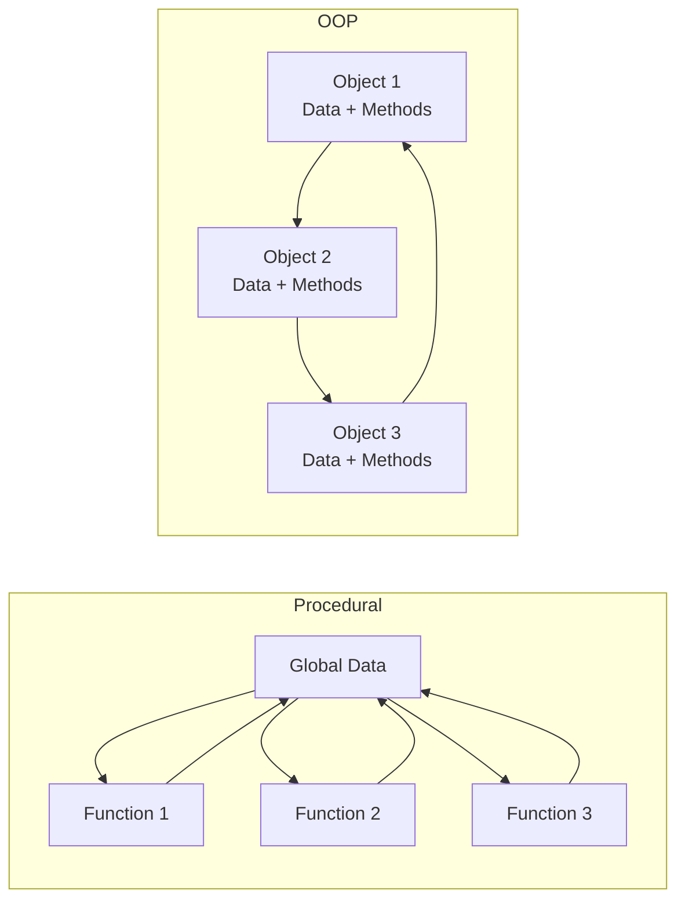
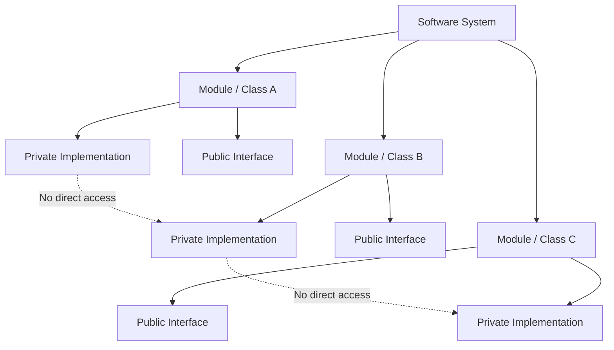
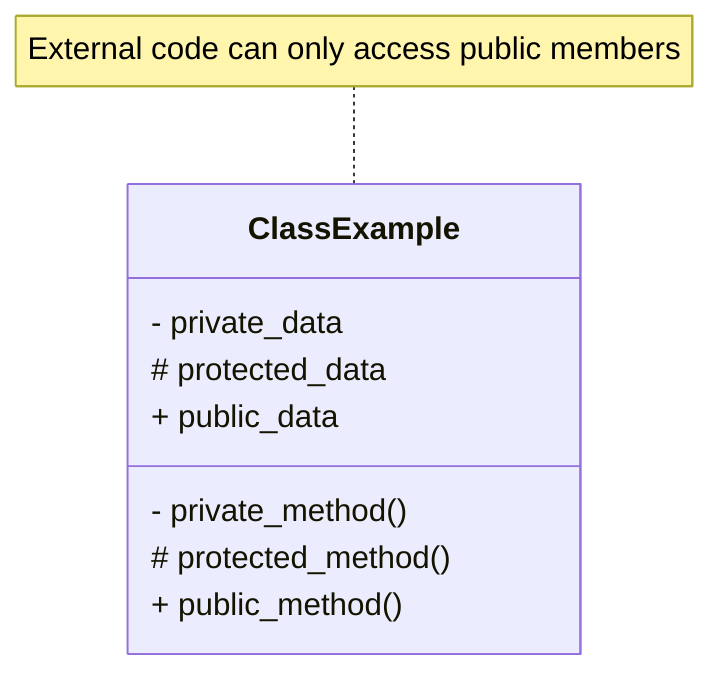
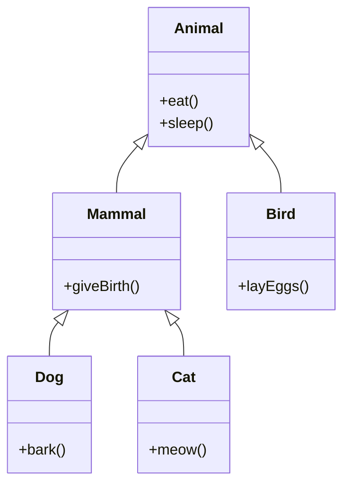
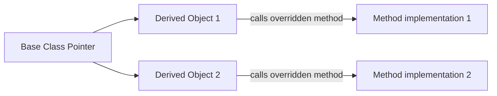
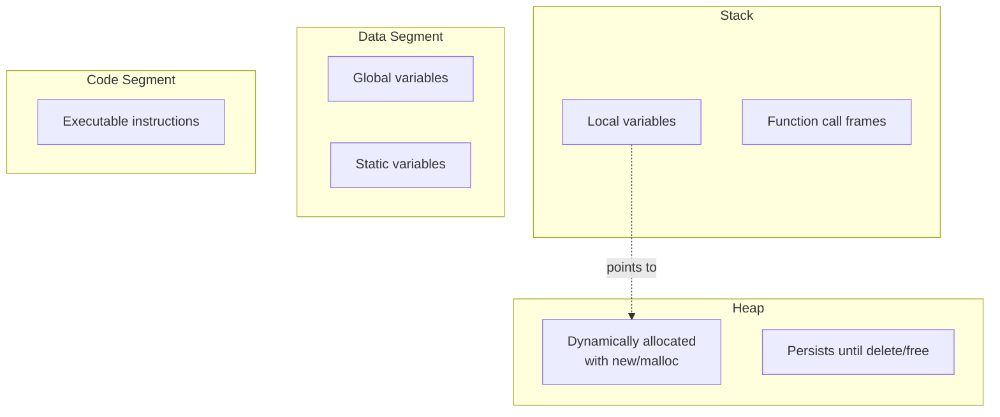

# Chapter 1: Introduction to OOP and C++ Basics

## 1.1 Procedural vs Object-Oriented Programming

Software development follows different paradigms. The two most fundamental paradigms are procedural programming and object-oriented programming.

### Procedural Programming

In procedural programming, the program is organized as a sequence of procedures (functions) that operate on data. Data is often global or passed explicitly between functions. The focus is on "what happens" – the step-by-step process.

**Characteristics:**
- Top-down design
- Functions share global data
- Limited code reuse (copy-paste or function libraries)
- Difficult to model real-world entities

### Object-Oriented Programming

In OOP, the program is organized around objects that encapsulate both data and behavior. Each object represents an entity from the problem domain. The focus is on "who does what" – objects interact by sending messages.

**Characteristics:**
- Bottom-up or hybrid design
- Data hiding and encapsulation
- High reusability through inheritance and composition
- Natural modeling of real-world systems

### Comparison Diagram



| Aspect | Procedural | Object-Oriented |
|--------|------------|-----------------|
| Unit | Function | Object |
| Data access | Global or passed | Encapsulated |
| Code reuse | Function libraries | Inheritance, composition |
| Modification impact | Widespread | Localized to class |
| Typical languages | C, Pascal, Fortran | C++, Java, C#, Python |

---

## 1.2 Benefits of OOP

OOP introduces three significant advantages for software engineering.

### Modularity

A class is a self-contained module. It defines all data and operations relevant to one concept (e.g., `BankAccount`, `Student`, `Vehicle`). Changes inside a class do not affect other parts of the program as long as the public interface remains unchanged. This reduces development time and bug propagation.

### Reusability

Existing classes can be extended through inheritance (is-a relationship) or combined through composition (has-a relationship). C++ also provides templates for generic reusable code. Instead of rewriting code, developers derive new classes from base classes, reusing and overriding behavior.

### Maintainability

Encapsulation hides implementation details. When a bug exists, you know exactly which class is responsible. Properly designed classes lead to loose coupling – each class has a single, well-defined responsibility. This makes debugging, testing, and refactoring predictable.



---

## 1.3 Core OOP Concepts

Four fundamental concepts form the foundation of object-oriented programming.

### Encapsulation

Encapsulation is the bundling of data and methods that operate on that data within a single unit (class), while restricting direct external access to the internal data. In C++, access specifiers (`private`, `protected`, `public`) enforce encapsulation.



### Abstraction

Abstraction means exposing only essential features of an object while hiding implementation details. In C++, abstraction is achieved through public interfaces, abstract classes (with pure virtual functions), and separation of declaration from definition.

### Inheritance

Inheritance allows a class (derived class) to acquire properties and behaviors from another class (base class). This creates an "is-a" relationship. C++ supports single, multiple, multilevel, hierarchical, and hybrid inheritance.



### Polymorphism

Polymorphism (many forms) allows objects of different classes to be treated as objects of a common base class, with the appropriate method being called based on the actual object type. C++ implements polymorphism via virtual functions and dynamic binding.



---

## 1.4 C++ as a Multi-Paradigm Language

C++ is not purely object-oriented. It supports multiple programming paradigms, giving developers flexibility.

| Paradigm | C++ Features |
|----------|---------------|
| Procedural | Functions, loops, conditionals, arrays, pointers |
| Object-Oriented | Classes, inheritance, polymorphism, encapsulation |
| Generic | Templates (function templates, class templates) |
| Functional | Lambda expressions (C++11), `std::function`, `std::bind`, algorithms |

This multi-paradigm nature allows C++ to be used for low-level system programming as well as high-level application development.

---

## 1.5 Basic C++ Syntax Review

The following subsections review essential C++ syntax needed before diving into classes and objects.

### 1.5.1 Input and Output

C++ uses streams for I/O. The standard library provides `cin`, `cout`, and `cerr`.

```cpp
#include <iostream>

int main() {
    int age;
    std::cout << "Enter your age: "; // output
    std::cin >> age;                  // input
    std::cerr << "Error: invalid age" << std::endl; // error output (unbuffered)
    return 0;
}
```

- `cout` (character output) – buffered, for normal program output.
- `cin` (character input) – extracts formatted data from standard input.
- `cerr` (character error) – unbuffered, for immediate error messages.
- `clog` – buffered version for logging.

Manipulators like `std::endl` (newline + flush) and `std::flush` control output formatting.

### 1.5.2 Namespaces

Namespaces prevent name conflicts in large projects. The entire C++ standard library is inside namespace `std`.

```cpp
#include <vector>

// Option 1: Explicit qualification
std::vector<int> v;

// Option 2: using declaration (brings one name into scope)
using std::vector;
vector<int> v2;

// Option 3: using directive (brings all names - generally avoid in headers)
using namespace std;
vector<int> v3; // now std:: is optional

// Custom namespace
namespace MyLibrary {
    void compute() {}
    class Matrix {};
}

// Usage
MyLibrary::compute();
```

Best practice: Avoid `using namespace std;` in header files and large codebases. Use explicit `std::` or selective `using` declarations.

### 1.5.3 References vs Pointers

Both references and pointers provide indirect access to objects, but they differ significantly.

| Feature | Pointer | Reference |
|---------|---------|-----------|
| Can be null | Yes | No (must refer to valid object) |
| Can be reassigned | Yes (point to different address) | No (always refers to original object) |
| Syntax | Uses `*` and `&` operators | Implicit, acts like variable alias |
| Memory overhead | Usually 4/8 bytes | Typically none (implementation detail) |
| Arithmetic possible | Yes (pointer arithmetic) | No |
| Used for | Dynamic memory, arrays, optional parameters | Function parameters (pass by reference), aliasing |

**Code example:**

```cpp
int a = 10, b = 20;

// Pointer
int* ptr = &a;   // ptr holds address of a
*ptr = 15;       // a becomes 15
ptr = &b;        // ptr now points to b

// Reference
int& ref = a;    // ref is another name for a
ref = 25;        // a becomes 25
// ref = b;      // Wrong: this assigns value of b to a, does not change reference target

// Pass by reference (common use)
void swap(int& x, int& y) {
    int temp = x;
    x = y;
    y = temp;
}
```

### 1.5.4 Dynamic Memory Management

C++ allows manual memory allocation on the heap using `new` and `delete`. Unlike stack allocation, heap memory persists until explicitly freed.

```cpp
// Single object
int* p = new int(42);     // allocate and initialize
delete p;                  // free memory
p = nullptr;               // good practice: reset pointer

// Array
int* arr = new int[100];   // allocate array of 100 integers
delete[] arr;              // free array (note the [])

// 2D array (jagged)
int** matrix = new int*[rows];
for (int i = 0; i < rows; ++i)
    matrix[i] = new int[cols];

// Deallocation
for (int i = 0; i < rows; ++i)
    delete[] matrix[i];
delete[] matrix;
```

**Memory layout diagram:**



**Rules:**
- Every `new` must match with one `delete`.
- Every `new[]` must match with one `delete[]`.
- Deleting already freed memory causes undefined behavior.
- In modern C++, avoid raw `new`/`delete` – use smart pointers (`std::unique_ptr`, `std::shared_ptr`) and containers.

### 1.5.5 Function Overloading and Default Arguments

**Function Overloading:** Multiple functions can share the same name if they have different parameter lists (type, number, or order). Return type alone cannot distinguish overloads.

```cpp
int add(int a, int b) { return a + b; }
double add(double a, double b) { return a + b; }
int add(int a, int b, int c) { return a + b + c; }

// Calls:
add(5, 10);        // first version
add(3.5, 2.7);     // second version
add(1, 2, 3);      // third version
```

Overload resolution selects the best match. Ambiguous calls (e.g., `add(1, 2.5)`) produce compilation errors.

**Default Arguments:** Parameters can have default values, allowing callers to omit trailing arguments.

```cpp
void log(const std::string& message, int level = 0, bool timestamp = true) {
    // implementation
}

// Valid calls:
log("System started");                    // level=0, timestamp=true
log("Warning", 1);                        // timestamp=true
log("Error", 2, false);                   // all arguments provided

// Invalid: cannot skip middle argument
// log("Invalid", , false);   // error
```

**Rules for default arguments:**
- Defaults must be specified from rightmost parameter toward left.
- Default arguments are resolved at compile time (based on function declaration visible at call site).
- Virtual functions and default arguments have subtle interactions (avoid defaults in overridden functions).

```mermaid
flowchart LR
    Caller -->|log(msg)| F1[log(message, level=0, timestamp=true)]
    Caller -->|log(msg,1)| F2[log(message, level=1, timestamp=true)]
    Caller -->|log(msg,1,false)| F3[log(message, level=1, timestamp=false)]
```

---

## Summary

This chapter covered the transition from procedural to object-oriented thinking, the four pillars of OOP (encapsulation, abstraction, inheritance, polymorphism), and reviewed essential C++ syntax needed to write classes. Subsequent chapters will build on this foundation to implement fully object-oriented designs in C++.

## References

- Stroustrup, B. (2013). *The C++ Programming Language*. Addison-Wesley.
- ISO/IEC 14882:2020 (C++20 Standard).
- Lippman, S. B., Lajoie, J., & Moo, B. E. (2012). *C++ Primer*. Addison-Wesley.
