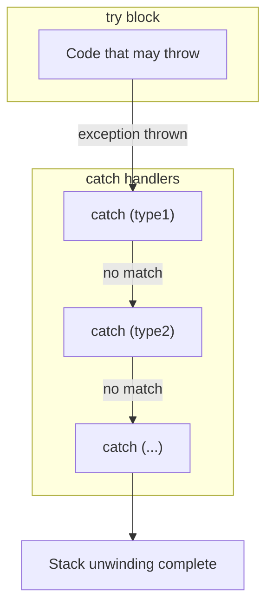
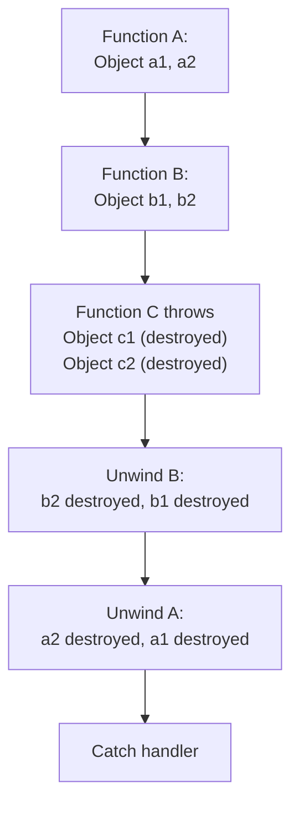
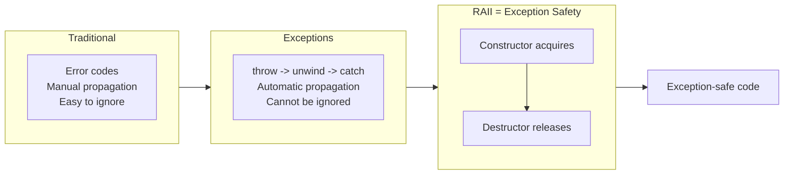

# Chapter 7: Exception Handling

Exception handling is a mechanism that separates error detection from error handling, allowing programs to respond to exceptional circumstances without cluttering normal code flow.

## Traditional Error Handling vs Exceptions

Traditional methods for handling errors include returning error codes, setting global flags (`errno`), or using `setjmp`/`longjmp`. Each has significant drawbacks.

| Aspect | Traditional (Error Codes) | Exceptions |
|--------|---------------------------|-------------|
| Propagation | Manual checking after every call | Automatic propagation up the call stack |
| Ignorability | Easy to ignore (e.g., not checking return value) | Cannot be ignored – program terminates if uncaught |
| Code clarity | Interleaves normal and error logic | Separates normal flow from error handling |
| Constructors | Cannot return error codes | Throw exception to indicate failure |
| Performance | No overhead when no error occurs | Some overhead even if no exception is thrown (but modern compilers optimise) |

**Example – Traditional error code**:

```cpp
int openFile(const char* name, FileHandle& out) {
    if (!name) return -1;
    // ... attempt open
    if (failed) return -2;
    return 0; // success
}

FileHandle fh;
if (openFile("data.txt", fh) != 0) {
    // handle error
}
```

**Example – Exception**:

```cpp
void openFile(const char* name, FileHandle& out) {
    if (!name) throw std::invalid_argument("name is null");
    // ... attempt open
    if (failed) throw std::runtime_error("cannot open file");
}

try {
    FileHandle fh;
    openFile("data.txt", fh);
    // use fh
} catch (const std::exception& e) {
    // handle any error uniformly
}
```

## C++ Exception Keywords: `try`, `catch`, `throw`



### Basic Syntax

```cpp
try {
    // Code that may throw an exception
    if (error_condition)
        throw SomeExceptionType("error message");
} catch (const SpecificException& e) {
    // Handle specific exception
} catch (const AnotherException& e) {
    // Handle another type
} catch (...) {
    // Catch-all handler – handles any exception
}
```

### Throwing Exceptions

Use `throw` to raise an exception. You can throw any type, but by convention you throw objects derived from `std::exception`.

```cpp
#include <stdexcept>

double divide(double a, double b) {
    if (b == 0.0)
        throw std::runtime_error("Division by zero");
    return a / b;
}
```

## Throwing Exceptions from Constructors and Destructors

### Constructors

Constructors have no return value, so exceptions are the only reliable way to signal failure. A partially constructed object should not be allowed to exist.

```cpp
class Image {
    int* pixels;
    size_t width, height;
public:
    Image(size_t w, size_t h) : width(w), height(h) {
        if (w == 0 || h == 0)
            throw std::invalid_argument("dimensions must be positive");
        pixels = new int[w * h];  // may also throw std::bad_alloc
    }
    // destructor not called if constructor throws
};
```

**Important**: If an exception escapes a constructor, the object's destructor will **not** be called. Resources already acquired must be released before throwing.

### Destructors

Destructors should **not** throw exceptions. If an exception propagates out of a destructor while another exception is already active, `std::terminate` is called (program crashes).

```cpp
class Resource {
public:
    ~Resource() {
        try {
            // clean up that might throw
            close();
        } catch (...) {
            // log or swallow – never rethrow
        }
    }
};
```

**Rule**: Destructors are `noexcept` by default (C++11). If you must report an error, log it internally and do not throw.

## Catch by Value, Reference, or Pointer

The `catch` clause can receive the exception object in different ways:

| Catch form | Advantages | Disadvantages | Recommended? |
|------------|------------|---------------|---------------|
| `catch (std::exception e)` | Simple | Copies the exception – slicing occurs for derived types. | No |
| `catch (std::exception& e)` | No copy, polymorphic behaviour | None | **Yes**, prefer const reference |
| `catch (const std::exception* e)` | Can handle pointers | Requires throwing pointer to heap object – memory management issues. | No |
| `catch (const std::exception& e)` | Same as above, plus prevents modification | – | **Best practice** |

**Best practice**: Catch by `const` reference to avoid slicing and unnecessary copying.

```cpp
try {
    // ...
} catch (const std::exception& e) {
    std::cerr << e.what() << '\n';
}
```

## Standard Exception Hierarchy (`<stdexcept>`)

The C++ standard library provides a hierarchy of exception classes derived from `std::exception`.

```mermaid
classDiagram
    class std::exception {
        +what() const char*
    }
    class std::logic_error {
        +what()
    }
    class std::invalid_argument
    class std::domain_error
    class std::length_error
    class std::out_of_range
    class std::runtime_error {
        +what()
    }
    class std::range_error
    class std::overflow_error
    class std::underflow_error
    class std::bad_alloc
    class std::bad_cast
    class std::bad_typeid
    class std::bad_weak_ptr
    
    std::exception <|-- std::logic_error
    std::exception <|-- std::runtime_error
    std::exception <|-- std::bad_alloc
    std::exception <|-- std::bad_cast
    std::exception <|-- std::bad_typeid
    std::exception <|-- std::bad_weak_ptr
    
    std::logic_error <|-- std::invalid_argument
    std::logic_error <|-- std::domain_error
    std::logic_error <|-- std::length_error
    std::logic_error <|-- std::out_of_range
    
    std::runtime_error <|-- std::range_error
    std::runtime_error <|-- std::overflow_error
    std::runtime_error <|-- std::underflow_error
```

### Common Standard Exceptions

| Exception type | Category | Typical cause |
|----------------|----------|----------------|
| `std::invalid_argument` | logic_error | Bad argument passed to a function |
| `std::out_of_range` | logic_error | Index/subscript out of bounds |
| `std::length_error` | logic_error | Attempt to exceed max length (e.g., `vector::reserve`) |
| `std::domain_error` | logic_error | Mathematical domain error (e.g., `sqrt(-1)`) |
| `std::runtime_error` | runtime_error | Error discovered at runtime (file not found, etc.) |
| `std::overflow_error` | runtime_error | Arithmetic overflow |
| `std::bad_alloc` | – | `new` fails to allocate memory |
| `std::bad_cast` | – | `dynamic_cast` on reference fails |

### Using Standard Exceptions

```cpp
#include <stdexcept>
#include <vector>

int getValue(const std::vector<int>& vec, size_t index) {
    if (index >= vec.size())
        throw std::out_of_range("index " + std::to_string(index) + 
                                " exceeds size " + std::to_string(vec.size()));
    return vec[index];
}
```

## Exception Specifications (Deprecated) vs `noexcept` Specifier

### Old Exception Specifications (deprecated in C++11, removed in C++17)

```cpp
// Deprecated syntax – do not use
void oldFunc() throw(std::runtime_error, std::bad_alloc); // lists allowed exceptions
void oldNoThrow() throw();  // promises no exceptions
```

These were checked at runtime, caused performance overhead, and were removed from the language.

### `noexcept` Specifier (C++11)

`noexcept` declares that a function will never throw an exception. If a `noexcept` function does throw, `std::terminate` is called.

```cpp
void safeFunction() noexcept {
    // Must not throw
}

void mayThrow() {
    // May or may not throw
}

// Conditional noexcept
template<typename T>
void swap(T& a, T& b) noexcept(noexcept(T(std::move(a)))) {
    // // noexcept if move constructor is noexcept
}
```

**When to use `noexcept`**:
- Move constructors and move assignment operators (enables optimisations like `std::vector` reallocation)
- Destructors (they are `noexcept` by default)
- Simple getters/setters that cannot throw
- Functions you intend to call from destructors or `catch` blocks

**Example – Move constructor with `noexcept`**:

```cpp
class Buffer {
    int* data;
public:
    Buffer(Buffer&& other) noexcept : data(other.data) {
        other.data = nullptr;
    }
};
```

`std::vector` uses `noexcept` to decide whether to use move or copy when reallocating – moves are only used if they are `noexcept`.

## Stack Unwinding and Resource Management

When an exception is thrown, the runtime searches for a matching `catch` handler. During this process, all local objects in the scope between the `throw` and the `catch` are destroyed in reverse order of construction. This is **stack unwinding**.



```cpp
#include <iostream>

class Resource {
    std::string name;
public:
    Resource(const std::string& n) : name(n) {
        std::cout << "Acquire " << name << '\n';
    }
    ~Resource() {
        std::cout << "Release " << name << '\n';
    }
};

void risky() {
    Resource r1("local in risky");
    throw std::runtime_error("oops");
    Resource r2("never created"); // not reached
}

void outer() {
    Resource r3("in outer");
    risky();
}

int main() {
    try {
        outer();
    } catch (const std::exception& e) {
        std::cout << "Caught: " << e.what() << '\n';
    }
}
```

Output:
```
Acquire in outer
Acquire local in risky
Release local in risky
Release in outer
Caught: oops
```

Notice that `r2` is not constructed, and `r1` is properly destroyed before `r3`. This automatic cleanup is the foundation of exception safety.

## RAII (Resource Acquisition Is Initialization) as the Key to Exception‑Safe Code

**RAII** is a C++ idiom where a resource is acquired in a constructor and released in the destructor. The resource lifetime is tied to object lifetime. When an exception causes stack unwinding, local RAII objects are destroyed automatically, releasing their resources.

### Without RAII – Leak Prone

```cpp
void badFunction() {
    int* data = new int[1000];
    // ... if an exception is thrown here, delete[] never runs
    delete[] data;
}
```

### With RAII – Exception Safe

```cpp
#include <vector>

void goodFunction() {
    std::vector<int> data(1000); // RAII: memory acquired in constructor
    // ... if exception is thrown, vector's destructor runs automatically
} // data destroyed here, memory freed
```

### Writing RAII Classes

```cpp
class FileHandle {
    FILE* file;
public:
    FileHandle(const char* filename, const char* mode) {
        file = fopen(filename, mode);
        if (!file)
            throw std::runtime_error("cannot open file");
    }
    
    ~FileHandle() {
        if (file) fclose(file);
    }
    
    // Disable copy (or implement deep copy)
    FileHandle(const FileHandle&) = delete;
    FileHandle& operator=(const FileHandle&) = delete;
    
    // Allow move
    FileHandle(FileHandle&& other) noexcept : file(other.file) {
        other.file = nullptr;
    }
    
    FILE* get() const { return file; }
};

// Usage
void processFile() {
    FileHandle fh("data.txt", "r");
    // ... work with fh – if exception occurs, fh's destructor closes the file
}
```

### Exception Safety Guarantees

There are three levels of exception safety for operations:

| Level | Guarantee |
|-------|------------|
| **No‑throw guarantee** | The operation never throws an exception (e.g., `noexcept` functions). |
| **Strong guarantee** | If an exception is thrown, the program state remains unchanged (rollback). |
| **Basic guarantee** | If an exception is thrown, no resources are leaked and the object remains in a valid (but unspecified) state. |
| **No guarantee** | Memory leaks or corrupted state may occur. |

**Strong guarantee example – Copy‑and‑swap**:

```cpp
class String {
    char* data;
public:
    void swap(String& other) noexcept {
        std::swap(data, other.data);
    }
    
    String& operator=(const String& other) {
        String temp(other);    // may throw – but if it does, *this unchanged
        swap(temp);            // non‑throwing
        return *this;
    }
};
```

### Common RAII Wrappers in the Standard Library

| Resource | RAII Wrapper |
|----------|--------------|
| Memory (raw `new`) | `std::vector`, `std::string`, smart pointers |
| File handle | `std::fstream` (not fully, but closes on destruction) |
| Mutex lock | `std::lock_guard`, `std::unique_lock` |
| Dynamic allocation with custom deleter | `std::unique_ptr<T, Deleter>` |

**Example – `std::lock_guard`**:

```cpp
#include <mutex>
std::mutex m;

void threadSafeFunction() {
    std::lock_guard<std::mutex> lock(m); // acquires mutex
    // ... critical section – if exception, lock is released automatically
} // lock destroyed, mutex released
```

## Guidelines for Exception‑Safe Code

1. **Use RAII for all resources** – Let destructors do cleanup.
2. **Do not throw from destructors** – Mark them `noexcept`.
3. **Catch by const reference** – Avoid slicing and unnecessary copies.
4. **Prefer standard exceptions** – Use `std::runtime_error`, `std::invalid_argument`, etc.
5. **Provide strong guarantee when reasonable** – Use copy‑and‑swap for assignment.
6. **Mark move constructors and swap as `noexcept`** – Enables optimisations.
7. **Avoid raw `new` and `delete`** – Use containers and smart pointers.
8. **Do not use exception specifications** – Use `noexcept` if you promise no exceptions.

## Summary Diagram



Exception handling, when combined with RAII, makes C++ programs robust and maintainable. The key is to ensure that every resource is managed by an object whose destructor releases it – then exceptions become a tool for propagating errors, not a threat to resource correctness.