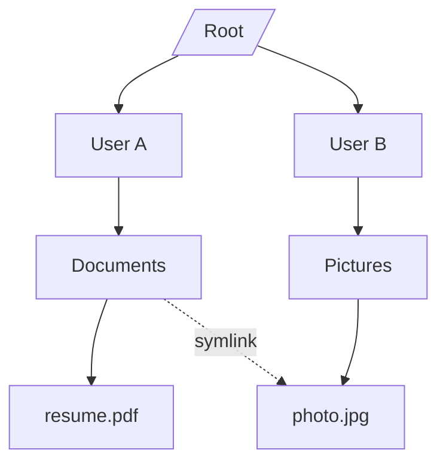
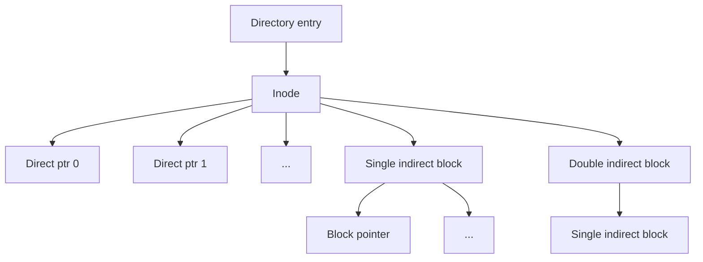

# Chapter 8: File Systems

A file system is the OS component that manages how data is stored, organised, and retrieved on persistent storage devices (disks, SSDs). This chapter covers file concepts, directory structures, allocation methods, free space management, disk scheduling, and real‑world file system designs.

---

## File Concept

A **file** is a named collection of related information stored on a secondary storage device. It is the logical unit of storage, hiding the physical details of the disk.

### File Attributes

| Attribute | Description |
|-----------|-------------|
| **Name** | Human‑readable identifier (e.g., `report.txt`). |
| **Identifier** | Unique number (inode number) used internally by OS. |
| **Type** | Indicates format (e.g., `.c`, `.pdf`, executable). |
| **Location** | Pointer to where the file is stored on disk. |
| **Size** | Current size in bytes (and possibly maximum). |
| **Protection** | Access permissions (read, write, execute for owner/group/others). |
| **Timestamps** | Creation, last modification, last access times. |
| **User ID / Owner** | Which user owns the file. |

### File Operations

Common system calls for file manipulation:

| Operation | Purpose |
|-----------|---------|
| `create` | Make a new file (allocate space, add directory entry). |
| `open` | Prepare file for use – returns a file descriptor. |
| `read` | Transfer bytes from file to memory. |
| `write` | Transfer bytes from memory to file. |
| `seek` | Move the file pointer (random access). |
| `close` | Flush buffers, release resources. |
| `delete` | Remove file from disk and directory. |
| `truncate` | Discard existing content, keep file. |

### File Types

| Type | Example extensions | Purpose |
|------|--------------------|---------|
| Regular | `.txt`, `.c`, `.pdf` | User data or programs. |
| Directory | folder | Contains file names and references. |
| Special (device) | `/dev/sda` (Unix) | Represents I/O devices. |
| Named pipe | FIFO | Inter‑process communication. |
| Socket | `/var/run/docker.sock` | Network or local IPC. |

**Real‑life analogy**: A file is like a physical document in a filing cabinet. Its attributes include the document title (name), the drawer number (location), its size, and who can read it (protection).

---

## Directory Structure

A **directory** is a container that stores file names and their associated metadata (or pointers to metadata). Directories organise files hierarchically.

### Single‑Level Directory

All files are in one directory. Simple but suffers from name collisions and poor organisation on multiuser systems.

**Example**: MS‑DOS floppy disks (root only).

### Two‑Level Directory

Separate directory per user: a master file directory (MFD) contains user directories, each user has their own user file directory (UFD). Different users can have files with the same name.

### Tree‑Structured Directory

A general hierarchy: directories can contain subdirectories. Users can create unlimited nesting. Current working directory simplifies pathnames.

**Absolute path**: from root (`/home/user/file.txt`).  
**Relative path**: from current directory (`./file.txt`).

### Acyclic‑Graph Directory

Allows sharing of files or subdirectories via **links** (shortcuts, aliases). Two types:
- **Hard link**: Multiple directory entries point to the same file (same inode) – cannot cross file systems.
- **Soft link (symbolic link)**: A special file containing a path to the target – can cross file systems.

**Problem**: Deleting a file becomes tricky (reference counts needed).

### General Graph Directory

Permits cycles (directory containing a subdirectory that links back to its parent). Leads to problems traversing directories (infinite loops). Solutions: garbage collection, refuse to remove files with references, or disallow cycles.



**Real‑life analogy**: 
- Single‑level = one big drawer with all files.
- Tree‑structured = a filing cabinet with folders and subfolders.
- Acyclic graph = multiple folder labels pointing to the same physical file (like sticky notes on a box).

---

## File System Mounting

**Mounting** is the act of attaching a file system (from a disk partition, USB drive, CD‑ROM) to an existing directory path in the main file system tree. The directory where it is attached is the **mount point**.

Steps:
1. The OS checks that the device contains a valid file system (superblock).
2. The OS records the mount point in a mount table.
3. Access to the mount point path is redirected to the root of the mounted file system.

**Example** (Unix): `mount /dev/sdb1 /mnt/usb`

**Real‑life**: A bookshelf (main file system) with empty slots (mount points). You put a labelled binder (file system from a USB drive) into a slot. When you look at that slot, you see the contents of the binder.

---

## File Allocation Methods

The OS must decide how to allocate disk blocks to files. Three classic methods.

### 1. Contiguous Allocation

Each file occupies a set of **contiguous blocks** on disk. The directory entry stores the start block and length.

- **Pros**: Simple, fast sequential and random access (only one seek).
- **Cons**: External fragmentation (holes); file growth is difficult (must pre‑allocate or move file).

**Real‑life**: A cinema with reserved seats – all seats in a row. If you need more seats, you must move to a different row.

### 2. Linked Allocation

Each file is a **linked list** of disk blocks. The directory entry stores the first block pointer. Each block contains a pointer to the next block (or a file allocation table).

- **Pros**: No external fragmentation; file can grow easily.
- **Cons**: Poor random access (must traverse pointers); reliability (one lost pointer ruins the rest).

**File Allocation Table (FAT)**: A separate table (at the start of the partition) holds pointers for all blocks. The directory entry stores the first block number. The FAT entry for each block points to the next. Random access still requires following the chain in memory (but can be cached).

**Real‑life**: A treasure hunt where each clue (block) tells you where the next clue is. Finding the 50th clue requires following 49 previous ones.

### 3. Indexed Allocation

Each file has its own **index block** – an array of pointers to all the file’s data blocks. The directory entry points to the index block.

- **Pros**: Direct random access (look up index block, then data block). No external fragmentation.
- **Cons**: Overhead of index block; small files waste space if index block is fixed size (e.g., 512 entries).

**Extensions** (Unix inode):
- Direct pointers (10‑12 pointers).
- Single indirect pointer (points to a block of pointers).
- Double indirect pointer (points to a block of single indirect blocks).
- Triple indirect pointer (for very large files).

This scheme supports huge files with minimal overhead for small files.



**Real‑life**: A library card catalogue. The card (index block) lists where each chapter (data block) is located in the library.

---

## Free Space Management

The OS must track which disk blocks are free and allocate them when needed.

### Bit Vector (Bitmap)

One bit per block (1 = free, 0 = allocated). The bit vector fits in memory for moderate‑sized disks (e.g., 1 TB with 4 KB blocks: 1 TB / 4 KB = 2²⁸ blocks → 256 MB of bitmap – large but manageable). Finding a free block is a scan for a 1‑bit.

### Linked List

Free blocks are linked together. The first free block pointer is stored. Each free block contains a pointer to the next free block.

- **Pros**: Simple, no extra space (except pointer in each free block).
- **Cons**: Traversing the list requires reading blocks (disk I/O). To allocate, need to read one block.

### Grouping

Store the addresses of many free blocks in one block. The last free block points to the next group. Reduces traversal reads.

### Counting

Free blocks often appear in contiguous runs (especially after file deletion). Record addresses of first free block and the count of contiguous free blocks. The list of (address, count) pairs is compact.

---

## Disk Scheduling

The OS (or disk driver) orders read/write requests to minimise seek time and improve throughput.

### Common Algorithms

| Algorithm | Description | Pros | Cons |
|-----------|-------------|------|------|
| **FCFS** | First‑come, first‑served | Fair, simple | Poor performance (wild seeks) |
| **SSTF** | Shortest seek time first | Better throughput | May starve far‑away requests |
| **SCAN** (elevator) | Move arm from one end to the other, servicing requests | Fair, no starvation | Requests at ends wait longer |
| **C‑SCAN** | Circular SCAN – only one direction, then jump back | Uniform waiting time | Extra jump time (no I/O during jump) |
| **LOOK** | Like SCAN but stop at last request (no go to end) | Less wasted motion | Still biased |
| **C‑LOOK** | Like C‑SCAN but stop at last request | Best of both | Slightly more complex |

```mermaid
flowchart LR
    Requests[Request queue: 98, 183, 37, 122, 14, 124, 65, 67] -> Algorithm[Choose algorithm]
    Algorithm --> FCFS[FCFS: order arrival]
    Algorithm --> SSTF[Nearest next]
    Algorithm --> SCAN[Elevator]
```

**Real‑life analogy**: 
- **FCFS**: A elevator that serves people in order of pressing the button (goes up and down wildly).
- **SCAN**: A lift that goes from bottom to top, then top to bottom, stopping at floors with pending requests.
- **LOOK**: Same but doesn’t go to the top floor if no one requested it.

---

## File System Layout

A typical Unix‑like file system on disk is divided into blocks. Common structure:

| Block range | Name | Purpose |
|-------------|------|---------|
| Block 0 | **Boot block** | Contains bootstrap loader (code to boot the OS). |
| Block 1 | **Superblock** | File system metadata: block size, number of blocks, free block count, inode table size, magic number. |
| Blocks 2..N | **Inode table** | Array of inodes, each describing a file (metadata + pointers). |
| Rest | **Data blocks** | Actual file content and directory entries. |

Additional structures:
- **Block bitmap** or **inode bitmap** for free space tracking (often placed after superblock).
- **Journal or log** area (for journaling file systems).

**Real‑life**: A warehouse (disk) with a map (superblock) at the entrance, a catalogue (inode table) giving details of each box, and the shelves (data blocks) where boxes are stored.

---

## Journaling and Log‑Structured File Systems

### Journaling (Write‑ahead logging)

Before modifying file system structures, the OS writes a **journal** (log) of the intended changes. After the journal is safely on disk, the actual changes are made. If a crash occurs, the OS replays the journal to restore consistency.

**Journaling levels**:
- **Writeback**: Metadata only, data may be inconsistent.
- **Ordered**: Metadata journaled; data written before journal commit.
- **Data**: Full data journaling – safe but slow.

**Examples**: ext3, ext4 (ordered), NTFS (metadata journaling), XFS.

**Real‑life**: A pilot’s checklist – before takeoff, you write “flaps up” in a log (journal), then do it. If you are interrupted, you can resume from the log.

### Log‑Structured File System (LFS)

Instead of overwriting files in place, LFS writes all changes sequentially to the end of a circular log (like a tape). The file system index (inode map) is also periodically written. Old blocks are garbage‑collected.

- **Pros**: Excellent write performance (sequential writes), fast crash recovery.
- **Cons**: Read requires scanning the log; garbage collection overhead.

**Real‑life**: A journalist’s notebook – every new fact is written at the end, never erasing. An index at the back points to the latest version of each topic.

---

## File System Examples

### FAT32 (File Allocation Table)

- **Origins**: MS‑DOS, Windows 95/98, still used for USB drives.
- **Structure**: Boot sector, FAT table (two copies), root directory (fixed location), data area.
- **Limitations**: Max file size 4 GB, max volume 8 TB (but practical 2 TB). No permissions, no journaling.
- **Advantage**: Simple, widely compatible.

### NTFS (New Technology File System)

- **Windows default** since NT 3.1.
- **Features**: Journaling ($LogFile), security (ACLs), compression, encryption (EFS), file‑size limit 16 EB, hard links, reparse points (symlinks, mount points).
- **Structure**: Master File Table (MFT) – each file has one or more MFT records; small files stored directly in MFT (“resident”).
- **Performance**: Good for large volumes; supports disk quotas.

### ext4 (Fourth Extended File System)

- **Linux default** for many distributions.
- **Features**: Journaling, extents (replaces block mapping for large files), delayed allocation, 1 EB max volume, subdirectory limits up to 64,000 (or higher with dir_index).
- **Backward compatibility**: Can mount ext2/ext3.
- **Tools**: `mkfs.ext4`, `tune2fs`.

**Comparison table**:

| Feature | FAT32 | NTFS | ext4 |
|---------|-------|------|------|
| Max file size | 4 GB | 16 EB | 16 TB (theoretically 1 EB) |
| Max volume size | 2 TB (8 TB with 64KB clusters) | 16 EB | 1 EB |
| Journaling | No | Yes (metadata) | Yes (metadata, optional data) |
| Permissions | No | ACLs (yes) | POSIX (yes) |
| Compression | No | Yes | No (can use ecryptfs) |
| Default OS | Legacy Windows, USB drives | Windows | Linux |

---

## Summary

| Concept | Key takeaway |
|---------|--------------|
| File attributes | Name, ID, size, protection, timestamps, owner. |
| File operations | create, open, read, write, close, delete, truncate. |
| Directory structures | Single‑level, two‑level, tree, acyclic graph (with links), general graph. |
| Mounting | Attaching a file system to a directory path. |
| Contiguous allocation | Simple but causes fragmentation. |
| Linked allocation (FAT) | Good for growth, poor random access. |
| Indexed allocation (inode) | Direct + indirect pointers; supports large files. |
| Free space management | Bitmap, linked list, grouping, counting. |
| Disk scheduling | FCFS, SSTF, SCAN, C‑SCAN, LOOK, C‑LOOK. |
| File system layout | Boot block, superblock, inode table, data blocks. |
| Journaling | Write log before changes; recover after crash. |
| Examples | FAT32 (simple, universal), NTFS (feature‑rich, Windows), ext4 (Linux standard). |

File systems are the bridge between the OS and persistent storage. The next chapter covers I/O systems and device management.