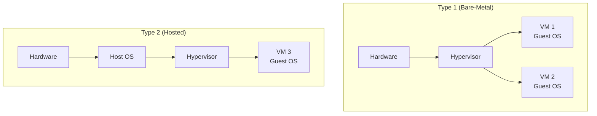
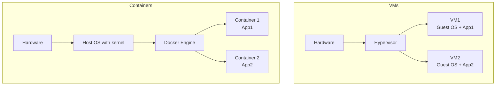

# Chapter 11: Virtualization and Cloud Computing

Virtualization decouples software from the underlying hardware, enabling multiple operating systems to run on a single physical machine. Cloud computing builds on virtualization to deliver computing resources as on‑demand services. This chapter explains hypervisors, containers, cloud models, and their trade‑offs.

---

## Virtual Machine Concepts: Hypervisors

A **virtual machine (VM)** is a software implementation of a physical computer that runs an operating system and applications. The **hypervisor** (or virtual machine monitor, VMM) is the software layer that creates and manages VMs.

### Type 1 Hypervisor (Bare‑Metal)

Runs directly on the physical hardware without a host OS. It has direct access to hardware resources.

- **Examples**: VMware ESXi, Microsoft Hyper‑V, KVM (Linux kernel‑based), Xen.
- **Pros**: High performance, low overhead, better security.
- **Cons**: Requires hardware drivers for all devices; more complex management.

### Type 2 Hypervisor (Hosted)

Runs as an application on top of a host operating system. The host OS manages physical hardware.

- **Examples**: Oracle VirtualBox, VMware Workstation, QEMU (without KVM acceleration).
- **Pros**: Easier to install, good for development and testing.
- **Cons**: Higher overhead (calls go through host OS), lower performance.

**Real‑life analogy**: 
- **Type 1**: A high‑rise apartment building with a property manager living on‑site (hypervisor directly controls elevators, electricity).
- **Type 2**: A rental agency that runs inside a larger office building – you rent a room, but the building’s own facilities manager (host OS) controls the infrastructure.

---

## Virtualization vs Emulation

| | **Virtualization** | **Emulation** |
|--|-------------------|---------------|
| **Guest instructions** | Run directly on CPU (if same architecture) | Simulated in software |
| **Performance** | Near‑native (with hardware support) | Very slow (10‑100× slowdown) |
| **Guest OS modification** | Not required (full virtualization) or minimal (para‑virtualization) | None needed |
| **Use case** | Run x86 Linux on x86 Windows | Run ARM software on x86, retro‑gaming |

**Virtualization** requires the guest and host to have the same instruction set architecture (ISA). **Emulation** can run software for any architecture by interpreting or translating each instruction.

**Example**: QEMU can emulate an ARM CPU on an x86 host (emulation). QEMU + KVM can virtualize an x86 guest on an x86 host (virtualization).

**Real‑life analogy**:
- **Virtualization**: A movie theatre where films are shown in their native format (digital projector plays digital files).
- **Emulation**: A translator who reads a French script out loud in English – every word is processed.

---

## Para‑Virtualization and Hardware‑Assisted Virtualization

### Para‑Virtualization

The guest OS is modified to be aware of the hypervisor. Instead of trapping privileged instructions (which are slow to emulate), the guest makes explicit **hypercalls** to the hypervisor.

- **Pros**: High performance (reduces trapping overhead).
- **Cons**: Requires modifying the guest OS (not possible for Windows).
- **Example**: Xen’s early approach (paravirtualized Linux, NetBSD).

### Hardware‑Assisted Virtualization

Modern CPUs (Intel VT‑x, AMD‑V) add hardware support for virtualization:
- **New CPU modes**: VMX root (hypervisor) and VMX non‑root (guest).
- **Extended Page Tables (EPT) / Nested Page Tables (NPT)**: Hardware‑assisted virtual memory translation (reduces shadow page table overhead).
- **VMCS (Virtual Machine Control Structure)**: Stores guest state, exit reasons.

**Benefits**:
- Full virtualization without guest modification.
- Near‑native performance.
- Simpler hypervisor implementation.

**Real‑life analogy**: 
- **Para‑virtualization**: A foreign tourist who learns a few local customs (modified OS) to move faster through airport security.
- **Hardware‑assisted**: An express lane at immigration with automated passport scanners (CPU support) – everyone can use it without special training.

---

## Containers vs Virtual Machines

**Containers** (e.g., Docker, LXC, Podman) virtualize at the **OS level**, not hardware level. They share the host kernel but isolate processes in namespaces.

| Feature | Virtual Machine | Container |
|---------|----------------|-----------|
| **Isolation** | Strong (separate kernels) | Moderate (shared kernel, namespaced) |
| **Startup time** | Seconds to minutes (boot OS) | Milliseconds (just start process) |
| **Disk footprint** | GBs (full OS + apps) | MBs (app + dependencies) |
| **Performance overhead** | Small (type 1) or moderate (type 2) | Very low (near‑native) |
| **Kernel** | Each VM has its own kernel | All containers share host kernel |
| **Guest OS** | Any OS (Linux, Windows, BSD) | Must match host kernel (e.g., Linux host → Linux containers; Windows host → Windows containers) |

**Container primitives** (Linux):
- **Namespaces**: Isolate views (PID, network, mount, UTS, IPC, user).
- **Cgroups (control groups)**: Limit resource usage (CPU, memory, disk I/O).
- **Union filesystems** (OverlayFS, AUFS): Efficient, layered images.

**Real‑life analogy**:
- **Virtual machines**: Detached houses – each has its own plumbing, electricity, foundation. Very isolated but expensive and slow to build.
- **Containers**: Apartments in the same building – share central heating, water, and elevator (host kernel), but have separate doors (namespaces) and rent control (cgroups).

---

## Cloud Computing Models

Cloud computing delivers computing resources over the internet on a pay‑per‑use basis. Three main service models.

### IaaS (Infrastructure as a Service)

Provides virtual machines, storage, networks, and other fundamental computing resources. You control the OS, applications, and middleware.

- **Examples**: AWS EC2, Google Compute Engine, Microsoft Azure VMs.
- **Customer responsibility**: OS patches, security, application data.
- **Analogy**: Renting a plot of land – you build whatever you want.

### PaaS (Platform as a Service)

Provides a platform where you deploy applications without managing the underlying infrastructure (OS, runtime, middleware, databases).

- **Examples**: AWS Elastic Beanstalk, Google App Engine, Heroku.
- **Customer responsibility**: Application code and data.
- **Analogy**: Renting a fully equipped kitchen – you only bring the ingredients and cook.

### SaaS (Software as a Service)

Provides ready‑to‑use applications over the internet. No installation, no management of infrastructure or platform.

- **Examples**: Google Workspace (Gmail, Docs), Salesforce, Microsoft 365.
- **Customer responsibility**: Only user data and configuration.
- **Analogy**: Eating at a restaurant – you just order and consume.

```mermaid
flowchart TD
    subgraph Customer responsibility
        direction TB
        App[Application]
        Data[Data]
        Runtime[Runtime]
        Middleware[Middleware]
        OS[OS]
        Virtual[Virtualization]
        Servers[Servers]
        Storage[Storage]
        Networking[Networking]
    end
    
    subgraph IaaS
        AppC[Application] --> Customer
        DataC[Data] --> Customer
        RuntimeC[Runtime] --> Customer
        MiddlewareC[Middleware] --> Customer
        OSC[OS] --> Customer
        VirtualC[Virtualization] --> Provider
        ServersC[Servers] --> Provider
        StorageC[Storage] --> Provider
        NetworkingC[Networking] --> Provider
    end

    subgraph PaaS
        AppP[Application] --> Customer
        DataP[Data] --> Customer
        RuntimeP[Runtime] --> Provider
        MiddlewareP[Middleware] --> Provider
        OSP[OS] --> Provider
        VirtualP[Virtualization] --> Provider
        ServersP[Servers] --> Provider
        StorageP[Storage] --> Provider
        NetworkingP[Networking] --> Provider
    end

    subgraph SaaS
        AppS[Application] --> Provider
        DataS[Data] --> Customer
        RuntimeS[Runtime] --> Provider
        MiddlewareS[Middleware] --> Provider
        OSS[OS] --> Provider
        VirtualS[Virtualization] --> Provider
        ServersS[Servers] --> Provider
        StorageS[Storage] --> Provider
        NetworkingS[Networking] --> Provider
    end
```

**Deployment models**:
- **Public cloud**: Shared infrastructure over the internet.
- **Private cloud**: Dedicated infrastructure for one organisation.
- **Hybrid cloud**: Combined public and private clouds.
- **Multi‑cloud**: Using multiple public cloud providers.

---

## Challenges: Isolation, Performance, Security

### Isolation

VMs provide strong isolation (separate kernels). However, side‑channel attacks (e.g., Spectre, Meltdown) can leak information across VMs on the same physical host.

**Containers** share the host kernel. A kernel bug or container escape can compromise other containers. Mitigations: seccomp, SELinux, AppArmor, user namespaces, gVisor (sandboxed container runtime).

**Real‑life**: Apartment walls (containers) provide less sound isolation than separate houses (VMs). A loud party in one apartment disturbs neighbours.

### Performance

| Overhead | VMs | Containers |
|----------|-----|------------|
| CPU (native) | ~0‑5% (with hardware assist) | ~0‑1% |
| Memory | Fixed per VM (static) | Dynamic, copy‑on‑write |
| I/O (disk, network) | Higher (double‑buffering) | Near‑native |
| Boot time | Long (OS boot) | Instant (process start) |

**Considerations**:
- **VMs**: Better for mixed‑trust workloads, legacy apps, different OSes.
- **Containers**: Better for microservices, CI/CD, high density.

### Security

**Shared risks** (both VMs and containers):
- Hypervisor or kernel vulnerabilities.
- Misconfigured networking (exposed ports).
- Insecure images or base OS.

**VM‑specific**:
- Hypervisor attacks (VM escape).
- Resource exhaustion (fork bombs affecting others).

**Container‑specific**:
- Privilege escalation from container to host.
- Secret leakage via environment variables.
- Image supply chain attacks (malicious layers).

**Best practices**:
- Keep hypervisor/host kernel patched.
- Use minimal base images (Alpine, Distroless).
- Run containers as non‑root, with read‑only root filesystems.
- Use secure secrets management (HashiCorp Vault, Kubernetes secrets).
- Network policies for micro‑segmentation.

---

## Summary

| Concept | Key takeaway |
|---------|--------------|
| Hypervisor Type 1 | Bare‑metal, runs directly on hardware (ESXi, KVM, Hyper‑V). |
| Hypervisor Type 2 | Runs as app on host OS (VirtualBox, Workstation). |
| Virtualization vs emulation | Virtualization: same ISA, near‑native. Emulation: different ISA, slow. |
| Para‑virtualization | Guest modified to use hypercalls; more efficient (Xen). |
| Hardware‑assisted virt | CPU extensions (VT‑x, AMD‑V) simplify hypervisors and improve performance. |
| Containers | OS‑level virtualization, share host kernel, lightweight (Docker, LXC). |
| VMs vs containers | VMs: strong isolation, slower; containers: fast, dense, shared kernel risk. |
| Cloud IaaS | Infrastructure – VMs, storage, networks (AWS EC2). |
| Cloud PaaS | Platform – deploy apps without managing OS (Heroku, App Engine). |
| Cloud SaaS | Software – ready‑to‑use apps (Gmail, Office 365). |
| Challenges | Isolation (side‑channel, container escape), performance trade‑offs, security hardening. |

Virtualization and cloud computing have transformed how we build and deploy software. Understanding these concepts bridges traditional OS knowledge with modern DevOps practices.