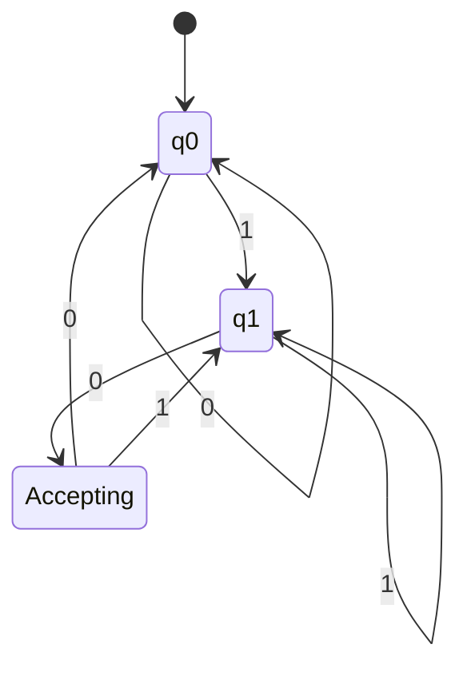
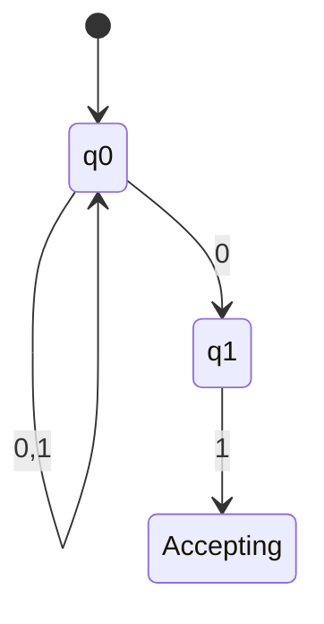
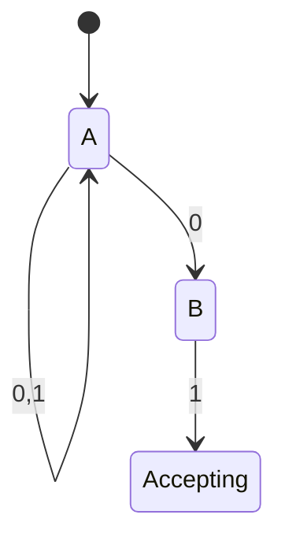
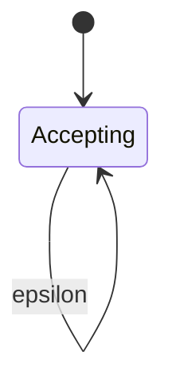
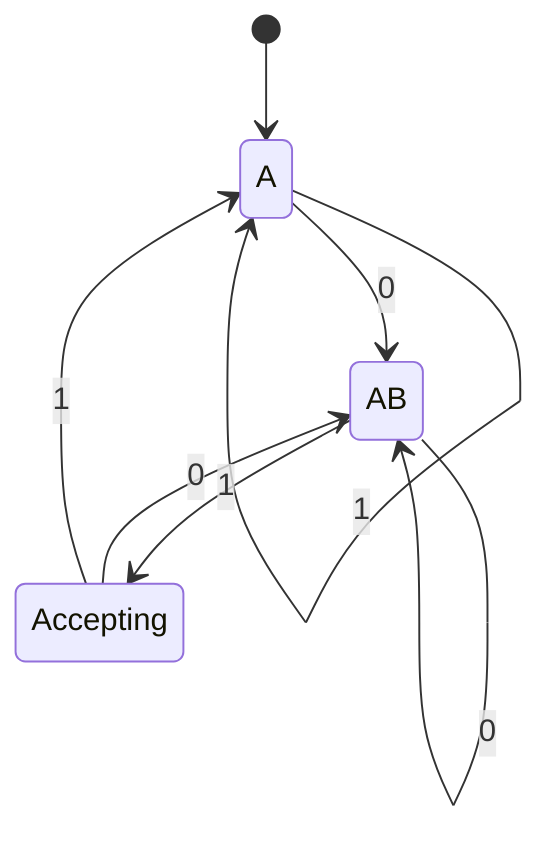
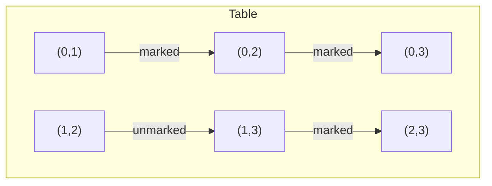
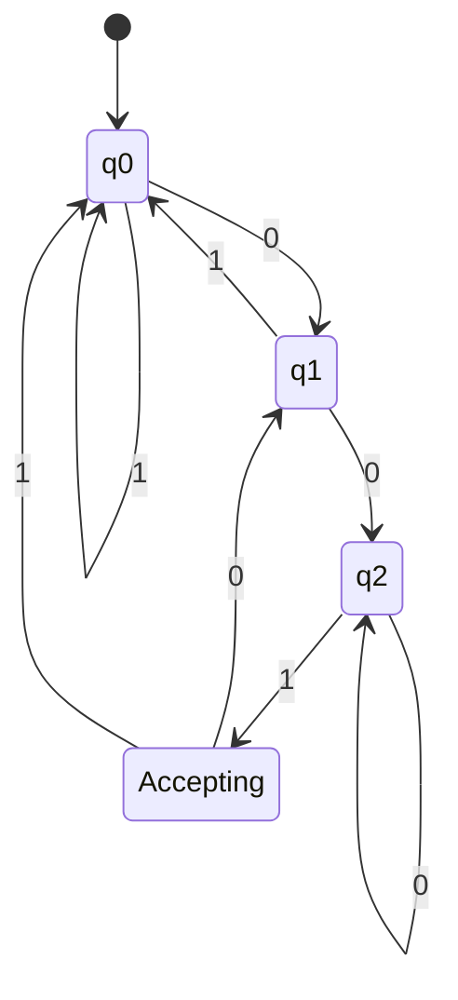
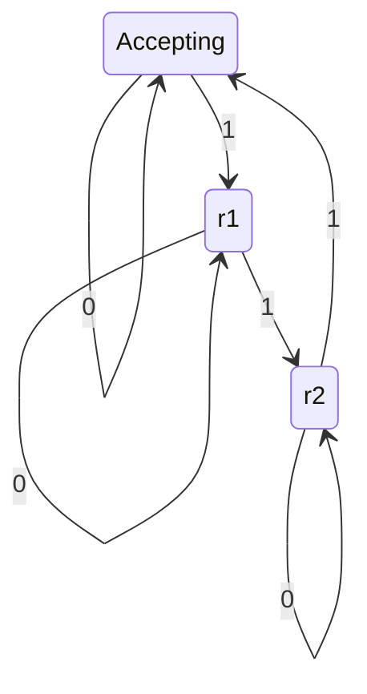

## Finite Automata

This chapter introduces the simplest class of abstract machines: finite automata. These are computational models with finite memory, used to recognise regular languages. We cover deterministic (DFA), non-deterministic (NFA), and epsilon-NFA variants, their equivalence, conversion algorithms, minimisation, and practical design strategies.

---

## 2.1 Deterministic Finite Automata (DFA)

A DFA is a simple machine that reads an input string from left to right, changing its internal state according to a fixed transition function. At any moment, the next state is uniquely determined by the current state and the input symbol.

### 2.1.1 Formal Definition (5-tuple)

A DFA is a 5-tuple `M = (Q, Σ, δ, q0, F)` where:

- `Q` - a finite set of **states**
- `Σ` - a finite **alphabet** of input symbols
- `δ: Q x Σ -> Q` - the **transition function** (deterministic)
- `q0 in Q` - the **start state**
- `F subseteq Q` - the set of **accepting (final) states**

### 2.1.2 Transition Functions and State Diagrams

The transition function `δ(q, a)` tells which state to go to when reading symbol `a` while in state `q`. It can be represented as a **state diagram** (a directed graph) or a **transition table**.

**Example:** DFA that accepts all binary strings ending with `01`.

- `Q = {q0, q1, q2}`
- `Σ = {0,1}`
- `q0` start state
- `F = {q2}`
- Transition function:

| State | Input 0 | Input 1 |
|-------|---------|---------|
| q_0 | q_0 | q_1 |
| q_1 | q_2 | q_1 |
| q_2 | q_0 | q_1 |

**Mermaid state diagram:**



### 2.1.3 Language Acceptance by DFA

The extended transition function `δ_hat: Q x Σ* -> Q` is defined recursively:

- `δ_hat(q, epsilon) = q`
- `δ_hat(q, wa) = δ(δ_hat(q, w), a)` for `w in Σ*` and `a in Σ`

A DFA `M` **accepts** a string `w` if `δ_hat(q0, w) in F`. The **language recognised** by `M` is:

`L(M) = { w in Σ* | δ_hat(q0, w) in F }`

---

## 2.2 Non-Deterministic Finite Automata (NFA)

An NFA relaxes the deterministic requirement: from a given state on a given symbol, there may be **zero, one, or several** possible next states. An NFA accepts a string if **some** sequence of choices leads to an accepting state.

### 2.2.1 Definition

An NFA is a 5-tuple `M = (Q, Σ, δ, q0, F)` where:

- `Q, Σ, q0, F` as in DFA
- `δ: Q x Σ -> 2^Q` (power set of `Q`)

The transition function returns a **set** of possible next states.

### 2.2.2 Why Non-Determinism is Useful

- **Conciseness**: Many languages have much smaller NFA descriptions than DFA.
- **Modular design**: NFAs can be built by union, concatenation, Kleene star directly from regular expressions.
- **Simulates parallelism**: An NFA can be viewed as exploring all possible paths simultaneously.

**Example:** NFA for strings ending with `01` (same language as previous DFA). It uses only two states:



But careful: The above is actually a DFA-like representation. A proper NFA for `(0+1)*01` can be:



Here from `A` on `0` we go to both `A` and `B` (non-determinism). On `1` from `A` only to `A`.

### 2.2.3 epsilon-NFA and epsilon-closure

An **epsilon-NFA** allows transitions on the empty string epsilon, meaning the machine can change state without consuming any input symbol.

**Formal definition:** `δ: Q x (Σ U {epsilon}) -> 2^Q`.

**epsilon-closure** of a set of states `S` is the set of all states reachable from `S` by following zero or more epsilon-transitions. Denoted `ECLOSE(S)`.

**Example epsilon-NFA:** Accepts strings over `{a,b}` where the number of `a` is even (can be built with epsilon-transitions to model parity). More standard: epsilon-NFA for the regular expression `a*`:



But epsilon-transitions are typically used to glue smaller automata.

**Algorithm for epsilon-closure:**
```
ECLOSE(S):
    closure = S
    stack = S (as a list)
    while stack not empty:
        pop state p
        for each q in δ(p, epsilon):
            if q not in closure:
                add q to closure
                push q
    return closure
```

---

## 2.3 Equivalence of DFA, NFA, and epsilon-NFA

All three models recognise exactly the same class of languages: **regular languages**.

- Every DFA is trivially an NFA (by viewing δ(q,a) as a singleton set).
- Every NFA can be converted to an equivalent DFA (subset construction - Section 2.4).
- Every epsilon-NFA can be converted to an equivalent NFA (by removing epsilon-transitions via epsilon-closure) and then to a DFA.

**Proof outline (epsilon-NFA -> NFA):**  
Given epsilon-NFA `E = (Q_E, Σ, δ_E, q0, F_E)`, construct NFA `N = (Q_E, Σ, δ_N, q0, F_N)` where:

- `δ_N(q, a) = ECLOSE(U over p in δ_E(q, a) of ECLOSE(p))` for `a in Σ`
- `F_N = { q | ECLOSE(q) intersection F_E != emptyset }`

This NFA accepts the same language without epsilon-transitions.

**Equivalence theorem:** For any epsilon-NFA, there exists a DFA recognising the same language, and vice versa.

---

## 2.4 Conversion of NFA to DFA (Subset Construction)

The **subset construction** (also called powerset construction) transforms an NFA `N = (Q_N, Σ, δ_N, q0, F_N)` into a DFA `D = (Q_D, Σ, δ_D, qD0, F_D)` where:

- Each state in `Q_D` is a **set of states** of `N`
- `Q_D subseteq 2^(Q_N)` (only reachable subsets)
- Start state: `qD0 = {q0}` (or epsilon-closure for epsilon-NFA)
- For a state `S subseteq Q_N` and symbol `a in Σ`:
    `δ_D(S, a) = U over p in S of δ_N(p, a)`
- `F_D = { S subseteq Q_N | S intersection F_N != emptyset }`

**Algorithm (only reachable subsets):**
```
Initialize queue with {q0}
Initialize Q_D = {{q0}}
while queue not empty:
    S = dequeue()
    for each a in Σ:
        T = union over p in S of δ_N(p,a)
        if T not in Q_D:
            add T to Q_D
            enqueue T
        δ_D(S,a) = T
```

**Example:** Convert the NFA for `(0+1)*01` (states A, B, C, where A start, C accept, δ(A,0)={A,B}, δ(A,1)={A}, δ(B,1)={C}) to DFA.

Reachable subsets:
- {A} (start)
  - on 0: {A,B}
  - on 1: {A}
- {A,B}
  - on 0: δ(A,0) U δ(B,0) = {A,B}  U  {} = {A,B}
  - on 1: δ(A,1) U δ(B,1) = {A}  U  {C} = {A,C}
- {A,C}
  - on 0: {A,B}  U  {} = {A,B}
  - on 1: {A}  U  {} = {A}
- No new sets.

Accepting subsets: those containing C -> {A,C} is accepting.

Result DFA has 3 states. The state diagram:



---

## 2.5 DFA Minimization

Given a DFA, we often want the **minimal DFA** (with fewest states) that recognises the same language. Two main approaches: the table-filling algorithm (Myhill-Nerode based) and Hopcroft's algorithm (more efficient).

### 2.5.1 Table-filling Algorithm (Myhill-Nerode)

The algorithm identifies pairs of states that are **distinguishable** (i.e., there exists a string that leads one to accept and the other to reject). Indistinguishable states can be merged.

**Steps:**

1. **Base:** Mark all pairs `(p, q)` where one is final and the other non-final.
2. **Inductive step:** For each unmarked pair `(p, q)`, for each symbol `a` in Σ, if `(δ(p,a), δ(q,a))` is already marked, then mark `(p, q)`.
3. Repeat until no new marks appear.
4. Unmarked pairs are equivalent - merge them.

**Example:** Minimise the DFA from the subset construction (states A, AB, AC).

Initially: final set {AC} vs non-final {A, AB}. Mark (A, AC) and (AB, AC).

Now examine (A, AB):
- On 0: δ(A,0)=AB, δ(AB,0)=AB -> (AB,AB) not a pair (same state) -> no mark.
- On 1: δ(A,1)=A, δ(AB,1)=AC -> (A,AC) is already marked -> therefore mark (A,AB).
Now all pairs involving A and AB are marked. No unmarked pairs remain. So no merging possible - the DFA is already minimal.

**Mermaid representation of a marking table** (for a different DFA with states 0,1,2,3):



### 2.5.2 Hopcroft's Algorithm

Hopcroft's algorithm partitions states using a **splitting** technique. It runs in `O(n log n)` time (with careful implementation) versus `O(n^2)` for table-filling.

**Idea:** Start with two groups: final and non-final. Repeatedly choose a group and a symbol to split groups that behave differently on that symbol.

Pseudo-code (simplified):
```
P = {F, Q \ F}
Worklist = {F, Q \ F} (if non-empty)
while Worklist not empty:
    remove group G from Worklist
    for each a in Σ:
        for each group H in P:
            split = { q in H | δ(q,a) in G }
            if split not empty and split != H:
                replace H by split and H\split in P
                add split and H\split to Worklist
```

### 2.5.3 Myhill-Nerode Theorem

The Myhill-Nerode theorem provides a theoretical characterisation of minimal DFA states. It states that a language `L` is regular iff the equivalence relation `equiv_L` on strings (two strings are equivalent iff for every suffix `z`, `xz in L <=> yz in L`) has a finite number of equivalence classes. The number of classes equals the number of states in the minimal DFA for `L`.

This theorem is the foundation of DFA minimisation.

---

## 2.6 Design of Finite Automata for Given Languages

Designing a DFA or NFA from a language description requires systematic reasoning. Below are common patterns.

### 2.6.1 Strings ending with a specific pattern

Language: `{ w  in  {0,1}* | w ends with 001 }`

Design approach: Build a "suffix detector" using states that remember the longest suffix that matches a prefix of the target.

**DFA states:** q0 (epsilon), q1 (0), q2 (00), q3 (001 accepting). Transitions on 0/1 that either extend match or fall back to appropriate prefix.



### 2.6.2 Strings containing a substring

Language: `{ w  in  {a,b}* | w contains "ab" }`

**NFA (easy):** states A (no 'ab' yet), B (saw 'a'), C (saw 'ab' accepting). Transitions: A on a -> A and B, A on b -> A; B on b -> C; B on a -> B; C on a,b -> C.

**DFA:** Can be derived via subset construction, but direct design: states: q0 (no 'a' pending, no 'ab'), q1 (last char 'a' but no 'ab' yet), q2 ('ab' seen - absorbing accept).

### 2.6.3 Strings with modulo condition

Language: `{ w  in  {0,1}* | number of 1's mod 3 = 0 }`

DFA with 3 states (remainder 0,1,2). Start state remainder 0 (accepting). Transition: on 1, remainder = (r+1) mod 3; on 0, remainder unchanged.



### 2.6.4 Strings with equal number of `01` and `10` substrings

This is a classic "run length" property. The difference between the count of `01` and `10` is determined by the first and last symbols. The minimal DFA has 4 states tracking first symbol (if any) and last symbol.

---

## Summary

| Model | Transition | Determinism | epsilon-moves | Power |
|-------|-----------|-------------|---------|-------|
| DFA | δ: QxΣ -> Q | Yes | No | Regular languages |
| NFA | δ: QxΣ -> 2^Q | No | No | Regular languages |
| epsilon-NFA | δ: Qx(Σ U {epsilon})->2^Q | No | Yes | Regular languages |

Key takeaways:
- DFA, NFA, epsilon-NFA are **equally expressive**.
- Subset construction converts NFA/epsilon-NFA to DFA (exponential blow-up in worst case).
- DFA minimisation yields a unique (up to isomorphism) minimal DFA.
- Myhill-Nerode theorem gives the theoretical basis for minimisation.


