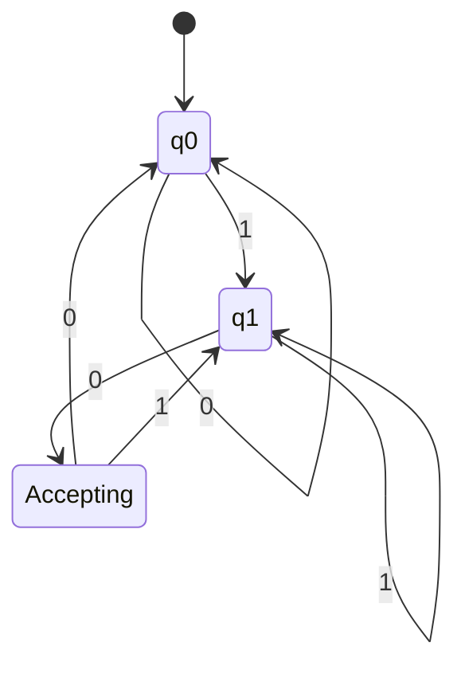
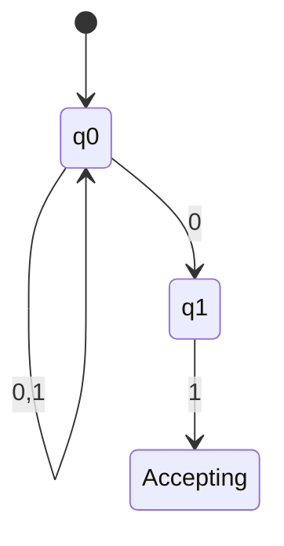
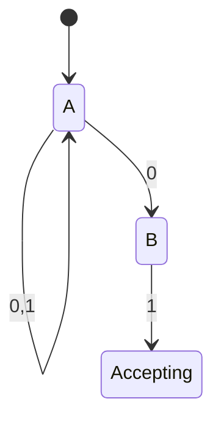
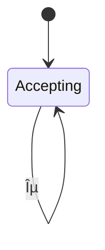
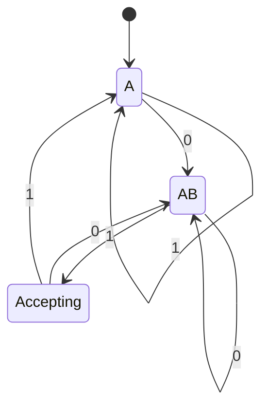
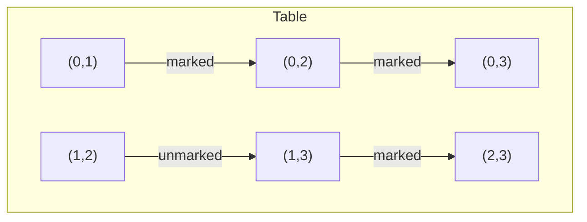
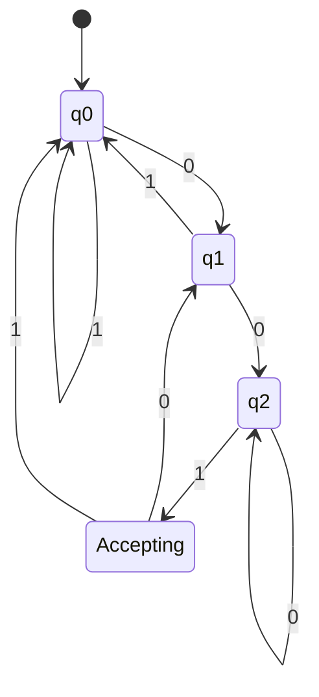
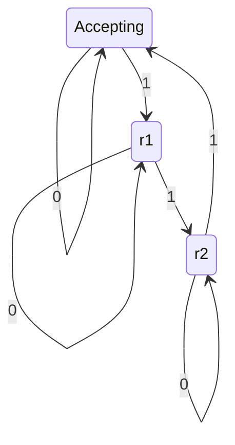

## Finite Automata

This chapter introduces the simplest class of abstract machines: finite automata. These are computational models with finite memory, used to recognise regular languages. We cover deterministic (DFA), nonâ€'deterministic (NFA), and εâ€'NFA variants, their equivalence, conversion algorithms, minimisation, and practical design strategies.

---

## 2.1 Deterministic Finite Automata (DFA)

A DFA is a simple machine that reads an input string from left to right, changing its internal state according to a fixed transition function. At any moment, the next state is uniquely determined by the current state and the input symbol.

### 2.1.1 Formal Definition (5â€'tuple)

A DFA is a 5â€'tuple $ M = (Q, \Sigma, \delta, q_0, F) $ where:

- $ Q $ â€" a finite set of **states**
- $ \Sigma $ â€" a finite **alphabet** of input symbols
- $ \delta : Q \times \Sigma \to Q $ â€" the **transition function** (deterministic)
- $ q_0 \in Q $ â€" the **start state**
- $ F \subseteq Q $ â€" the set of **accepting (final) states**

### 2.1.2 Transition Functions and State Diagrams

The transition function $ \delta(q, a) $ tells which state to go to when reading symbol $ a $ while in state $ q $. It can be represented as a **state diagram** (a directed graph) or a **transition table**.

**Example:** DFA that accepts all binary strings ending with `01`.

- $ Q = \{q_0, q_1, q_2\} $
- $ \Sigma = \{0,1\} $
- $ q_0 $ start state
- $ F = \{q_2\} $
- Transition function:

| State | Input 0 | Input 1 |
|-------|---------|---------|
| $q_0$ | $q_0$ | $q_1$ |
| $q_1$ | $q_2$ | $q_1$ |
| $q_2$ | $q_0$ | $q_1$ |

**Mermaid state diagram:**



### 2.1.3 Language Acceptance by DFA

The extended transition function $ \hat{\delta} : Q \times \Sigma^* \to Q $ is defined recursively:

- $ \hat{\delta}(q, \varepsilon) = q $
- $ \hat{\delta}(q, wa) = \delta( \hat{\delta}(q, w), a ) $ for $ w \in \Sigma^*,\ a \in \Sigma $

A DFA $ M $ **accepts** a string $ w $ if $ \hat{\delta}(q_0, w) \in F $. The **language recognised** by $ M $ is

$
L(M) = \{ w \in \Sigma^* \mid \hat{\delta}(q_0, w) \in F \}.
$

---

## 2.2 Nonâ€'Deterministic Finite Automata (NFA)

An NFA relaxes the deterministic requirement: from a given state on a given symbol, there may be **zero, one, or several** possible next states. An NFA accepts a string if **some** sequence of choices leads to an accepting state.

### 2.2.1 Definition

An NFA is a 5â€'tuple $ M = (Q, \Sigma, \delta, q_0, F) $ where:

- $ Q, \Sigma, q_0, F $ as in DFA
- $ \delta : Q \times \Sigma \to 2^Q $ (power set of $ Q $)

The transition function returns a **set** of possible next states.

### 2.2.2 Why Nonâ€'Determinism is Useful

- **Conciseness**: Many languages have much smaller NFA descriptions than DFA.
- **Modular design**: NFAs can be built by union, concatenation, Kleene star directly from regular expressions.
- **Simulates parallelism**: An NFA can be viewed as exploring all possible paths simultaneously.

**Example:** NFA for strings ending with `01` (same language as previous DFA). It uses only two states:



But careful: The above is actually a DFA-like representation. A proper NFA for `(0+1)*01` can be:



Here from `A` on `0` we go to both `A` and `B` (nonâ€'determinism). On `1` from `A` only to `A`.

### 2.2.3 εâ€'NFA and εâ€'closure

An **εâ€'NFA** allows transitions on the empty string ε, meaning the machine can change state without consuming any input symbol.

**Formal definition:** $ \delta : Q \times (\Sigma \cup \{\varepsilon\}) \to 2^Q $.

**εâ€'closure** of a set of states $ S $ is the set of all states reachable from $ S $ by following zero or more εâ€'transitions. Denoted $ \text{ECLOSE}(S) $.

**Example εâ€'NFA:** Accepts strings over `{a,b}` where the number of `a` is even (can be built with εâ€'transitions to model parity). More standard: εâ€'NFA for the regular expression `a*`:



But εâ€'transitions are typically used to glue smaller automata.

**Algorithm for εâ€'closure:**
```
ECLOSE(S):
    closure = S
    stack = S (as a list)
    while stack not empty:
        pop state p
        for each q in δ(p, ε):
            if q not in closure:
                add q to closure
                push q
    return closure
```

---

## 2.3 Equivalence of DFA, NFA, and εâ€'NFA

All three models recognise exactly the same class of languages: **regular languages**.

- Every DFA is trivially an NFA (by viewing δ(q,a) as a singleton set).
- Every NFA can be converted to an equivalent DFA (subset construction â€" Section 2.4).
- Every εâ€'NFA can be converted to an equivalent NFA (by removing εâ€'transitions via εâ€'closure) and then to a DFA.

**Proof outline (εâ€'NFA â†' NFA):**  
Given εâ€'NFA $ E = (Q_E, \Sigma, \delta_E, q_0, F_E) $, construct NFA $ N = (Q_E, \Sigma, \delta_N, q_0, F_N) $ where:

- $ \delta_N(q, a) = \text{ECLOSE}( \bigcup_{p \in \delta_E(q, a)} \text{ECLOSE}(p) ) $ for $ a \in \Sigma $
- $ F_N = \{ q \mid \text{ECLOSE}(q) \cap F_E \neq \emptyset \} $

This NFA accepts the same language without εâ€'transitions.

**Equivalence theorem:** For any εâ€'NFA, there exists a DFA recognising the same language, and vice versa.

---

## 2.4 Conversion of NFA to DFA (Subset Construction)

The **subset construction** (also called powerset construction) transforms an NFA $ N = (Q_N, \Sigma, \delta_N, q_0, F_N) $ into a DFA $ D = (Q_D, \Sigma, \delta_D, q_{D0}, F_D) $ where:

- Each state in $ Q_D $ is a **set of states** of $ N $
- $ Q_D \subseteq 2^{Q_N} $ (only reachable subsets)
- Start state: $ q_{D0} = \{ q_0 \} $ (or εâ€'closure for εâ€'NFA)
- For a state $ S \subseteq Q_N $ and symbol $ a \in \Sigma $:
  $
  \delta_D(S, a) = \bigcup_{p \in S} \delta_N(p, a)
  $
- $ F_D = \{ S \subseteq Q_N \mid S \cap F_N \neq \emptyset \} $

**Algorithm (only reachable subsets):**
```
Initialize queue with {q0}
Initialize Q_D = {{q0}}
while queue not empty:
    S = dequeue()
    for each a in Σ:
        T = union over p in S of δ_N(p,a)
        if T not in Q_D:
            add T to Q_D
            enqueue T
        δ_D(S,a) = T
```

**Example:** Convert the NFA for `(0+1)*01` (states A, B, C, where A start, C accept, δ(A,0)={A,B}, δ(A,1)={A}, δ(B,1)={C}) to DFA.

Reachable subsets:
- {A} (start)
  - on 0: {A,B}
  - on 1: {A}
- {A,B}
  - on 0: δ(A,0)∪δ(B,0) = {A,B} ∪ {} = {A,B}
  - on 1: δ(A,1)∪δ(B,1) = {A} ∪ {C} = {A,C}
- {A,C}
  - on 0: {A,B} ∪ {} = {A,B}
  - on 1: {A} ∪ {} = {A}
- No new sets.

Accepting subsets: those containing C â†' {A,C} is accepting.

Result DFA has 3 states. The state diagram:



---

## 2.5 DFA Minimization

Given a DFA, we often want the **minimal DFA** (with fewest states) that recognises the same language. Two main approaches: the tableâ€'filling algorithm (Myhillâ€'Nerode based) and Hopcroft’s algorithm (more efficient).

### 2.5.1 Tableâ€'filling Algorithm (Myhillâ€'Nerode)

The algorithm identifies pairs of states that are **distinguishable** (i.e., there exists a string that leads one to accept and the other to reject). Indistinguishable states can be merged.

**Steps:**

1. **Base:** Mark all pairs `(p, q)` where one is final and the other nonâ€'final.
2. **Inductive step:** For each unmarked pair `(p, q)`, for each symbol `a` in Σ, if `(δ(p,a), δ(q,a))` is already marked, then mark `(p, q)`.
3. Repeat until no new marks appear.
4. Unmarked pairs are equivalent â€" merge them.

**Example:** Minimise the DFA from the subset construction (states A, AB, AC).

Initially: final set {AC} vs nonâ€'final {A, AB}. Mark (A, AC) and (AB, AC).

Now examine (A, AB):
- On 0: δ(A,0)=AB, δ(AB,0)=AB â†' (AB,AB) not a pair (same state) â†' no mark.
- On 1: δ(A,1)=A, δ(AB,1)=AC â†' (A,AC) is already marked â†' therefore mark (A,AB).
Now all pairs involving A and AB are marked. No unmarked pairs remain. So no merging possible â€" the DFA is already minimal.

**Mermaid representation of a marking table** (for a different DFA with states 0,1,2,3):



### 2.5.2 Hopcroft’s Algorithm

Hopcroft’s algorithm partitions states using a **splitting** technique. It runs in $ O(n \log n) $ time (with careful implementation) versus $ O(n^2) $ for tableâ€'filling.

**Idea:** Start with two groups: final and nonâ€'final. Repeatedly choose a group and a symbol to split groups that behave differently on that symbol.

Pseudoâ€'code (simplified):
```
P = {F, Q \ F}
Worklist = {F, Q \ F} (if nonâ€'empty)
while Worklist not empty:
    remove group G from Worklist
    for each a in Σ:
        for each group H in P:
            split = { q in H | δ(q,a) in G }
            if split not empty and split != H:
                replace H by split and H\split in P
                add split and H\split to Worklist
```

### 2.5.3 Myhillâ€"Nerode Theorem

The Myhillâ€"Nerode theorem provides a theoretical characterisation of minimal DFA states. It states that a language $ L $ is regular iff the equivalence relation $ \equiv_L $ on strings (two strings are equivalent iff for every suffix $ z $, $ xz \in L \Leftrightarrow yz \in L $) has a finite number of equivalence classes. The number of classes equals the number of states in the minimal DFA for $ L $.

This theorem is the foundation of DFA minimisation.

---

## 2.6 Design of Finite Automata for Given Languages

Designing a DFA or NFA from a language description requires systematic reasoning. Below are common patterns.

### 2.6.1 Strings ending with a specific pattern

Language: `{ w ∈ {0,1}* | w ends with 001 }`

Design approach: Build a “suffix detector” using states that remember the longest suffix that matches a prefix of the target.

**DFA states:** q0 (ε), q1 (0), q2 (00), q3 (001 accepting). Transitions on 0/1 that either extend match or fall back to appropriate prefix.



### 2.6.2 Strings containing a substring

Language: `{ w ∈ {a,b}* | w contains "ab" }`

**NFA (easy):** states A (no ‘ab’ yet), B (saw ‘a’), C (saw ‘ab’ accepting). Transitions: A on a â†' A and B, A on b â†' A; B on b â†' C; B on a â†' B; C on a,b â†' C.

**DFA:** Can be derived via subset construction, but direct design: states: q0 (no ‘a’ pending, no ‘ab’), q1 (last char ‘a’ but no ‘ab’ yet), q2 (‘ab’ seen â€" absorbing accept).

### 2.6.3 Strings with modulo condition

Language: `{ w ∈ {0,1}* | number of 1's mod 3 = 0 }`

DFA with 3 states (remainder 0,1,2). Start state remainder 0 (accepting). Transition: on 1, remainder = (r+1) mod 3; on 0, remainder unchanged.



### 2.6.4 Strings with equal number of `01` and `10` substrings

This is a classic “run length” property. The difference between the count of `01` and `10` is determined by the first and last symbols. The minimal DFA has 4 states tracking first symbol (if any) and last symbol.

---

## Summary

| Model | Transition | Determinism | εâ€'moves | Power |
|-------|-----------|-------------|---------|-------|
| DFA | δ: QÃ-Σ â†' Q | Yes | No | Regular languages |
| NFA | δ: QÃ-Σ â†' 2^Q | No | No | Regular languages |
| εâ€'NFA | δ: QÃ-(Σ∪{ε})â†'2^Q | No | Yes | Regular languages |

Key takeaways:
- DFA, NFA, εâ€'NFA are **equally expressive**.
- Subset construction converts NFA/εâ€'NFA to DFA (exponential blowâ€'up in worst case).
- DFA minimisation yields a unique (up to isomorphism) minimal DFA.
- Myhillâ€"Nerode theorem gives the theoretical basis for minimisation.

---

