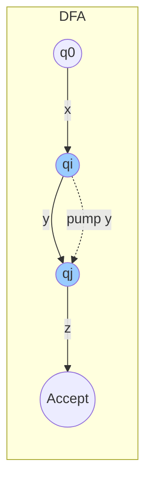
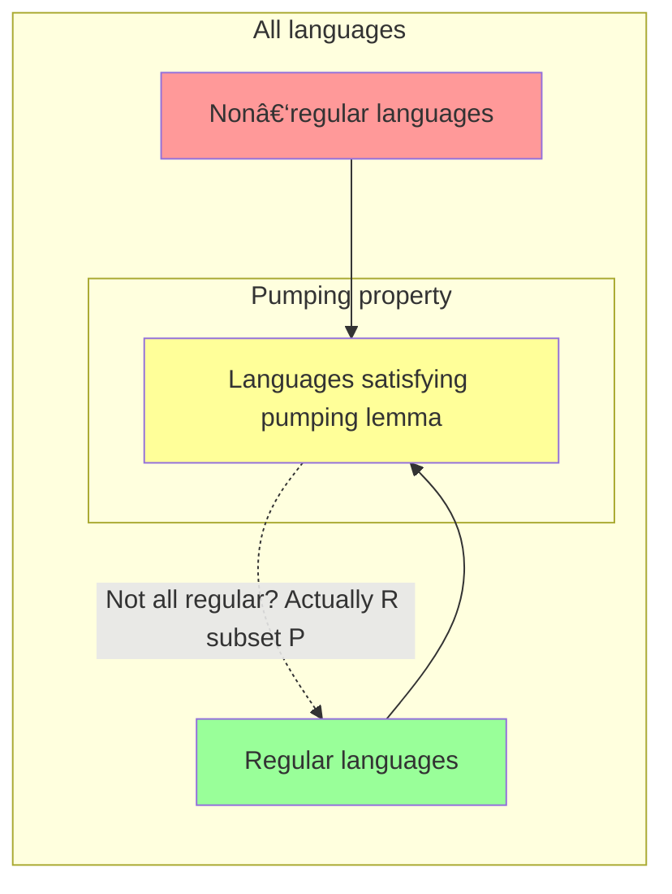

# Chapter 4: Pumping Lemma for Regular Languages

The Pumping Lemma is a powerful tool used to prove that certain languages are **not regular**. It describes a property that every regular language must satisfy. If a language violates this property, it cannot be regular.

---

## 1. Statement of the Pumping Lemma

Let $ L $ be a **regular language**. Then there exists an integer $ p \geq 1 $ (called the **pumping length**) such that **every** string $ s \in L $ with $ |s| \ge p $ can be written as $ s = xyz $, satisfying:

1. $ |y| \ge 1 $  (the pumped part is non‑empty)
2. $ |xy| \le p $  (the first $ p $ symbols contain the pumping part)
3. For all $ i \ge 0 $, $ xy^i z \in L $  (the string can be “pumped” any number of times)

> In any sufficiently long string of a regular language, there is a non‑empty substring near the beginning that can be repeated any number of times (including zero) and the resulting strings will still belong to the language.

---

## 2. Proof Idea of the Pumping Lemma

The proof relies on the fact that a regular language is accepted by a **Deterministic Finite Automaton (DFA)** with a finite number of states.

- Let the DFA have $ p $ states.
- Consider a string $ s $ of length $ \ge p $.
- When the DFA reads $ s $, it visits a sequence of states: $ q_0 \to q_1 \to \cdots \to q_n $ where $ n = |s| $.
- Since there are only $ p $ states, by the pigeonhole principle, some state must repeat within the first $ p+1 $ steps.
- Let $ q_i = q_j $ be the first repetition ($ i < j \le p $).
- Then the substring $ y $ between $ q_i $ and $ q_j $ can be **pumped** â€" repeated any number of times â€" and the DFA will still end in an accepting state (if the original string was accepted).

### DFA with a pumping cycle

- $ x $ â€" moves from start $ q_0 $ to the first occurrence of the repeated state $ q_i $.  
- $ y $ â€" moves from $ q_i $ to $ q_j $ (the loop, can be repeated).  
- $ z $ â€" moves from $ q_j $ to an accept state.  

Because $ q_i = q_j $, we can go around the loop $ i $ times, giving $ xy^i z $ for any $ i \ge 0 $.

---

## 3. Application of the Pumping Lemma

To prove a language $ L $ is **not regular**, we use **proof by contradiction**:

1. **Assume** $ L $ is regular. Then the pumping lemma holds for some pumping length $ p $.
2. **Choose** a clever string $ s \in L $ with $ |s| \ge p $ that will lead to a contradiction.
3. **Consider all possible ways** to split $ s = xyz $ satisfying $ |y| \ge 1 $ and $ |xy| \le p $.
4. **Show** that for every such split, there exists some $ i \ge 0 $ such that $ xy^i z \notin L $.
5. **Conclude** that our assumption was false â€" $ L $ is not regular.

### Example: Prove $ L = \{ 0^n 1^n \mid n \ge 0 \} $ is not regular

- Assume $ L $ is regular with pumping length $ p $.
- Choose $ s = 0^p 1^p $ (length $ 2p \ge p $).
- By the lemma, $ s = xyz $ with $ |xy| \le p $ and $ |y| \ge 1 $.
- Since $ |xy| \le p $, the part $ xy $ lies entirely within the block of $ 0 $’s.  
  So $ y = 0^k $ for some $ k \ge 1 $.
- Pump $ y $ **up** (choose $ i = 2 $):  
  $ xy^2 z = 0^{p+k} 1^p $.  
  This string has more $ 0 $’s than $ 1 $’s, so it is **not** in $ L $.
- Contradiction. Hence $ L $ is not regular.

---

## 4. Techniques to Prove Languages are Non‑Regular

### 4.1 Standard Pumping Lemma Strategy

- Choose $ s $ that depends on $ p $.
- Ensure $ |xy| \le p $ forces $ y $ to lie in a specific part of $ s $.
- Pump up or down to break the pattern.

### 4.2 Closure Properties + Pumping Lemma

Sometimes it is easier to combine the pumping lemma with operations that preserve regularity.

**Example**: Prove $ L = \{ w \mid w \text{ has equal number of 0's and 1's} \} $ is not regular.

- Intersect $ L $ with the regular language $ 0^*1^* $.  
  The result is $ \{ 0^n1^n \} $, which is non‑regular.
- If $ L $ were regular, the intersection would also be regular (regular languages closed under intersection). Contradiction.

### 4.3 Using Homomorphisms

Apply a string homomorphism to map the language to a known non‑regular language.

### 4.4 Myhillâ€"Nerode Theorem (alternative to pumping)

The Myhillâ€"Nerode theorem gives a necessary and sufficient condition for regularity (infinite number of distinguishable prefixes). It can sometimes prove non‑regularity more easily, but the pumping lemma is more common for introductory courses.

### 4.5 Example: Palindrome Language

Prove $ L = \{ w \in \{0,1\}^* \mid w = w^R \} $ (palindromes) is not regular.

- Choose $ s = 0^p 1 0^p $.
- With $ |xy| \le p $, $ y $ consists only of $ 0 $’s from the first block.
- Pumping changes the number of leading $ 0 $’s but not the trailing $ 0 $’s, breaking the palindrome property.

---

## 5. Limitations of the Pumping Lemma

The pumping lemma is a **necessary** condition for regularity, but **not sufficient**.  
Some non‑regular languages **satisfy** the pumping lemma â€" they can be “pumped” but are still not regular.

### 5.1 Example: A Non‑regular Language that Satisfies the Pumping Lemma

Let $ L = \{ a^i b^j c^k \mid i,j,k \ge 0 \text{ and if } i=1 \text{ then } j=k \} $

- This language is not regular (can be shown with Myhillâ€"Nerode).
- Yet it **does** satisfy the pumping lemma (careful choice of pumping length works).

### 5.2 What the Pumping Lemma Cannot Do

- It **cannot prove** that a language **is** regular.
- It may fail for languages that require more sophisticated arguments (e.g., context‑free pumping lemma needed for $ \{ a^n b^n c^n \} $).
- Some non‑regular languages require **Ogden’s lemma** (a stronger version for context‑free languages) or the Myhillâ€"Nerode theorem.

### 5.3 When the Pumping Lemma Fails to Prove Non‑regularity

Consider $ L = \{ a^n b^m \mid n \neq m \} $.  
The pumping lemma **can** prove it is not regular (choose $ s = a^p b^{p+p!} $ or similar).  
But if a language satisfies the pumping lemma, you must use other methods.

### Diagram: Limitations Overview

**Key takeaway**  
- Every regular language satisfies the pumping lemma (R ⊆ P).  
- Some non‑regular languages also satisfy it (P ⊈ R).  
- Therefore, satisfying the pumping lemma does **not** guarantee regularity.

---

## Summary Table

| Aspect                 | Description                                                                 |
|------------------------|-----------------------------------------------------------------------------|
| **Statement**          | Every long enough string can be split into xyz, where y can be pumped.      |
| **Proof idea**         | DFA has finite states â†' a state repeats within first p symbols â†' loop.      |
| **Application**        | Assume L regular, find contradiction by pumping a carefully chosen string. |
| **Common techniques**  | Choose s dependent on p, force y into a specific region, pump up/down.      |
| **Limitations**        | Not sufficient (some non‑regular languages satisfy it); cannot prove regularity. |

---

*The pumping lemma is a fundamental tool in the theory of computation, but it must be applied carefully. Use closure properties or Myhillâ€"Nerode when the pumping lemma is inconclusive.*

