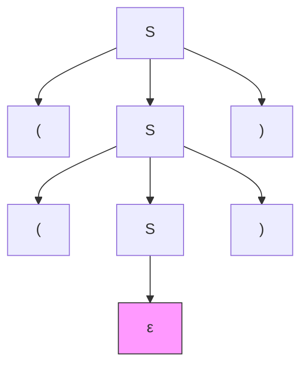
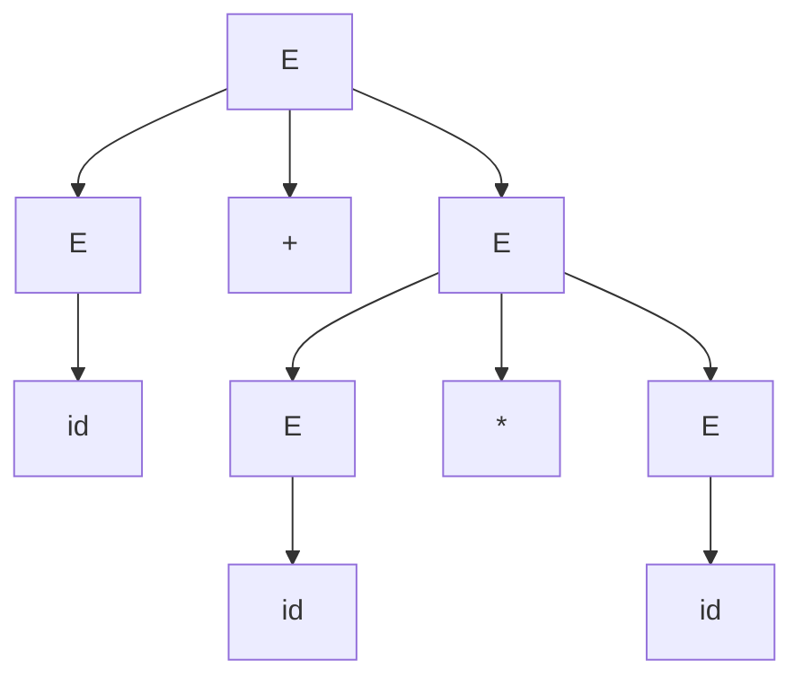
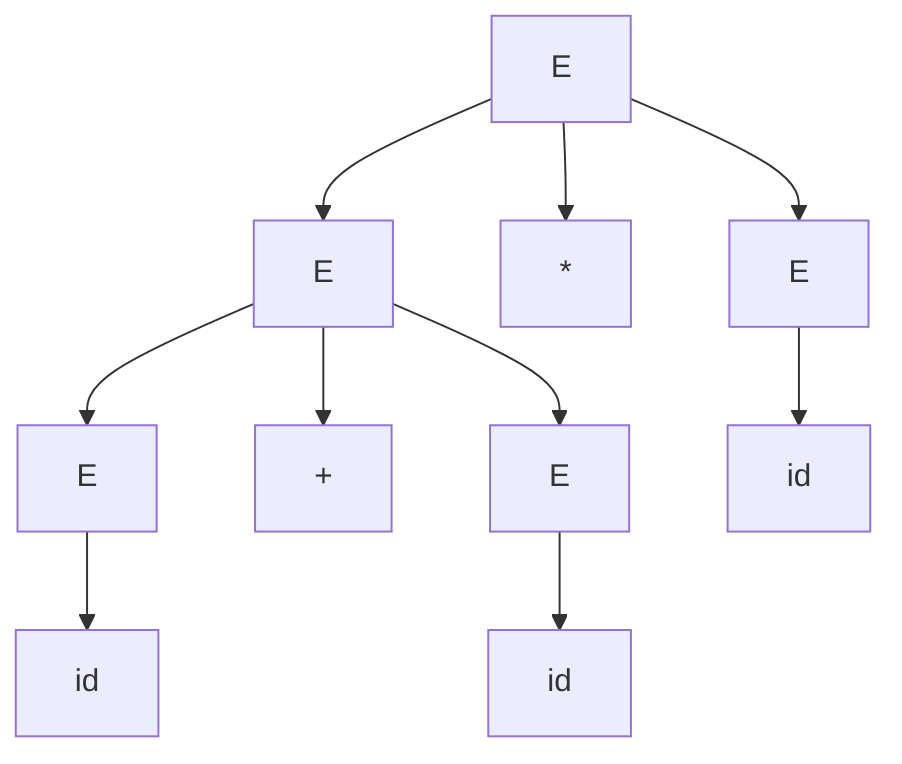
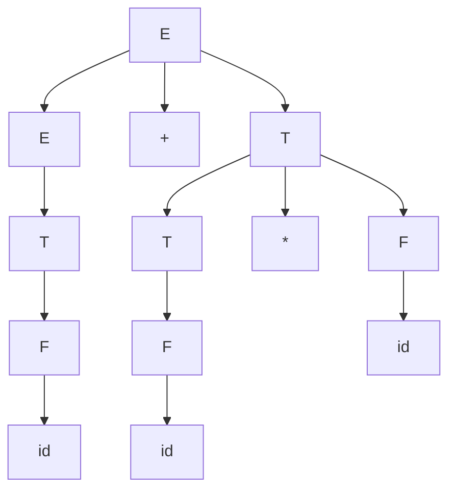

# Chapter 5: Context‑Free Grammars (CFG)

Context‑free grammars generate context‑free languages, a superset of regular languages. They are fundamental in programming language syntax, natural language processing, and compiler design.

---

## 1. Components of a CFG (V, Σ, R, S)

A context‑free grammar is a 4‑tuple \( G = (V, \Sigma, R, S) \):

- **V** – finite set of *non‑terminal* symbols (variables)
- **Σ** – finite set of *terminal* symbols (alphabet), disjoint from V
- **R** – finite set of *production rules* of the form \( A \to \alpha \), where \( A \in V \) and \( \alpha \in (V \cup \Sigma)^* \) (any string of terminals and non‑terminals)
- **S** – the *start symbol* (\( S \in V \))

### Example: Grammar for balanced parentheses
- \( V = \{S\} \)
- \( \Sigma = \{(,)\} \)
- \( R = \{ S \to \varepsilon,\; S \to (S),\; S \to SS \} \)
- \( S \) is start symbol

---

## 2. Derivations and Sentential Forms

A **derivation** is a sequence of replacements of non‑terminals using production rules, starting from \( S \) and ending with a string of only terminals (a sentence).

If \( \alpha \Rightarrow \beta \) (one step), replace one non‑terminal in \( \alpha \) using a rule.  
The reflexive transitive closure \( \Rightarrow^* \) means zero or more steps.

A **sentential form** is any string of terminals and non‑terminals that appears in a derivation (including intermediate steps).

### Example derivation (balanced parentheses grammar):
\( S \Rightarrow SS \Rightarrow (S)S \Rightarrow (SS)S \Rightarrow (()S)S \Rightarrow (())S \Rightarrow (()) \)  

Here \( SS, (S)S, (SS)S, (()S)S, (())S, (()) \) are sentential forms; the last one is a sentence.

---

## 3. Leftmost and Rightmost Derivations

- **Leftmost derivation** – always replace the leftmost non‑terminal.
- **Rightmost derivation** – always replace the rightmost non‑terminal.

For the same sentence, leftmost and rightmost derivations can be different.

### Example: Grammar \( S \to AB,\; A \to a,\; B \to b \)

- Leftmost: \( S \Rightarrow AB \Rightarrow aB \Rightarrow ab \)  
- Rightmost: \( S \Rightarrow AB \Rightarrow Ab \Rightarrow ab \)

In unambiguous grammars, both are unique for a given sentence. In ambiguous grammars, multiple leftmost (or rightmost) derivations exist.

---

## 4. Parse Trees

A parse tree is a graphical representation of a derivation.  
- Root: start symbol \( S \)  
- Internal nodes: non‑terminals  
- Children: right‑hand side of a rule applied to the parent  
- Leaves: terminals (or ε) in left‑to‑right order forming the sentence.

### Mermaid diagram of parse tree for `(())` from grammar \( S \to \varepsilon \mid (S) \mid SS \):

(We often write ε as a leaf with no symbol, but for visibility we put a node labeled ε.)

Parse trees abstract away the order of replacements (leftmost vs rightmost) and show only the structural grouping.

---

## 5. Ambiguity in Context‑Free Grammars

A grammar is **ambiguous** if there exists at least one string that has more than one distinct parse tree (equivalently, more than one leftmost derivation or more than one rightmost derivation).

### Example: Classic ambiguous grammar for arithmetic expressions
\( E \to E+E \mid E*E \mid (E) \mid id \)

String `id+id*id` has two parse trees:

**Tree 1** (multiplication before addition – intended):

**Tree 2** (addition before multiplication – wrong precedence):

Thus the grammar is ambiguous.

### Removing Ambiguity (Where Possible)

Some ambiguous grammars can be rewritten to be unambiguous by introducing precedence and associativity rules.

**Unambiguous version** for arithmetic:

- \( E \to E+T \mid T \)
- \( T \to T*F \mid F \)
- \( F \to (E) \mid id \)

Now `id+id*id` has only one parse tree: multiplication deeper (higher precedence).

Not every CFG can be made unambiguous (see inherently ambiguous languages below).

---

## 6. Inherently Ambiguous Languages

A **context‑free language** \( L \) is **inherently ambiguous** if every CFG generating \( L \) is ambiguous. No unambiguous grammar exists for \( L \).

### Classic example: \( L = \{ a^n b^n c^m \mid n,m \ge 0 \} \cup \{ a^n b^m c^m \mid n,m \ge 0 \} \)

- Strings of form \( a^n b^n c^n \) have two distinct structural interpretations: either as part of the first set (matching a's and b's first) or second set (matching b's and c's).
- Proved via Ogden’s lemma (a generalisation of the pumping lemma for CFLs).

Another example: \( \{ a^i b^j c^k \mid i=j \text{ or } j=k \} \).

### Why inherent ambiguity matters:
- Some programming language constructs (e.g., ambiguous `if-then-else` can be resolved with disambiguation rules, but the language itself is not inherently ambiguous).
- For parser generators, inherent ambiguity means no deterministic parser exists for that language.

---

## Comparison Table: CFG vs Regular Grammar

| Property | Regular Grammar (Type 3) | CFG (Type 2) |
|----------|--------------------------|---------------|
| Rules form | \( A \to aB \mid \varepsilon \) | \( A \to \alpha, \alpha \in (V\cup\Sigma)^* \) |
| Derivation capacity | Cannot count nested parentheses | Can count (balanced parentheses) |
| Ambiguity possible? | No (regular languages have unambiguous DFA, hence unambiguous regex) | Yes |
| Pumping lemma | \( uv^iw \) | \( uv^ixy^iz \) (with two pumping parts) |
| Closure properties | Closed under union, intersection, complement, etc. | Closed under union, concatenation, Kleene star, but **not** under intersection or complement |

---

## Example: Complete CFG for simple arithmetic (unambiguous)

\( G = (V,\Sigma,R,E) \)  
- \( V = \{E, T, F\} \)  
- \( \Sigma = \{+, *, (, ), id\} \)  
- \( R \):
  1. \( E \to E+T \mid T \)  
  2. \( T \to T*F \mid F \)  
  3. \( F \to (E) \mid id \)

**Leftmost derivation of `id+id*id`:**  
\( E \Rightarrow E+T \Rightarrow T+T \Rightarrow F+T \Rightarrow id+T \Rightarrow id+T*F \Rightarrow id+F*F \Rightarrow id+id*F \Rightarrow id+id*id \)

**Parse tree** (mermaid):

This grammar is unambiguous, unlike the earlier ambiguous version.

---

## Decision Properties of CFLs (briefly)

Unlike regular languages, many properties of CFLs are **undecidable**:
- Emptiness: decidable (check if start symbol can generate any terminal string)
- Finiteness: decidable (check for cycles that generate infinite strings)
- Membership (CYK algorithm for CNF grammars): decidable, \( O(n^3) \)
- **Equivalence** of two CFGs: undecidable
- **Ambiguity** (whether a given CFG is ambiguous): undecidable
- **Inherent ambiguity** of a language: undecidable

---

## Summary

- CFGs consist of non‑terminals, terminals, production rules, and a start symbol.
- Derivations (leftmost/rightmost) and parse trees capture syntax structure.
- Ambiguity occurs when a string has multiple parse trees; some grammars can be made unambiguous, but some languages are inherently ambiguous.
- CFGs are more powerful than regular expressions but still have limitations (e.g., cannot check \( a^n b^n c^n \)).

**Further reading**: Chomsky normal form (CNF), CYK algorithm, pushdown automata (PDA), deterministic vs non‑deterministic CFLs, Ogden’s lemma.