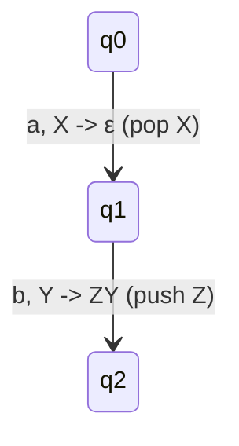
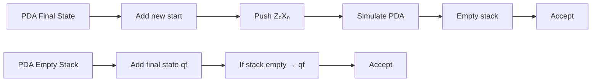
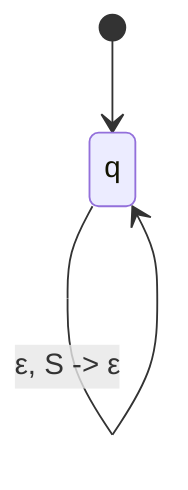
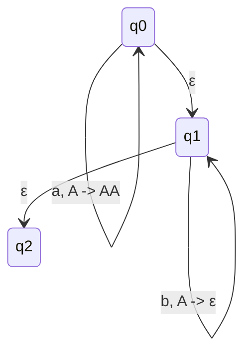
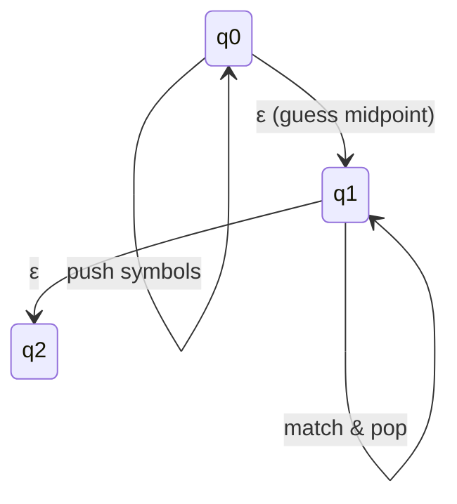
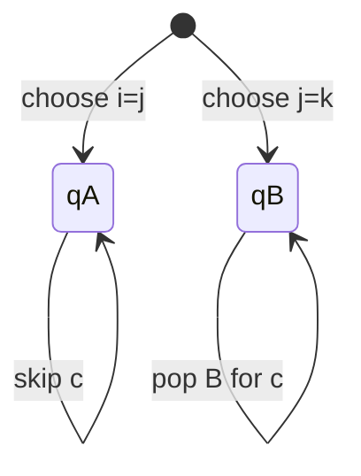

# Chapter 7: Pushdown Automata (PDA)

A **Pushdown Automaton (PDA)** extends a finite automaton with an unbounded stack, enabling it to recognize context-free languages. This chapter covers the formal definition, operational semantics, acceptance modes, equivalence with context-free grammars, and practical constructions.

---

## 7.1 Definition and Components (7-tuple)

A PDA is formally defined as a 7-tuple:

```
M = (Q, Σ, Γ, δ, q₀, Z₀, F)
```

### Components

| Component | Meaning                                                  |
| --------- | -------------------------------------------------------- |
| Q         | Finite set of **states**                                 |
| Σ         | Finite **input alphabet**                                |
| Γ         | Finite **stack alphabet**                                |
| δ         | **Transition function**: `Q × (Σ ∪ {ε}) × Γ → P(Q × Γ*)` |
| q₀ ∈ Q    | **Start state**                                          |
| Z₀ ∈ Γ    | **Initial stack symbol**                                 |
| F ⊆ Q     | Set of **final states**                                  |

### Transition Meaning

```
δ(q, a, X) = {(p, γ)}
```

Means:

* In state `q`
* Reading input `a` (or `ε`)
* With `X` on top of stack

→ Move to state `p` and replace `X` with `γ`

### Stack Operations

* **Push Y** → `γ = YX`
* **Pop X** → `γ = ε`
* **No change** → `γ = X`

---

### Mermaid Example



---

## 7.2 Stack Operations & Instantaneous Descriptions (ID)

An **Instantaneous Description (ID)**:

```
(q, w, γ)
```

Where:

* `q` = current state
* `w` = remaining input
* `γ` = stack content (top at left)

### One Move Relation

```
(q, a w, X γ) ⊢ (p, w, β γ)
```

If:

```
(p, β) ∈ δ(q, a, X)
```

We use:

```
⊢*
```

for zero or more moves.

---

### Example: L = {aⁿ bⁿ}

```
(q₀, aabb, Z₀)
⊢ (q₀, abb, AZ₀)
⊢ (q₀, bb, AAZ₀)
⊢ (q₁, b, AZ₀)
⊢ (q₁, ε, Z₀)
```

---

## 7.3 Acceptance Methods

### A. Acceptance by Final State

```
L(M) = { w | (q₀, w, Z₀) ⊢* (q, ε, γ), q ∈ F }
```

✔ Stack content doesn't matter

---

### B. Acceptance by Empty Stack

```
N(M) = { w | (q₀, w, Z₀) ⊢* (q, ε, ε), q ∈ Q }
```

✔ Stack must be empty

---

### Equivalence Theorem

A language is accepted by PDA:

* by **final state** ⇔ by **empty stack**

---

### Conversion (Final → Empty)

* Add new start state `q'₀`
* Add new stack symbol `X₀`
* Push `Z₀X₀`
* On reaching final state → empty stack

---

### Conversion (Empty → Final)

* Add new final state `q_f`
* When stack empty → go to `q_f`

---

### Diagram



---

## 7.4 PDA ⇔ CFG Equivalence

### Theorem

A language is context-free **iff** it is accepted by a PDA.

---

## 7.4.1 CFG → PDA

Given CFG:

```
G = (V, Σ, R, S)
```

Construct PDA:

```
M = ({q}, Σ, V, δ, q, S, ∅)
```

### Transitions

* For `A → aB₁B₂...Bₖ`:

```
δ(q, a, A) → (q, B₁B₂...Bₖ)
```

* For `A → a`:

```
δ(q, a, A) → (q, ε)
```

---

### Example

Grammar:

```
S → aSb | ε
```

Converted:



---

## 7.4.2 PDA → CFG

Given:

```
M = (Q, Σ, Γ, δ, q₀, Z₀, ∅)
```

Construct CFG using variables:

```
[pXq]
```

Meaning:

"Start at state p with X, end at q after popping X"

---

### Rules

1. Start:

```
S → [q₀ Z₀ q]  for all q ∈ Q
```

2. For:

```
δ(p, a, X) → (r, Y₁...Yₖ)
```

* If k = 0:

```
[p X r] → a
```

* If k ≥ 1:

```
[p X qₖ] → a [r Y₁ q₁][q₁ Y₂ q₂]...[qₖ₋₁ Yₖ qₖ]
```

---

## 7.5 PDA Constructions

---

### Example 1: L = {aⁿ bⁿ}

Idea:

* Push for `a`
* Pop for `b`



---

### Example 2: Palindrome

```
L = {wwᴿ}
```



---

### Example 3: L = {aⁱ bʲ cᵏ | i=j OR j=k}

Use nondeterminism:



---

## Summary

* PDA = FA + Stack
* ID = `(state, input, stack)`
* Two acceptance types (equivalent)
* PDA ⇔ CFG
* Stack helps in counting & memory
* Nondeterminism is powerful
