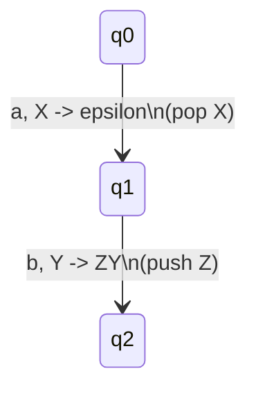
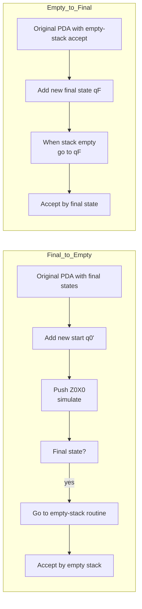
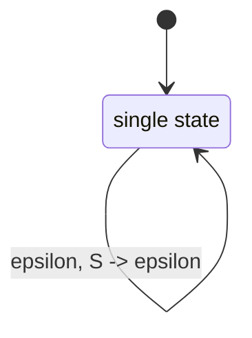
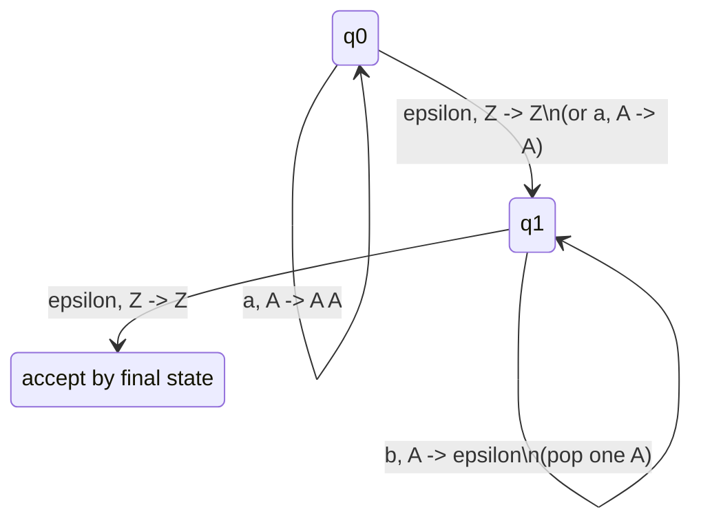
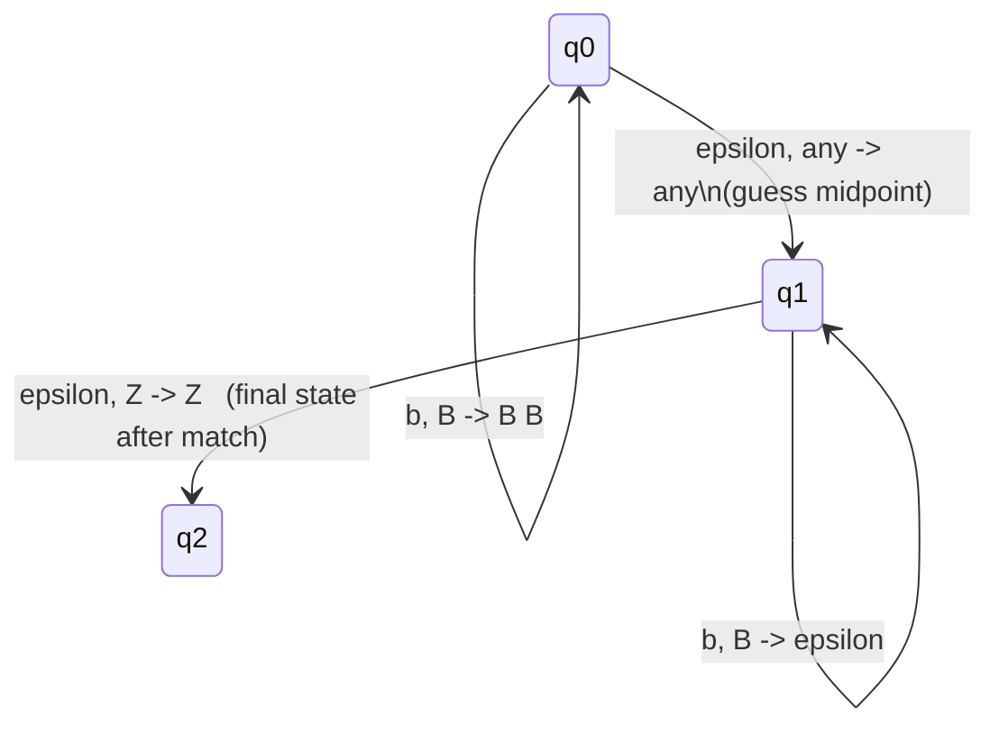
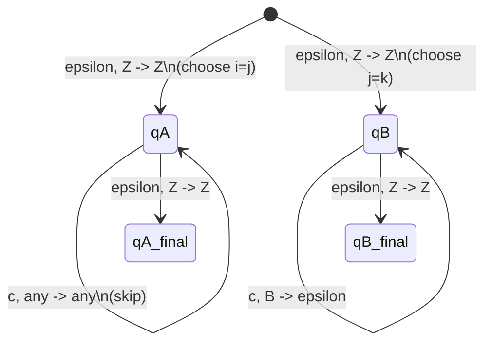

## Chapter 7: Pushdown Automata (PDA)

A **Pushdown Automaton (PDA)** extends a finite automaton with an unbounded stack, enabling it to recognize context-free languages. This chapter covers the formal definition, operational semantics, acceptance modes, equivalence with context-free grammars, and practical constructions.

---

### 7.1 Definition and Components (7-tuple)

A PDA is formally defined as a 7-tuple

M = (Q, Sigma, Gamma, delta, q_0, Z_0, F)

where

| Component | Meaning |
|-----------|---------|
| Q | finite set of **states** |
| Sigma | finite **input alphabet** |
| Gamma | finite **stack alphabet** |
| delta | **transition function**: Q x (Sigma U {epsilon}) x Gamma -> P(Q x Gamma^*) |
| q_0 in Q | **start state** |
| Z_0 in Gamma | **initial stack symbol** |
| F subseteq Q | set of **final states** (for acceptance by final state) |

The transition delta(q, a, X) = {(p, gamma)} means:
In state q, reading input a (or epsilon for epsilon-transition), with X on top of stack, the PDA may move to state p and replace X with the string gamma (push/pop operations encoded in gamma).

- **Push** Y: gamma = YX (adds Y on top)
- **Pop** X: gamma = epsilon
- **No change**: gamma = X

> **Mermaid representation** (example transition):

---

### 7.2 Stack Operations and Instantaneous Descriptions (ID)

An **Instantaneous Description** (ID) is a triple (q, w, gamma) representing the current state q, remaining input w, and stack content gamma (top written leftmost).

**One move** |- is defined:
(q, a w, X gamma) |- (p, w, beta gamma) if (p, beta) in delta(q, a, X) (where a in Sigma U {epsilon}).

We write |-^* for zero or more moves.

**Example sequence** for L = {a^n b^n} (pop a for each b):

(q_0, aabb, Z_0) |- (q_0, abb, A Z_0) |- (q_0, bb, AA Z_0) |- (q_1, b, A Z_0) |- (q_1, epsilon, Z_0)

---

### 7.3 Acceptance by Empty Stack vs Final State

A PDA can accept a string in two equivalent ways:

#### A. Acceptance by **Final State** (F)
L(M) = { w | (q0, w, Z0) |-*(q, epsilon, gamma) for some q in F, gamma in Gamma* }

Stack content at acceptance is irrelevant.

#### B. Acceptance by **Empty Stack** (E)
N(M) = { w | (q0, w, Z0) |-*(q, epsilon, epsilon) for some q in Q }

The stack must be completely empty; final states are not used.

#### Equivalence of the two modes

> **Theorem:** A language is accepted by a PDA by final state **iff** it is accepted by a (possibly different) PDA by empty stack.

**Construction (final -> empty):**
Add a new start state q'_0 and a new stack bottom marker X_0. Push Z_0 X_0, then simulate the original PDA. When the original enters a final state, jump to a new state that empties the stack.

**Construction (empty -> final):**
Add a new final state q_f. When the stack becomes empty, jump to q_f. Also ensure that from q_f you can pop any remaining stack symbols (though none remain).

---

### 7.4 Equivalence of PDA and Context-Free Grammars

**Main theorem:** A language is context-free **iff** it is accepted by some PDA.

We prove two directions:

#### 7.4.1 CFG -> PDA (Single-state construction)

Given a CFG G = (V, Sigma, R, S) in **Greibach normal form** (all productions A -> a alpha where a in Sigma, alpha in V^*), we build a PDA with **one state**:

M = ({q}, Sigma, V, delta, q, S, emptyset)

Transitions:
- For each production A -> a B_1 B_2 ... B_k:
  delta(q, a, A) contains (q, B_1 B_2 ... B_k)
- For each terminal a (if a production A -> a):
  delta(q, a, A) contains (q, epsilon)

**Intuition:** Stack holds the grammar's leftmost derivation. Reading an input symbol matches the terminal produced at the top of the stack.

**Example:** S -> a S b | epsilon converted to Greibach:
S -> a S B, B -> b, plus S -> epsilon.
PDA transitions:

#### 7.4.2 PDA -> CFG (from empty-stack acceptance)

Given a PDA M = (Q, Sigma, Gamma, delta, q_0, Z_0, emptyset) that accepts by empty stack, we construct a CFG G with nonterminals [pXq] (meaning "starting in state p with X on top, we pop X and end in state q after reading some input").

**Productions:**

1. **Start symbol:** S -> [q_0 Z_0 q] for every q in Q.
2. For each transition (r, Y_1 Y_2 ... Y_k) in delta(p, a, X) (where k >= 0):
   - If k = 0 (pop): add [p X r] -> a
   - If k >= 1: for all sequences of states q_1, q_2, ..., q_k in Q, add
     
     [p X q_k] -> a [r Y_1 q_1] [q_1 Y_2 q_2] ... [q_{k-1} Y_k q_k]
     
3. For any state p and stack symbol X: add [p X p] -> epsilon? (Actually this is not needed; the construction automatically generates derivations that exactly consume input.)

**Simplified algorithm** (often taught):
Introduce nonterminal (p, X, q) meaning "pop X while going from p to q". For each transition of the form delta(p, a, X) contains (r, Y_1 ... Y_m) and for every choice of states q_1, ..., q_m, create a production
(p, X, q_m) -> a (r, Y_1, q_1) ... (q_{m-1}, Y_m, q_m).

If m = 0: (p, X, r) -> a.

Start symbol: (q_0, Z_0, q_f) for every q_f.

---

### 7.5 Construction of PDA for Given Languages

We illustrate with two classic context-free languages.

#### Example 1: L = {a^n b^n | n >= 0}

**Idea:** Push A for each a, pop one A for each b.

**Acceptance by empty stack** variant: simply remove final state q_2 and let the last pop of Z_0 happen.

#### Example 2: L = {w w^R | w in {a,b}^*} (even-length palindromes)

Push symbols until middle (nondeterministically guess), then pop matching symbols.

#### Example 3: L = {a^i b^j c^k | i = j or j = k}

Needs nondeterminism: two parallel tracks.

**Method:** Use a PDA with two "phases" nondeterministically chosen.

1. **Phase 1** (i = j): push A for each a, pop A for each b, then skip c's.
2. **Phase 2** (j = k): skip a's, push B for each b, pop B for each c.

The PDA nondeterministically jumps to the correct phase at the start.

Both final states are accepting (by final state) or we can empty stack.

---

### Summary

- A PDA is a 7-tuple with a stack, giving it memory.
- **Instantaneous descriptions** track state, remaining input, stack.
- **Final state** and **empty stack** acceptance are equivalent.
- PDA and CFG are equally expressive:
  - CFG -> single-state PDA (Greibach normal form helps).
  - PDA (empty stack) -> CFG via nonterminals [pXq].
- Constructing PDAs for languages often relies on using the stack to count/remember and nondeterminism to guess derivation steps.

The next chapter will explore deterministic PDAs and the separation between deterministic and nondeterministic context-free languages.
