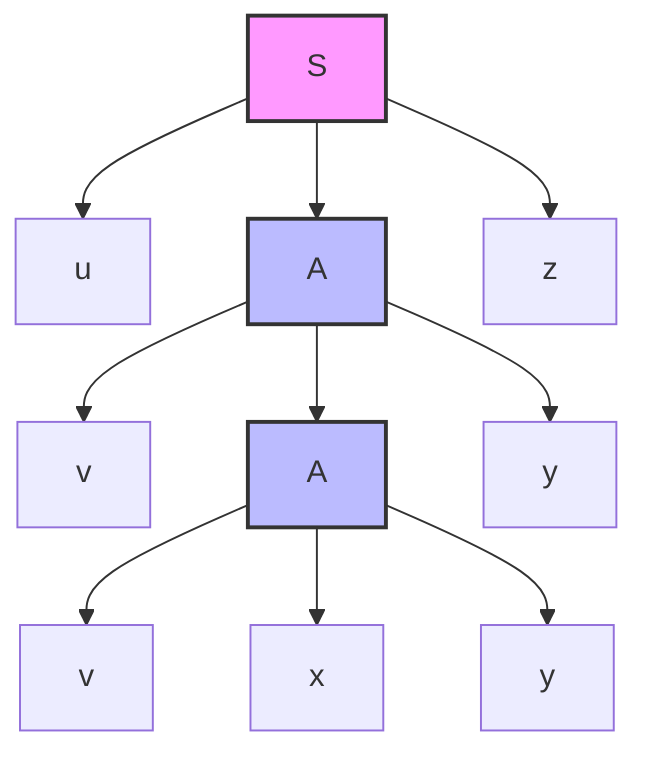
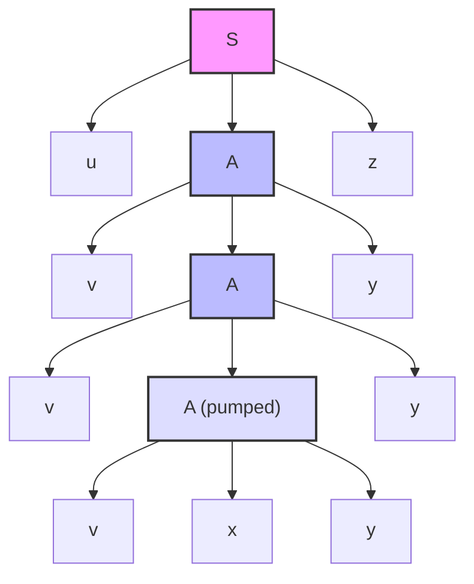
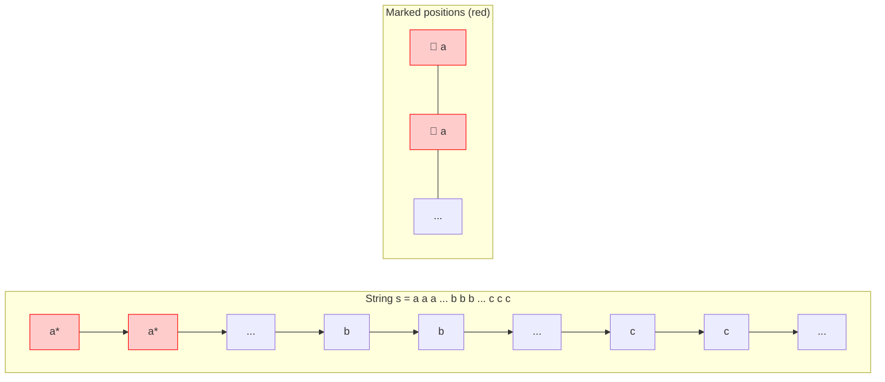

# Chapter 8. Pumping Lemma for Context-Free Languages

## 1. Statement of the Pumping Lemma (based on parse tree height)

### Theorem (Pumping Lemma for CFLs)

Let (L) be a context-free language. Then there exists a constant (p > 0) (the *pumping length*) such that any string (s \in L) with (|s| \ge p) can be written as:

[
s = uvxyz
]

with the following properties:

1. (|vxy| \le p) (the middle part is bounded in length)
2. (|vy| \ge 1) (at least one of (v) or (y) is non-empty)
3. (uv^i x y^i z \in L) for all (i \ge 0) (pumping (v) and (y) keeps the string in (L))

---

### Intuition from Parse Trees

Assume the grammar is in **Chomsky Normal Form (CNF)**. If a string is long enough, a parse tree must have a path where a nonterminal repeats. The subtree rooted at the lower occurrence can be cut and pasted to generate longer strings.

The string is split into five parts:
(u) (left of the upper (A)), (v) (from the lower (A) to the first part of its yield), (x) (the yield of the lower (A) between (v) and (y)), (y) (the rest of the lower (A)’s yield), and (z) (right of the upper (A)).

By repeating the subtree rooted at the lower (A), we obtain (uv^i x y^i z):

---

## 2. Applications – Proving Languages are Not Context-Free

To show a language (L) is not context-free, assume it is and derive a contradiction using the pumping lemma.

### Example 1

(L_1 = {a^n b^n c^n \mid n \ge 0})

**Proof:**
Assume (L_1) is CFL. Let (p) be the pumping length. Choose (s = a^p b^p c^p \in L_1) with (|s| = 3p \ge p).

By the lemma, (s = uvxyz), (|vxy| \le p), (|vy| \ge 1). Since (|vxy| \le p), it cannot contain all three letters (a, b, c) simultaneously. Consider the cases:

* **Case 1:** (vxy) contains no (c). Pumping increases only (a)’s and/or (b)’s, breaking equality.
* **Case 2:** (vxy) contains no (a). Pumping increases (b)’s and/or (c)’s, breaking equality.
* **Case 3:** (vxy) contains no (b). Pumping increases (a)’s and/or (c)’s, breaking equality.

All cases lead to contradiction. Therefore, (L_1) is not context-free.

---

### Example 2

(L_2 = {ww \mid w \in {a,b}^*})

Choose (s = a^p b^p a^p b^p). Because (|vxy| \le p), the substring (vxy) lies entirely within one half or straddles the middle only slightly, forcing an imbalance when pumped. Formal case analysis yields a contradiction.

---

### Example 3: A language that is context-free (for contrast)

(L = {a^n b^m c^n d^m \mid n,m \ge 0})

Grammar:
(S \to aSc \mid T,\quad T \to bTd \mid \varepsilon)

This shows the pumping lemma does not prove non-CFL for all languages.

---

## 3. Limitations of the CFL Pumping Lemma (Ogden’s Lemma)

The pumping lemma is necessary but not sufficient. Some non-CFLs may satisfy it.

### Ogden’s Lemma – A Stronger Version

Ogden’s lemma allows marking positions in the string. The pumped substrings (v) and (y) must contain at least one marked symbol.

**Statement (simplified):**
For any CFL (L), there exists a constant (p) such that for any string (s \in L) with at least (p) marked positions, we can write (s = uvxyz) with (|vxy| \le p), (|vy| \ge 1), and (v) and (y) together contain at least one marked symbol. Moreover, (uv^i x y^i z \in L) for all (i \ge 0).

---

### Why it helps – Diagram of marking

Ogden’s lemma forces (vxy) to include at least one marked symbol, ensuring that pumping affects the critical part of the string.

---

### Example that requires Ogden’s lemma

[
L = {a^n b^n c^m \mid n,m \ge 0} \cup {a^n b^m c^m \mid n,m \ge 0}
]

This union is actually context-free.

A more intricate example:

[
L = {a^i b^j c^k \mid i = j \text{ or } j = k \text{ but not both}}
]

This language is not context-free but satisfies the standard pumping lemma. Ogden’s lemma can prove its non-CFL nature.

---

### Conclusion on Limitations

| Property                               | Standard Pumping Lemma | Ogden’s Lemma |
| -------------------------------------- | ---------------------- | ------------- |
| Necessary condition for CFL            | ✓ (weaker)             | ✓ (stronger)  |
| Sufficient condition                   | ✗                      | ✗             |
| Can prove (a^n b^n c^n) non-CFL        | ✓                      | ✓             |
| Can prove certain interleaved non-CFLs | ✗                      | ✓             |

---

### Key takeaway

Use the standard pumping lemma for typical examples. When it fails due to the bound (|vxy| \le p) being too weak, apply Ogden’s lemma by marking symbols to force the pump to affect the critical portion.
