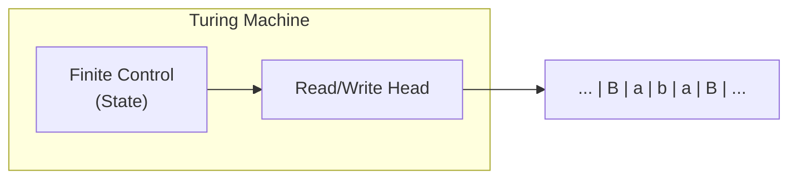
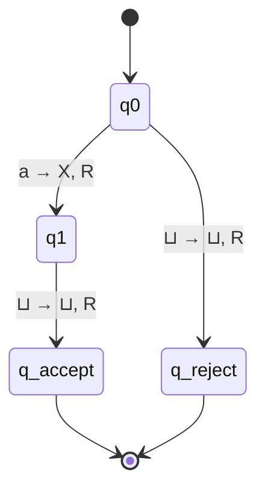
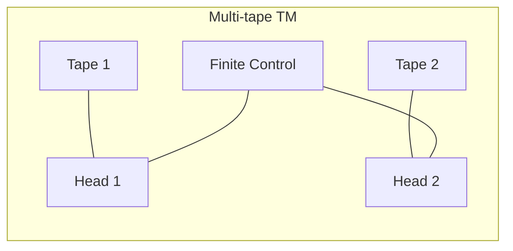
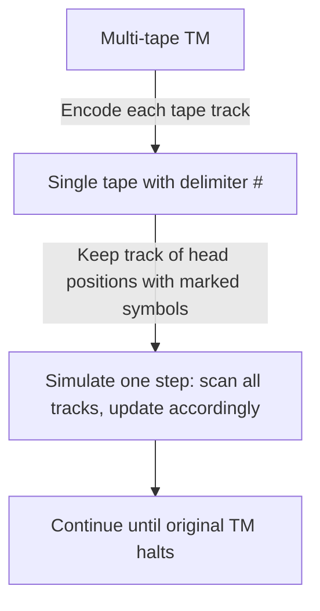

## Chapter 9. Turing Machines

This chapter introduces the most powerful model of computation – the **Turing Machine** (TM). Turing Machines formalise the notion of an algorithm and serve as the foundation for computability theory and complexity theory.

---

### 1. Definition and Components of a Turing Machine (7‑tuple)

A Turing Machine is a mathematical model consisting of:

- A **finite set of states** \( Q \)
- An **input alphabet** \( \Sigma \) (does not include the blank symbol)
- A **tape alphabet** \( \Gamma \) (includes \( \Sigma \) and the blank symbol \( \sqcup \))
- A **transition function** \( \delta: Q \times \Gamma \to Q \times \Gamma \times \{L, R\} \)  
  (deterministic; for NDTM it’s a relation)
- A **start state** \( q_0 \in Q \)
- An **accept state** \( q_{\text{accept}} \in Q \)
- A **reject state** \( q_{\text{reject}} \in Q \) (with \( q_{\text{accept}} \neq q_{\text{reject}} \))

**Formal 7‑tuple:**  
\[
M = (Q, \Sigma, \Gamma, \delta, q_0, q_{\text{accept}}, q_{\text{reject}})
\]

#### Diagram of a Turing Machine

The tape is infinite to the left and right. Initially, the input string is placed on the tape, surrounded by blanks (\( \sqcup \)). The head starts at the first symbol.

---

### 2. Instantaneous Descriptions (ID) and Computation

An **Instantaneous Description** (ID) captures the complete configuration of a TM at a given moment: the tape contents, the head position, and the current state.

Notation:  
\( u \, q \, v \)  
- \( u \) = symbols to the left of the head (including the symbol under head as the first of \( v \)?)  
Better: \( x_1 x_2 \dots x_{i-1} \, q \, x_i x_{i+1} \dots x_n \)  
where the head is on \( x_i \) and state is \( q \).

**Example:**  
ID: \( \sqcup a b \, q_2 \, c \sqcup \) means tape has ... ⊔ a b c ⊔ ..., head on `c`, state \( q_2 \).

#### How a TM computes

1. Start in \( q_0 \) with input \( w \) on tape.
2. Repeat:
   - Read symbol under head.
   - Apply transition \( \delta(q, a) = (q', b, d) \):
     - Write \( b \) to current cell.
     - Move head Left or Right.
     - Change state to \( q' \).
3. Halt when entering \( q_{\text{accept}} \) (accept) or \( q_{\text{reject}} \) (reject).

A TM **accepts** input \( w \) if it eventually enters \( q_{\text{accept}} \).  
It **rejects** if it enters \( q_{\text{reject}} \) or loops forever (but loops are considered non‑accepting).

#### Transition diagram for a simple TM

---

### 3. Language Acceptance by Turing Machine

The set of strings accepted by a TM \( M \) is called the **language recognised** by \( M \):

\[
L(M) = \{ w \in \Sigma^* \mid M \text{ accepts } w \}
\]

Languages accepted by TMs are called **recursively enumerable** (r.e.) or **Turing‑recognisable**. If a TM always halts (accepts or rejects) on every input, the language is **decidable** (recursive).

---

### 4. Design of Turing Machines for Simple Languages

#### Example 1: \( L = \{ a^n b^n \mid n \ge 1 \} \)

**Strategy:**  
- Scan from left, mark first `a` as `X`, move right, find matching `b` and mark it as `Y`.  
- Repeat until no `a` left.

**Mermaid state diagram:**

```mermaid
stateDiagram-v2
    [*] --> q0
    q0 --> q1: a → X, R
    q0 --> q_reject: b or ⊔
    q1 --> q1: a → a, R ; Y → Y, R
    q1 --> q2: b → Y, L
    q2 --> q2: a → a, L ; Y → Y, L
    q2 --> q0: X → X, R
    q0 --> q_accept: ⊔ → ⊔, R
```

#### Example 2: \( L = \{ ww^R \mid w \in \{0,1\}^* \} \) (palindromes)

**Strategy:**  
- Compare first and last symbols; if equal, cross them and repeat.  
- Use a special marker `#` for crossed symbols.

---

### 5. Variants of Turing Machines

All variants below are **equivalent in power** to the standard single‑tape deterministic TM (they recognise exactly the same class of languages).

#### 5.1 Multi‑tape Turing Machine

- Has \( k \) tapes, each with its own head.
- Transition: \( \delta(q, a_1, \dots, a_k) = (q', b_1, \dots, b_k, d_1, \dots, d_k) \)
- **Equivalence:** A multi‑tape TM can be simulated by a single‑tape TM with at most quadratic slowdown (by interleaving tape contents with separators).

**Diagram of a 2‑tape TM:**

#### 5.2 Non‑Deterministic Turing Machine (NDTM)

- Transition function: \( \delta: Q \times \Gamma \to \mathcal{P}(Q \times \Gamma \times \{L,R\}) \) (set of possible moves).
- **Equivalence:** Any NDTM can be simulated by a deterministic TM (exponential slowdown in worst case). This is a foundational result: NDTMs do **not** add extra power in terms of recognisability.

#### 5.3 Other Variants (brief)

- **Multi‑head TM:** Multiple heads on one tape – still equivalent.
- **Two‑dimensional tape** (like a grid) – also equivalent (can be encoded onto a 1D tape).
- **Off‑line TM:** Input on a separate read‑only tape – equivalent.
- **Counter machines, stack machines** – weaker than TMs.

---

### 6. Church–Turing Thesis

> **Church–Turing Thesis:** Every effectively computable function (algorithmically computable) is computable by a Turing Machine.

This is a **thesis** (a claim about the nature of computation), not a theorem. It is widely accepted because:

- All known models of computation (lambda calculus, recursive functions, register machines, Post systems) have been proven equivalent to TMs.
- No one has found a model that can compute more than a TM.

**Implications:**  
If a problem can be solved by any algorithmic means, it can be solved by a TM. The thesis allows us to reason about computability using TMs without loss of generality.

---

### Summary Table

| Variant | Description | Equivalent to single‑tape DTM? |
|---------|-------------|-------------------------------|
| Single‑tape DTM | Standard model | Yes (trivial) |
| Multi‑tape DTM | Several tapes | Yes (simulate with interleaving) |
| Non‑deterministic TM | Multiple possible moves | Yes (simulate by exploring tree) |
| Multi‑head TM | Several heads on one tape | Yes |
| 2D tape TM | Tape extends in two dimensions | Yes (encode as 1D) |
| Off‑line TM | Input on separate read‑only tape | Yes |

**Key takeaway:** Turing Machines capture the intuitive notion of computation. Their invariance across many variants supports the Church–Turing thesis, which defines the boundary between computable and uncomputable.

---

### Mermaid Diagram: Simulation of Multi‑tape by Single‑tape

This encoding shows equivalence: a single tape can hold the contents of all tapes, one after another, with a marker for each head. Thus, multi‑tape TMs are no more powerful.

