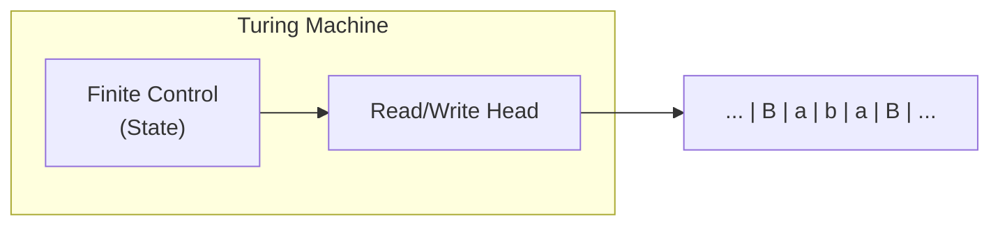
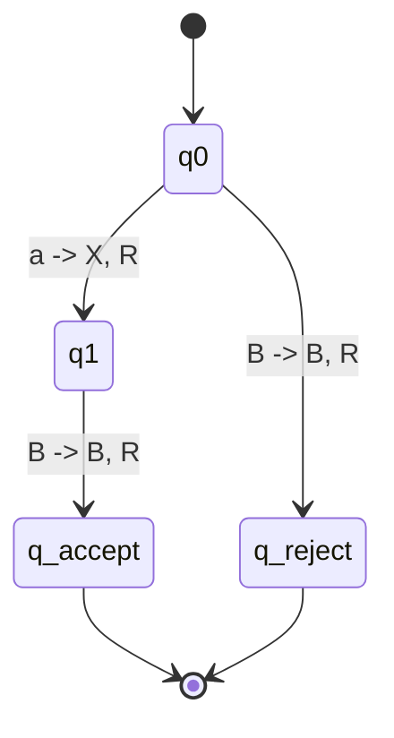
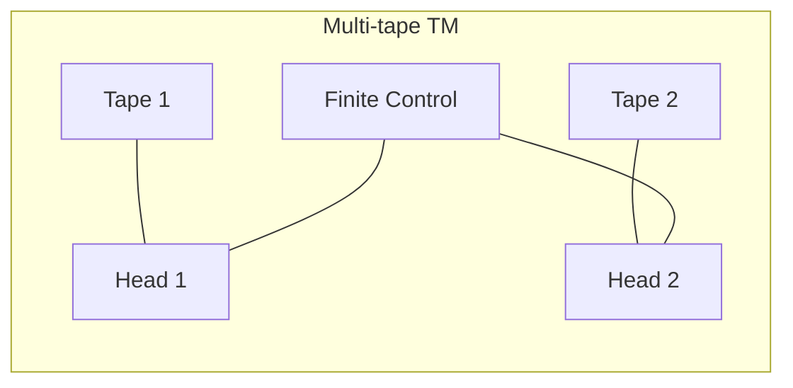
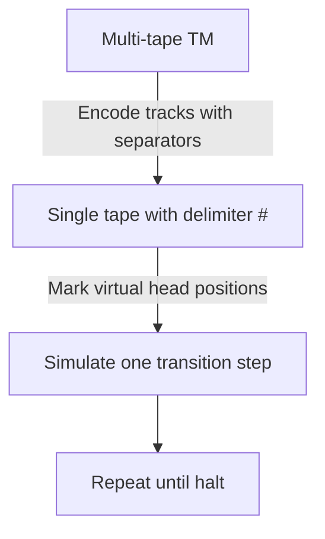

## Chapter 9: Turing Machine

This chapter introduces the most powerful classical model of computation: the **Turing Machine (TM)**. Turing Machines formalize the notion of an algorithm and form the base of computability and complexity theory.

---

## 1. Definition and Components of a Turing Machine (7-tuple)

A deterministic Turing Machine is defined by:

- A finite set of states $Q$
- An input alphabet $\Sigma$ (does not include blank)
- A tape alphabet $\Gamma$ ($\Sigma \subseteq \Gamma$, and blank belongs to $\Gamma$)
- A transition function
  $$
  \delta: Q \times \Gamma \to Q \times \Gamma \times \{L, R\}
  $$
- A start state $q_0 \in Q$
- An accept state $q_{accept} \in Q$
- A reject state $q_{reject} \in Q$, where $q_{accept} \ne q_{reject}$

Formal 7-tuple:

$$
M = (Q, \Sigma, \Gamma, \delta, q_0, q_{accept}, q_{reject})
$$

### Diagram of a Turing Machine



The tape is conceptually unbounded in both directions. Initially, input is written on the tape with blank symbols around it, and the head starts at the first input symbol.

---

## 2. Instantaneous Descriptions (ID) and Computation

An **Instantaneous Description (ID)** captures one full machine configuration: tape content, head position, and current state.

A common notation is:

$$
x_1 x_2 \dots x_{i-1}\; q\; x_i x_{i+1} \dots x_n
$$

where the head scans $x_i$ and the current state is $q$.

Example ID:

$$
B\ a\ b\ q_2\ c\ B
$$

This means the head is on $c$, and the machine is in state $q_2$.

### How a TM computes

1. Start in $q_0$ with input $w$ on tape.
2. Repeatedly apply transitions.
3. If $\delta(q, a) = (q', b, d)$, then:
   - write $b$
   - move head in direction $d \in \{L, R\}$
   - change state to $q'$
4. Halt when entering $q_{accept}$ or $q_{reject}$.

A TM **accepts** $w$ if it eventually enters $q_{accept}$. It **rejects** if it enters $q_{reject}$. If it never halts, then it does not accept.

### Transition Diagram (Simple TM)



---

## 3. Language Acceptance by Turing Machine

The language recognized by a TM $M$ is:

$$
L(M) = \{\, w \in \Sigma^* \mid M \text{ accepts } w \,\}
$$

- Languages recognized by TMs are called **Turing-recognizable** (or recursively enumerable).
- If a TM halts on every input, its language is **decidable** (recursive).

---

## 4. Designing TMs for Simple Languages

### Example 1

$$
L = \{a^n b^n \mid n \ge 1\}
$$

Strategy:

- Mark the leftmost unmarked $a$ as $X$
- Move right and mark the matching $b$ as $Y$
- Return left and repeat
- Accept when all symbols are matched

```mermaid
stateDiagram-v2
    [*] --> q0
    q0 --> q1: a -> X, R
    q0 --> q_reject: b or B
    q1 --> q1: a -> a, R ; Y -> Y, R
    q1 --> q2: b -> Y, L
    q2 --> q2: a -> a, L ; Y -> Y, L
    q2 --> q0: X -> X, R
    q0 --> q_accept: B -> B, R
```

### Example 2

$$
L = \{ww^R \mid w \in \{0,1\}^*\}
$$

(palindromes)

Strategy:

- Compare first and last unmatched symbols
- Mark matched symbols and shrink inward
- Reject on mismatch, accept when all symbols are matched

---

## 5. Variants of Turing Machines

All variants below are equivalent in language recognition power to the standard single-tape deterministic TM.

### 5.1 Multi-tape TM

- Has $k$ tapes and $k$ heads
- Transition form:
  $$
  \delta(q, a_1, \dots, a_k) = (q', b_1, \dots, b_k, d_1, \dots, d_k)
  $$
- Can be simulated by a single-tape TM (polynomial overhead)



### 5.2 Non-deterministic TM (NDTM)

Transition relation:

$$
\delta: Q \times \Gamma \to \mathcal{P}(Q \times \Gamma \times \{L, R\})
$$

A deterministic TM can simulate an NDTM (possibly with exponential slowdown), so NDTM does not increase computability power.

### 5.3 Other Equivalent Variants

- Multi-head TM
- 2D tape TM
- Off-line TM (read-only input tape + work tape)

All can be encoded by the standard model.

---

## 6. Church-Turing Thesis

> **Church-Turing Thesis:** Every effectively computable function is computable by a Turing Machine.

This is a thesis, not a theorem, because it connects a formal model to the informal notion of algorithm.

Why it is accepted:

- Multiple independent models (lambda calculus, recursive functions, register machines) have the same power as TMs.
- No physically realizable general model has been shown to exceed TM-computability for algorithmic tasks.

Implication:

If a problem is algorithmically solvable, then some TM solves it.

---

## Summary Table

| Variant | Description | Equivalent to single-tape DTM? |
| --- | --- | --- |
| Single-tape DTM | Standard model | Yes |
| Multi-tape DTM | Several tapes | Yes |
| Non-deterministic TM | Multiple choices per move | Yes |
| Multi-head TM | Multiple heads on one tape | Yes |
| 2D tape TM | Grid-style tape | Yes |
| Off-line TM | Separate read-only input tape | Yes |

**Key takeaway:** Turing Machines provide a robust and stable definition of computation. Equivalent TM variants reinforce the Church-Turing thesis and help classify computable vs non-computable problems.

---

## Mermaid: Simulating Multi-tape with Single Tape



A single tape can store all tape tracks with separators and markers, proving equivalence in computational power.